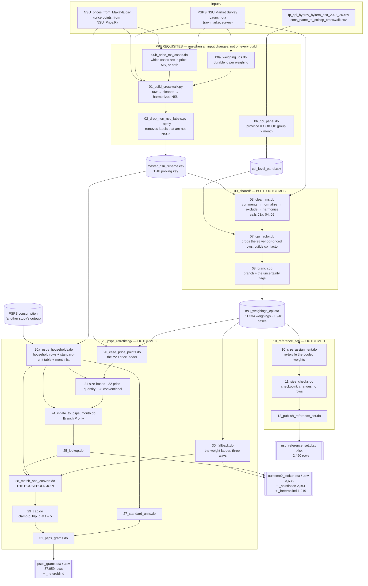

# NSU Market Survey — Data Cleaning

Turns quantities reported in **non-standard units** (NSUs) in the PSPS household panel —
a *bilog*, a *tumpok*, a *bugkos* — into **grams**, using the NSU Market Survey as the
measurement source. Western Visayas, five provinces, 102 municipalities, 19 food items.

**Two deliverables**, built from the same 11,334 market-survey weighings and not derivable
from one another:

| | **Outcome 1** — the reference set | **Outcome 2** — PSPS retro-fitting |
| :-- | :-- | :-- |
| answers | what does a named local unit weigh here, by size? | how many grams did this household consume? |
| file | `nsu_reference_set.dta` / `.xlsx` | `psps_grams.dta` / `.csv` |
| unit of observation | case × published size | household × item × acquisition slot |
| rows | 2,490 | 87,959 |
| built by | `dofiles/master_outcome1.do` | `dofiles/master_outcome2.do` |

Outcome 1 slices weighings by the **size** the field recorded; Outcome 2 slices them by the
**price points** the price file holds. The same case can yield three sizes in one and a
single weight in the other.

---

## Where to start

| you want to… | read |
| :-- | :-- |
| understand the method | `docs/conversion_factor_methodology.md` |
| run the pipeline | *Running it* below, then `dofiles/README.md` |
| know what a published column means | `docs/data_dictionary.md` |
| change a threshold or a tie rule | `docs/implicit_assumptions.md` — **before** you touch the constant |
| know where a dropped row went | `docs/attrition_ledger.md` |
| understand the NSU vocabulary | `docs/master_rename.md` |
| put a judgement call in front of a reviewer | `docs/adjudication_playbook.md` |

---

## Folder layout

```
Data Cleaning/
├── inputs/        every external file the build reads. Two are gitignored — see below
├── dofiles/       the pipeline, in four folders. dofiles/README.md is its run order
│   ├── 00_shared/            raw survey → one clean weight per weighing
│   ├── 10_reference_set/     Outcome 1
│   ├── 20_psps_retrofitting/ Outcome 2
│   ├── 90_diagnostics/       scoping, auditing, reporting. Never on a critical path
│   └── archive/              superseded. Nothing calls it
├── docs/          the written record: method, assumptions, dictionary, oddities
├── outputs/
│   ├── build/     everything a run produces (see below)
│   └── tables/    hand-maintained crosswalks and the build manifest. Tracked
└── reference/     review workbooks and the adjudicated snap verdict ledger
```

### Where a build's output lands

Every step writes under `outputs/<build_name>/` — `outputs/build/` for the published build,
another subtree for a variant. Five folders, split by what a reader needs to know before
opening a file:

| folder | macro | holds |
| :-- | :-- | :-- |
| `deliverables/` | `${bdeliv}` | the published objects, each with the `.xlsx` or `.csv` that ships beside it |
| `intermediate/` | `${btemp}` | every other `.dta` a step writes and a later step reads |
| `summary/` | `${bsummary}` | sense checks, summary statistics, the attrition ledger, the pipeline explorer |
| `diagnostics/` | `${btables}` | issue-specific scoping tables and review workbooks. Never a dependency |
| `graphs/` | `${bgraphs}` | analytic figures meant to be read on their own |

The macro names keep their old spelling (`${btemp}`, `${btables}`) even though the folders
are no longer called `temp/` and `tables/` — repointing a macro is one line in
`00_shared/00_globals.do`, and every do-file that reads them needed no edit.

---

## Inputs

**Every external file the build reads lives in `inputs/`, and every path to one is defined
in `dofiles/00_shared/00_globals.do`.** Nothing reaches outside the project folder except
the PSPS consumption file, which is a different study's deliverable.

| file | global | tracked? | read by |
| :-- | :-- | :-- | :-- |
| `PSPS NSU Market Survey Launch.dta` | `${data}` | **no** | `00a`, `00b`, `01`, `03` |
| `NSU_prices_from_Makayla.csv` | `${pricedata}` | **no** | `00b`, `01`, `20` |
| `fp_cpi_byprov_byitem_psa_2023_26.csv` | `${cpifile}` | yes | `06` |
| `cons_name_to_coicop_crosswalk.csv` | `${cwfile}` | yes | `06` |
| *(PSPS consumption, outside this project)* | `${psps_cons}` | n/a | `20a` |

**The raw survey and the price file are gitignored** — they are not ours to publish. A
clone therefore has the code, the documentation and the crosswalks, but cannot rebuild from
raw until those two files are placed in `inputs/`. Everything downstream of the crosswalk
is reproducible without them.

> `inputs/` also holds `fp_cpi_byprov_byitem_psa_2023_26.bak.csv` and `.bak2.csv` —
> superseded CPI vintages differing by up to 930 rows. **They are not inputs.**
> `06_cpi_panel.do` pins the live vintage by SHA-256 (`${cpisha}`), which is the only thing
> that says which of the three was read. `coicop_groups_reference.csv` is a lookup for
> humans; no step reads it.

---

## What feeds what



**Two ordering constraints, and nowhere else.** `20a` must precede `24` (it writes the
month list) and `30` must precede `28` (it writes the three fallback schedules `28`
climbs). Everything else within a stage is independent. Step `26` is deliberately absent —
`26_psps_extract.do` is archived and `20a` replaces it; the gap is kept so the step numbers
cited on issues #19, #21 and #23 still resolve.

---

## Running it

**The working directory must be `dofiles/`.** Each step reaches `00_shared/00_globals.do`
by a relative path, because the globals that would give it an absolute one are what that
file defines.

```bash
cd ".../Data Cleaning/dofiles"
"C:\Program Files\StataNow19\StataSE-64.exe" -e do master_outcome1.do
"C:\Program Files\StataNow19\StataSE-64.exe" -e do master_outcome2.do
```

Run the prerequisites first, once, and again whenever an input changes. **They are not in
either master**, deliberately, so a routine rebuild does not regenerate the crosswalk. The
Stata steps run from `dofiles/`; the two Python steps take a path from the project root.

```bash
"C:\Program Files\StataNow19\StataSE-64.exe" -e do 00_shared\00a_weighing_ids.do
"C:\Program Files\StataNow19\StataSE-64.exe" -e do 00_shared\00b_price_ms_cases.do
python dofiles/00_shared/01_build_crosswalk.py
python dofiles/00_shared/02_drop_non_nsu_labels.py --apply
"C:\Program Files\StataNow19\StataSE-64.exe" -e do 00_shared\06_cpi_panel.do
```

**That order is a straight line on purpose.** `00a` owns the durable id registry and reads
only the raw survey, so nothing downstream can move an id. `01` needs that registry to
number the price-only cases and reads the case-coverage CSV `00b` writes. `02` filters what
`01` produced. `03` needs the result.

> **`stata -e` exits 0 even when a do-file errors.** Check the log for `r(` followed by a
> number and a semicolon. An exit status of 0 is not evidence the build ran.

### After any change

```bash
python dofiles/verify_pipeline.py
```

**This is the one command that says whether the pipeline on disk is the pipeline the code
describes.** Exit 0 means it is. It rebuilds the crosswalk into a scratch directory and
diffs it column by column, accounts for the non-NSU trim, re-runs the fold weight tests,
runs `verify_documented_claims.py` (which re-derives every number in `docs/` that no build
file produces), and checks every input against a SHA-256 manifest.

**Hashes, not timestamps.** A git checkout rewrites the mtime of every file it touches, so a
branch switch makes a stale artifact look fresh. An earlier version of the fold check was
guarded on mtime and would have passed over exactly the failure it exists to catch.

It does **not** re-run the Stata build — that would overwrite the artifacts it is checking.

### Is the answer sensible?

```bash
"C:\Program Files\StataNow19\StataSE-64.exe" -e do 90_diagnostics\sense_check_outputs.do
```

Separate from reproduction, because a build can reproduce byte for byte and still be wrong
by a factor of ten. **Read its section 4 first** — sections 1–3 judge the outputs against
other outputs of the same build, which cannot catch an error shared by all of them. Section
4 leaves the pipeline and asks whether the implied food intake is an amount a person could
eat.

`90_diagnostics/test_full_rebuild.do` answers the other question — does the pipeline
reproduce from the raw files? — by building into its own subtree and diffing every published
dataset against the live build.

### A variant build, without touching the published one

`00_globals.do` takes a `${build_name}` override. Set it before the globals load and the
whole build goes to `outputs/<build_name>/`:

```stata
global build_name "anchor_pull_nsu_unit"
global unitvar    "pull_nsu_unit"
do "00_shared/03_clean_ms.do"
```

`90_diagnostics/measure_anchor_keying.do` is the worked example. `outputs/anchor_*/` is
gitignored.

---

## Conventions this pipeline is built on

Each exists because the project was bitten without it.

**Define a rule once; import it everywhere.** `nsu_fold_rule.py` owns which raw spellings
mean the same thing. `nsu_normalize.py` and the `nsu_normalize` program in `00_globals.do`
own string normalization and must agree character for character. `gen_d_thin` and `THIN` own
the thin flag. There were once eleven byte-identical copies of the normalizers across
`90_diagnostics/`, and a fix to one reached none of the others.

**A diagnostic reads what the pipeline computed; it never recomputes it.** If the build
discards something a diagnostic needs, the fix is to keep it. The block reading was computed,
used and dropped, so two diagnostics each carried a hand-written copy of the rule — guarding
the *constant* and not the *branch structure*. The fix was one word: add `w_block` to the
`keep`.

**A diagnostic must read the build it claims to validate.** One spent six weeks pointed at a
superseded build, reproducing its own past answers no matter what changed upstream — worse
than not running, because it looked like confirmation.

**A correction that can match nothing must assert its row count.** One hand-made fix tested
the wrong size code, matched zero rows, logged `(0 real changes made)`, and shipped a 1 gram
whole chicken to the published reference set.

**A hardcoded count must carry its derivation.** `assert n == 11458` invites whoever hits it
to update the number. Show the arithmetic that produces it.

**A threshold must say what it claims about the data.** `KGMAX = 30`, `THIN = 3`,
`FOLD = 0.85`, `PMERGE = 20` are each a statement about the world. Every one is written up in
`docs/implicit_assumptions.md` with what rests on it and whether anything checks it. **Add
the entry before adding the constant.**

**Build objects in Stata. Use Python only where Stata cannot** — fuzzy string matching,
`.xlsx` I/O, unicode normalization. Each language boundary is a place where Stata's data
model has to be re-interpreted, and that re-interpretation fails *silently*: a labelled
numeric read back as its label string, a pandas Categorical whose `>` compares category
order. Both ran without error; neither can happen inside a do-file.

**Determinism.** Stata does not sort stably — since version 13 `sort` places tied
observations in an order drawn from the sort seed. `00_globals.do` pins `set sortseed` and
every step sorts on a **unique** key immediately before saving, so no ties are left for the
seed to break. This is not only about reproducibility: a `bysort key: ... _n` where `key` is
not unique is reading an order the seed chose.

**Never put this repository inside a sync folder's path that git can race.** Git relies on
atomic renames; a sync client uploading `.git/index` mid-write corrupts it.

---

## Status

Both outcomes are built and live. Open items are tracked as GitHub issues; the ones that
change a published number are cross-referenced from `docs/implicit_assumptions.md` (`A1`–`A21`)
and from the appendices of `docs/conversion_factor_methodology.md`.

**The checks that must stay green:** `python dofiles/verify_pipeline.py` exits 0, and
`verify_documented_claims.py` reports every claim OK.
