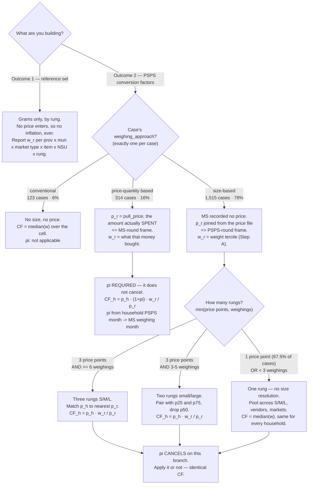

# NSU → Gram Conversion Factors: Methodology

**Purpose.** Convert quantities reported in non-standard units (NSUs) in the PSPS
household panel into grams, using the NSU Market Survey as the measurement source.

## Two deliverables

**Outcome 1 — reference set for future data collection.** A lookup key, one per
province, with columns

> municipality | market type | item | NSU | size | grams per unit

keeping within-item heterogeneity (a row per size, not one averaged scalar). Use
case: a respondent reports 1 mango; the enumerator asks the size (small / medium /
large, e.g. with reference pictures) and logs the answer directly in grams.

**Outcome 2 — conversion factors for PSPS.** For each item-NSU-municipality
observed in PSPS, a grams-per-unit value, so PSPS NSU quantities can be turned
into grams retrospectively. This is the pipeline documented below.

---

## Decision tree

The steps that apply to a given observation depend on **which deliverable** you are
building and, for Outcome 2, on the case's **weighing approach** and how many
**rungs** it can support. This is the map; the sections below are the detail.



### The scenarios as a table

| # | deliverable | branch | rungs | $`w_r`$ is | $`p_r`$ is | frame of $`p_r`$ | $`\pi`$ | conversion factor |
|---|---|---|---|---|---|---|---|---|
| 1 | Outcome 1 | any | as resolved | tercile / point median | *not reported* | — | never | $`w_r`$ itself |
| 2 | Outcome 2 | conventional | 1 | cell median | none | — | n/a | $`\operatorname{median}(w)`$ |
| 3 | Outcome 2 | price-quantity | as fielded | weight bought at that point | `pull_price` (spent) | **MS** | **required** | $`p_h(1{+}\pi)\,w_r/p_r`$ |
| 4 | Outcome 2 | size-based | 3 | tercile median | price file p25/p50/p75 | **PSPS** | cancels | $`p_h\,w_r/p_r`$ |
| 5 | Outcome 2 | size-based | 2 | median-split median | price file p25, p75 | **PSPS** | cancels | $`p_h\,w_r/p_r`$ |
| 6 | Outcome 2 | size-based | 1 | pooled cell median | the single median point | **PSPS** | cancels | $`\operatorname{median}(w)`$ |

Scenario 6 is the most common outcome, and note that it makes rows 2 and 6 the same
object: once a case has only one rung, the size-based branch degenerates to exactly
what the conventional branch does.

Two things the tree deliberately makes visible. **Inflation is a branch property,
not a global step** — it is required for scenario 3 and inert for 4–6. And **the
ordinal ladder is not the same observable in every branch**: it is a weight tercile
on the size-based branch and a given price point on the price-quantity branch, which
is why $`p_r`$'s peso frame differs between them.

---

## Notation

A **case** $`c`$ is a province × municipality × item × NSU combination.

**Market survey (MS) side.** A case is resolved into up to three **rungs** — an
*ordinal* ladder from smallest/cheapest to largest/dearest, indexed
$`r \in \{1, 2, 3\}`$. The rung is **not** intrinsically a size: which observable
realizes it depends on the case's weighing approach.

| weighing approach | what a rung is, concretely |
|---|---|
| size-based | a weight tercile — the S / M / L relabelling of §Step A |
| price-quantity based | a price point the enumerator was given — MP25 / MP50 / MP75 |
| conventional | there is one rung and it has no size or price attached |

Per rung $`r`$ within a case:

- $`w_r`$ — grams per NSU (the weight of a rung-$`r`$ unit)
- $`p_r`$ — price, **PHP per NSU**, of a rung-$`r`$ unit. **Its peso frame depends
  on the branch** and this is the single easiest thing to get wrong:
  - *price-quantity:* $`p_r`$ is the amount the enumerator **actually spent**, so
    it is an **MS-round** price, and $`w_r`$ is what that money bought at MS-round
    prices.
  - *size-based:* the MS recorded no price at all, so $`p_r`$ is joined in from the
    price file and is a **PSPS-round** price.

  The *same nominal number* (e.g. ₱88) can therefore be an MS-round price in one
  case and a PSPS-round price in another — the frame comes from how it was used,
  not from the number. Carry it explicitly (see §Reporting prices in two frames).
- $`v_r \equiv p_r / w_r`$ — unit value, **PHP per gram**, in whatever frame
  $`p_r`$ is in

The S / M / L notation is retained below where the discussion is specifically about
the size-based branch; read $`s`$ as a rung index elsewhere.

**PSPS side**, household $`h`$ in case $`c`$:

- $`q_h`$ — quantity the household reports buying, in NSU units
- $`e_h`$ — total value it paid for that quantity (PHP)
- $`p_h \equiv e_h / q_h`$ — implied price, **PHP per NSU** (in PSPS-round pesos)
- $`\pi`$ — cumulative inflation *rate* between the PSPS round and the MS round
  (the MS was fielded ~2 years *after* PSPS), so $`1+\pi`$ is the price factor;
  dividing an MS-round price by $`1+\pi`$ restates it in PSPS-round pesos. A tilde
  marks such a deflated MS quantity: $`\tilde p_s \equiv p_s / (1+\pi)`$ and
  $`\tilde v_s \equiv v_s / (1+\pi)`$

Throughout, **$`p`$ is always PHP per NSU** and **$`v`$ is always PHP per gram** —
they are never interchangeable.

---

## Conventional NSU (the simple case)

Some NSUs are effectively standard within a locality (gantang, salop, salmon …).
There is no size to resolve: a single weight $`w_c`$ characterizes the unit, so

```math
\widehat{CF}_h = w_c \quad\text{for every household in the case.}
```

Everything below concerns the non-standard case, where a unit's grams vary with
its size / price.

---

## The pipeline (size / price-varying NSUs)

### Step A — build the reference from the market survey

Within a case, **pool all weighings** — across market types, vendors, and the
survey's original heterogeneity labels — into one weight distribution. Let $`w`$
be a pooled weighing and let $`Q_{1/3}, Q_{2/3}`$ be the terciles of that
distribution. **Relabel each weighing by its weight tercile:**

```math
\text{size}(w) = \begin{cases}
S & \text{if } w \le Q_{1/3} \\[4pt]
M & \text{if } Q_{1/3} < w \le Q_{2/3} \\[4pt]
L & \text{if } w > Q_{2/3}
\end{cases}
```

For each size $`s`$, take its representative weight $`w_s`$ (the tercile median)
and its price $`p_s`$ (PHP per NSU), giving the unit value $`v_s = p_s / w_s`$.
Because bigger units cost more, the three prices order as $`p_S \le p_M \le p_L`$;
these are the case's price points (**$`S \leftrightarrow`$ MP25,
$`M \leftrightarrow`$ MP50, $`L \leftrightarrow`$ MP75**).

This re-terciling is deliberate: the survey's own S/M/L labels overlap heavily in
weight across vendors, so we re-derive the sizes from the pooled weights rather
than trust the labels.

**This follows the LSMS guidebook's own prescription**, not just our own reading of
the data. Oseni, Durazo & McGee (2017), *The Use of Non-Standard Units for the
Collection of Food Quantity*, §3 Step 3 "Calculating the conversion factors", p. 16
(`docs/WB-NSU-Guide.pdf`) states the problem in the same terms —

> "the small size of a unit found in market X may be larger than the large version
> collected in market Y. These must be reconciled so that there is a standard
> classification of small, medium, and large within the relevant level of
> geographic aggregation"

— and prescribes the method:

> "classify measurements based on their position in the distribution of
> measurements for that particular item-unit pair. The most basic approach is to
> classify observations that fall below the 33rd percentile as small, between the
> 33rd and 66th percentile as medium, and above the 66th percentile as large."

The same page authorizes the two-size fallback used in the ladder below —

> "the number of sizes must be considered before applying this method. Some units
> may only be found in two relatively uniform sizes, in which case only small and
> large size should be assigned"

— and the choice of the median as the within-rung estimator: *"The mean or median
measurement for each container unit can be used."* The guidebook also recommends
reviewing the reference photos as a verification step; that check has not been done
here and remains available.

#### Where $`w_r`$ and $`p_r`$ actually come from

The market survey used one of three **weighing approaches** per case, and a case
uses exactly one of them. The approach decides what a rung *is*, where the pair
$`(w_r, p_r)`$ comes from — and, critically, **which peso frame $`p_r`$ is already
in**:

| approach | share of cases | a rung is | $`w_r`$ | $`p_r`$ | frame of $`p_r`$ |
|---|---|---|---|---|---|
| conventional | 123 (6%) | the whole case | the single $`w_c`$ | none needed | — |
| price-quantity based | 314 (16%) | a given price point (MP25/50/75) | weight bought at that point | the peso amount the enumerator **actually spent**, recorded in the MS | **MS round** |
| size-based | **1,515 (78%)** | a weight tercile (S/M/L) | tercile median (above) | **not in the MS at all** — must be joined from the price file | **PSPS round** |

For size-based cases the enumerator was asked for a *small / medium / large* unit,
never for a peso amount, so no price was recorded (the MS `pull_price` field is
empty for them by construction). Their price points therefore have to be joined in
from the price file, where they are PSPS-derived percentiles that were never spent
in the MS round.

#### Which price points exist for a case

The price file does not carry a mp25/mp50/mp75 triple for every case. Point
selection followed the field protocol below, so **the set of available price points
is itself a signal of how thin or how homogeneous the PSPS data was for that cell**:

- **≥3 unique PSPS prices in the municipality** → record p25, p50, p75 — *unless*
  the interquartile range is ≤ ₱40, in which case record only the municipality
  median. (₱20 — the smallest bill and a common coin — was taken as the smallest
  meaningful gap between quartiles; ₱40 is two of those. There is no strong prior
  behind the threshold beyond that.)
- **≤2 unique PSPS prices in the municipality** → record the province median
  alongside the 1–2 municipal prices — *unless* those municipal prices sit within
  ₱20 of the province median, in which case record only the province median.

So a case whose only price point is a municipality or province median is one where
few PSPS respondents used that NSU in that cell, or where the prices they reported
barely varied.

#### Degrading gracefully: how many rungs a case can support

How many rungs we can actually assign depends on two separate limits, and we take
whichever is smaller.

**Limit 1 — how many times the unit was weighed.** You cannot split three weighings
into three sizes. Measured on the size-based cases:

| weighings in the cell | sizes the weights can support | cells |
|---|---|---|
| ≥ 6 | three terciles, S / M / L | 700 (44.6%) |
| 3–5 | two groups, small / large | 493 (31.4%) |
| < 3 | one — no size resolution | 378 (24.1%) |

**Limit 2 — how many price points exist.** A size is only useful if there is a
price to pair it with, so a cell with a single median price supports one rung no
matter how often we weighed it. This limit turns out to be **binary**, a direct
consequence of the field protocol above:

| price points in the price file | cases | share |
|---|---|---|
| full p25 / p50 / p75 triple | 959 | 32.5% |
| a single median-type point (municipality median, province median, or a unique municipal price) | 1,991 | **67.5%** |

**No case has exactly two quartile points.** So Limit 2 usually binds and it binds
hard: roughly two thirds of cases collapse to a single rung on price grounds alone,
whatever their weight distribution looks like. The two-size rung is reachable only
where a case has the full price triple but just 3–5 weighings.

*(These two tallies are not yet joined — the 67.5% is over all price-file cases,
including price-only ones with no MS weighings. Joining them on
`harmonized_nsu_unit` to get the true joint distribution is the first task of the
implementation.)*

**When a case collapses to one rung** the sizes are not separated at all: pool every
size-based weighing in the cell across vendors, market types **and** the original
S / M / L labels, take the median of that single pooled distribution, and map it to
the one available price point. Every household in the cell gets that one number
regardless of what it paid. Note what this is *not*: it is not "the small one" or
"the medium one" — it is the middle of the whole pooled distribution, the same
object the conventional-NSU branch produces,
$`\widehat{CF} = \operatorname{median}(w)`$.

### Step B — apply to a PSPS household

**B1. Restate the MS price points** into PSPS-round pesos. The weights $`w_s`$ are
unchanged — grams do not inflate:

```math
\tilde p_s = \frac{p_s}{1+\pi}, \qquad \tilde v_s = \frac{v_s}{1+\pi} = \frac{\tilde p_s}{w_s}
```

Three things about this step that the notation hides:

1. **Only the price-quantity branch needs it — for the size-based branch $`\pi`$
   cancels.** In a size-based case both $`p_h`$ and $`p_r`$ are PSPS-frame (the
   latter straight from the price file), and $`\pi`$ enters only as a common factor
   on both sides. The match is unaffected, because for any $`\pi > -1`$
   ```math
   \operatorname*{arg\,min}_r \bigl|(1{+}\pi)p_h - (1{+}\pi)p_r\bigr|
   = \operatorname*{arg\,min}_r \bigl|p_h - p_r\bigr|,
   ```
   and so is the division, because
   $`\frac{(1+\pi)p_h}{(1+\pi)p_r / w_r} = \frac{p_h\,w_r}{p_r}`$. Restating the
   size-based price points is therefore **harmless but has no effect** — it is a
   no-op, not a double-count. (An earlier version of this doc called it
   double-counting; that is only true if one restates $`p_r`$ and forgets $`p_h`$.)

   In a price-quantity case there is nothing to cancel against: $`p_r`$ is a
   nominal amount **spent at MS-round prices**, so $`v_r = p_r/w_r`$ is genuinely
   PHP-2026 per gram while $`p_h`$ is PSPS-frame, and one factor of $`(1+\pi)`$
   survives into the answer. The structural reason for the asymmetry: in a
   size-based case $`w_r`$ is a property of *the unit* (a medium mango), assumed
   time-invariant and paired with a PSPS-era price — already a coherent PSPS pair.
   In a price-quantity case $`w_r`$ is not a property of any unit; it is "whatever
   ₱88 buys", which is a function of the price level, so the pair is a coherent
   *MS* pair and converting it costs a $`\pi`$.

   **The single rule that covers both branches:** always restate $`p_h`$ into the MS
   frame; additionally restate $`p_r`$ **only when it came from the price file**
   (size-based). Whichever route is taken, apply the *same* $`\pi`$ to both sides —
   mixing a household-level $`\pi`$ on $`p_h`$ with a cell-level one on $`p_r`$
   fails to cancel and injects variation that is pure artefact.
2. **$`\pi`$ is not one number, and it is often negative.** Measured on the PSA
   province × COICOP food CPI over the median-to-median window (PSPS 2024m5 → MS
   2026m4), the median across province × group is **+7.4%**, but the range is
   **−18.1% to +58.1%**, and 6 of 16 groups have a negative median: rice −6.8%,
   fresh meat −4.0%, other meat −2.9%, sugar/confectionery −2.4%, ice cream −1.9%,
   water ≈ 0. Signs flip *within* a group across provinces — leafy vegetables run
   −9.4% in Iloilo and +58.1% in Antique. So $`\pi`$ must be province × COICOP
   specific; a pooled or national figure would be wrong in both directions, and
   "deflate" is a misnomer for a factor that is frequently below 1. Prefer naming
   any precomputed column `price_psps_frame` (or `_restated`) over `_deflated`.
3. **$`\pi`$ is household-specific, so B1 does not save operations.** PSPS fielding
   ran 2023m12–2025m1 and is **bimodal** (Dec 2023–Jul 2024, then Oct 2024–Jan
   2025), and which mode a province sits in differs: Aklan appears only in the
   early wave, Negros Occidental only in the late one. There is no single "PSPS
   round" month, so $`\tilde p_s`$ varies household by household just as $`p_h`$
   does. Moving the PSPS anchor across its range moves $`\pi`$ by **15.6 pp** for
   other vegetables, 10.5 pp for tubers, 9.3 pp for fruits. Since the operation
   count is the same either way and grams are frame-invariant, it is equivalent —
   and cheaper in variables — to inflate $`p_h`$ into the MS frame instead:
   $`p_h^{MS} = p_h(1+\pi)`$, match against the un-restated $`p_s`$, and divide by
   $`v_s`$. That leaves $`p_s`$ and $`v_s`$ as clean case-level constants fit to
   publish in the Outcome-1 reference table with no peso-frame caveat attached.

The index itself is sound for this use: the PSA series is a fixed-base level index
(range 83–308, median 137 at 2023m12 rising to 148 at 2026m1) with no base break at
the 2026 boundary (median month-on-month change +1.3% there vs +0.0% elsewhere), so
ratios across the window are valid. Coverage is **complete** — all 5 provinces × 16
COICOP groups — because the `cons_name → item_group` crosswalk is province-specific
by design: ice cream maps to `01.1.8.6` everywhere except Iloilo, which has only the
parent `01.1.8`. The two rows are complementary, not redundant, so no fallback
ladder is needed.

**B2. Match** the household's price to the nearest MS price point, both sides in one
frame — this decides the size:

```math
s(h) = \underset{s \in \{S, M, L\}}{\arg\min} \; \bigl\lvert p_h - \tilde p_s \bigr\rvert
```

**B3. Convert** price into grams using that size's (deflated) PHP-per-gram value:

```math
\widehat{CF}_h = \frac{p_h}{\tilde v_{s(h)}}
\qquad\Longrightarrow\qquad
\widehat g_h = q_h \cdot \widehat{CF}_h
```

$`\widehat{CF}_h`$ is the grams in one NSU unit; $`\widehat g_h`$ is the
household's total grams.

> **Why we adjust only once, on the MS side (the doubt, resolved).** Grams are
> physical — they do not inflate — so the division returns grams only if numerator
> and denominator are in the *same* peso-frame, letting pesos cancel:
> ```math
> \frac{\text{PHP}_{\text{PSPS}} / \text{NSU}}{\text{PHP}_{\text{PSPS}} / \text{g}} = \text{g} / \text{NSU}.
> ```
> Restating the MS price points into PSPS pesos in B1 puts everything — the
> household's raw $`p_h`$, the matched price $`\tilde p_s`$, and the unit value
> $`\tilde v_s`$ — in one frame, so no further adjustment happens at the division.
> Inflating each household's $`p_h`$ into MS pesos instead gives the **identical**
> grams, because grams are frame-invariant:
> ```math
> \frac{p_h}{v_s / (1+\pi)} \;=\; \frac{(1+\pi)\,p_h}{v_s}.
> ```
> **Which side you adjust is therefore free, and the original "the MS side has
> fewer points" argument does not hold.** It assumed $`\pi`$ is constant within a
> case, so that three $`\tilde p_s`$ values could be computed once and reused. They
> cannot: $`\pi`$ depends on the household's own PSPS submission month, and those
> months are spread over 2023m12–2025m1 *within* a cell (see B1 note 3), so
> $`\tilde p_s`$ is as household-specific as $`p_h`$. Adjusting $`p_h`$ is the
> cheaper of the two equivalent routes — one derived variable instead of up to
> three — and it leaves $`p_s`$ and $`v_s`$ frame-free for the reference table.
>
> Two rules follow regardless of which route is taken: **match and divide in the
> same frame** (whichever side you move, use the moved values in *both* B2 and B3 —
> matching on restated prices and then dividing by an un-restated $`v_s`$ would
> reintroduce the whole gap), and the method assumes PHP-per-gram for the item
> moved only with its province × COICOP index (no differential *real* price change
> within the group) — this is what makes both the match and the division valid.

**Consistency check.** If $`p_h = \tilde p_{s(h)}`$ exactly, then
$`\widehat{CF}_h = w_{s(h)}`$ — the household is assigned exactly the weight the MS
measured for that size.

---

## Reporting prices in two frames

A reasonable worry about the branch asymmetry: *within one case, at the same ordinal
rung, could we end up with two different peso levels for the same period — one from
a restated price-quantity observation and one from an un-restated size-based
observation?*

**Within a case, no — the branches partition the cases.** A case uses exactly one
weighing approach; the MS never asked for both a size and a price point for the same
prov × mun × item × NSU. Measured on the built data, **1 case out of 1,952** contains
both (ILOILO / TIGBAUAN carrot, where two raw labels that fold to one harmonized unit
were fielded under different approaches — 16 weighings). It is exported to
`tables/fold_multi_weighing_approach.xlsx` and needs a branch assigned by hand.

**Across cases, the concern is real**, because two cases for the same item × unit in
different municipalities can sit on different branches, and then their price columns
are quoted in different frames. Two rules keep that from becoming a silent error:

1. **Grams are frame-free.** The Outcome-1 reference set contains only weights, so
   the frame question does not arise there at all. It exists only for Outcome 2, and
   only in the price columns.
2. **Never publish a bare `price` column.** Carry **both** frames on every row, plus
   the branch that determined them, so no reader has to infer which frame a number
   is in:

| column | size-based row | price-quantity row |
|---|---|---|
| `price_psps_frame` | the price-file value, as is | $`p_r/(1+\pi)`$ |
| `price_ms_frame` | price-file value $`\times (1+\pi)`$ | the recorded `pull_price`, as is |
| `weighing_approach` | `size-based` | `price-quantity based` |
| `pi_used`, `pi_psps_month`, `pi_ms_month` | populated (even though it cancels) | populated |

Both columns are always populated and always mutually consistent, so any two rows
are comparable in whichever frame the reader picks. This is what makes the asymmetry
visible rather than hidden — which is the actual risk, not the asymmetry itself.

---

## Assumptions to keep visible

1. **Single price schedule within the case.** All households in a case face the
   same price-per-gram schedule, so different PHP-per-gram means different sizes
   bought, not different prices for the same grams. Bargaining, quality, and
   vendor differences violate this; within a matched size, any price variation
   that is *not* size passes proportionally into $`\widehat g_h`$.

   **The LSMS guidebook flags this as the known weakness of price-based
   conversion**, which is its stated reason for preferring direct weighing
   (Oseni, Durazo & McGee 2017, §1.2, p. 3):

   > "unit prices can vary because of factors unrelated to the actual mass or
   > volume of an item… quality differences… price discounts on larger units"

   and separately that "prices can be subject to significant volatility due to
   market forces." Our Step A does use direct weighing, as recommended — but Step
   B reintroduces prices as the *matching* variable, so the caution applies to the
   size assignment even though the weights themselves are measured. The price
   discount point is the sharper one here: if larger units carry a per-gram
   discount, $`v_r`$ is not constant across rungs, which is precisely why the
   method keeps a separate $`v_r`$ per rung instead of one case-level scalar.
2. **Temporal alignment.** The two rounds are ~2 years apart, so prices must be
   put in a common frame before matching (Step B1 deflates the MS price points to
   PSPS terms); the item's real price-per-gram is assumed to have moved only with
   the general index between rounds.
3. **Weight terciles ↔ sizes.** Defining S / M / L as bottom / middle / top thirds
   of the pooled weights is a convention; if transactions concentrate in one size,
   the tercile cut misallocates the tails. Worth a robustness check (alternative
   cuts, or a modal-size assumption).
4. **Conventional units standard within locality.** Taken as standard within a
   locality; they may still vary *across* municipalities, which is testable where
   the MS weighed the same unit in several municipalities.
5. **Rank-pairing of sizes to price points (size-based cases only).** Pairing the
   $`k`$-th weight tercile from the MS with the $`k`$-th price percentile from the
   PSPS price file assumes the two distributions are *monotonically aligned* —
   that the households who paid the 25th-percentile price are the ones who bought
   the lightest units. Nothing in the data establishes this; the two distributions
   come from different rounds and different respondents, and only their rank order
   links them. If size and price are only weakly related in a cell (bargaining,
   quality, vendor differences — see assumption 1), the pairing misassigns, and it
   does so systematically rather than noisily. This assumption does **not** apply
   to the price-quantity branch, where $`w_s`$ and $`p_s`$ were observed together
   in the same transaction.
6. **Unit size stable between rounds (size-based cases only).** Because $`w_s`$ is
   measured in the MS round while $`p_s`$ comes from the PSPS round, the ratio
   $`v_s = p_s/w_s`$ is only a valid PSPS-round price-per-gram if the physical size
   of a "small"/"medium"/"large" unit did not change between rounds. Shrinkflation
   — vendors holding the peso price and reducing the unit — would make $`w_s`$ too
   small and $`v_s`$ too high. Note the symmetry with assumption 2: the
   price-quantity branch assumes the *price* schedule moved only with the index,
   while the size-based branch assumes the *quantity* schedule did not move at all.
   Neither branch is assumption-free; they lean on different things.

## Warning for downstream use

**Measurement error in $`p_h`$ propagates into grams.** $`p_h = e_h / q_h`$ is a
derived unit value: misreporting $`e_h`$ or $`q_h`$ feeds into $`p_h`$, which can
flip the household across a size boundary in B2 and scales $`\widehat g_h`$
proportionally in B3.

## Practical prerequisites

- **Unit-name harmonization.** The MS has ~173 raw item × NSU spellings for 19
  items; PSPS NSU strings must be mapped onto these after consolidating spelling
  variants (this is Outcome 1).
- **Incomplete sizes degrade gracefully.** Not every case has all of S / M / L;
  matching is nearest-neighbor over whatever price points exist, so a case with a
  single point maps every household to it (a case-level scalar).
- **Multiple vendors.** Vendor-level weights within a case are aggregated with a
  robust estimator (median, or a fixed light-trimmed mean); the pooling in Step A
  already dilutes single-vendor outliers.
