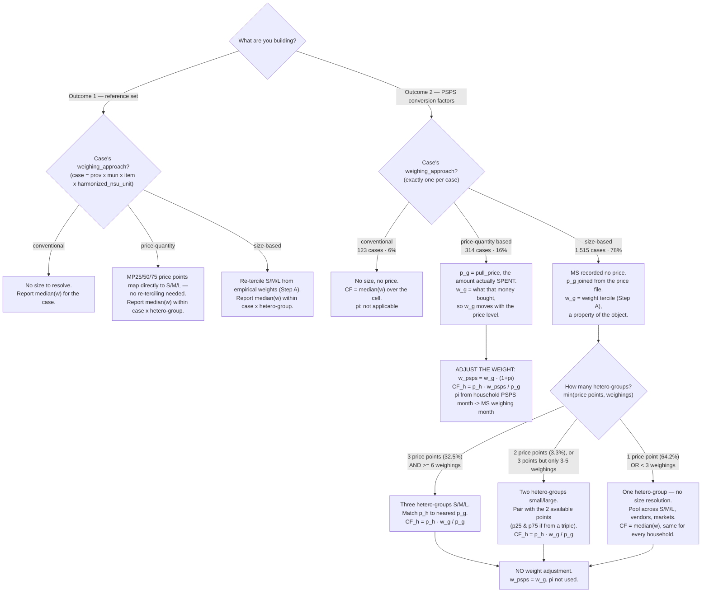
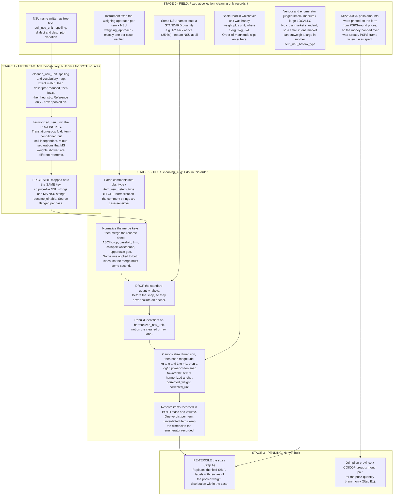

# NSU → Gram Conversion Factors: Methodology

**Purpose.** Convert quantities reported in non-standard units (NSUs) in the PSPS
household panel into grams, using the NSU Market Survey as the measurement source.

**Companion documents.** `docs/data_oddities.md` holds the individual cases, coding
conventions and small exclusions that would otherwise clutter this one — read it
before treating any single-case discrepancy as a bug.
`docs/inflation_adjustment_spec.md` is the build spec for the CPI inputs.
`docs/master_rename.md` documents the NSU vocabulary.

## Two deliverables

**Outcome 1 — reference set for future data collection.** A lookup key with columns

> province | municipality | item | NSU | size | grams per unit

keeping within-item heterogeneity (a row per size, not one averaged scalar). Use
case: a respondent reports 1 mango; the enumerator asks the size (small / medium /
large, e.g. with reference pictures) and logs the answer directly in grams.

**Market type is not in the key.** The reference weight is aggregated *across*
public market, talipapa and roadside vendors, exactly as Step A pools across them.
This is deliberate: the future enumerator using this table asks a respondent what
size they bought, not which market type the respondent's vendor belonged to, so a
market-type-specific row could not be looked up. It also keeps Outcome 1 on the same
grain as the Step A pool, so both come from one collapse rather than two.

**Outcome 2 — conversion factors for PSPS.** For each item-NSU-municipality
observed in PSPS, a grams-per-unit value, so PSPS NSU quantities can be turned
into grams retrospectively.

---

## Decision tree



### The scenarios as a table

All price points are nominal PSPS round throughout, in every scenario.

| # | deliverable | branch | hetero-groups | $`w_g`$ is | $`p_g`$ is | weight adjustment | conversion factor |
|---|---|---|---|---|---|---|---|
| 1 | Outcome 1 | any | as resolved | tercile / point median | *not reported* | none — report as measured | $`w_g`$ itself |
| 2 | Outcome 2 | conventional | 1 | cell median | none | none | $`\text{median}(w)`$ |
| 3 | Outcome 2 | price-quantity | as fielded | weight bought at that point | `pull_price`, the amount spent | $`\times(1+\pi)`$ | $`p_h\,w_g(1{+}\pi)/p_g`$ |
| 4 | Outcome 2 | size-based | 3 | tercile median | price file p25/p50/p75 | none | $`p_h\,w_g/p_g`$ |
| 5 | Outcome 2 | size-based | 2 | median-split median | the 2 available points | none | $`p_h\,w_g/p_g`$ |
| 6 | Outcome 2 | size-based | 1 | pooled cell median | the single median point | none | $`\text{median}(w)`$ |

Scenario 6 is the most common, and it makes rows 2 and 6 the same object: with one
hetero-group, the size-based branch degenerates to what the conventional branch does.

**Inflation is a branch property, not a global
step** — scenario 3 only. **It applies to the weight, never to a price** — every
$`p_g`$ stays PSPS round, so a hetero-group means the same thing in every scenario. And
**the ordinal ladder is not the same observable in every branch**: a weight tercile
on the size-based branch, a given price point on the price-quantity branch.

---

## Harmonization stages: what the field fixed vs what cleaning imposes

Everything above assumes cases are comparable across vendors, markets and
municipalities. They are not, as collected. Four separate harmonizations make them
so, at four different stages, and it matters which is which: a **field** fact is
something we can only record and work around, while a **desk** rule is ours to
change. The order is also load-bearing — the standard-quantity drop must precede the
magnitude snap, and the name merge must follow key normalization.



| stage | harmonizes | from → to | where |
|---|---|---|---|
| 0 field | *nothing* — this is the input | — | the instrument and the enumerator |
| 1 upstream | NSU **names**, MS and price side alike | `pull_nsu_unit` → `cleaned_nsu_unit` → `harmonized_nsu_unit` | `dofiles/diagnose_price_only.py` → `outputs/tables/master_nsu_rename.csv`; see `docs/master_rename.md` |
| 2 desk | the **grain**, then the **unit of measure** | raw MS rows → `corrected_weight` in g or mL, keyed on `harmonized_nsu_unit` | `dofiles/cleaning_Aug11.do` → `dofiles/correct_unit_snap.do` |
| 3 pending | **sizes**, and the price **round** | field S/M/L → weight terciles; nominal PSPS pesos → MS-frame weights | Step A and Step B1 below |

**The size labels are the one field artefact cleaning replaces outright.** Stage 0
recorded S/M/L as a local, per-vendor judgement; Stage 3 discards those labels and
re-derives the sizes from pooled weight. Everything else in Stage 2 repairs a
recording error or a naming inconsistency — this is the only step that overrides a
substantive field judgement, which is why it needs the guidebook citation it gets in
Step A.

**Name harmonization is upstream of everything and shared by both sources.** It is
not part of the Stata cleaning at all: the cleaning run only *joins* a key that was
already built, which is what makes the MS and price files joinable in the first
place. Rebuilding the vocabulary means re-running the upstream script, not editing
the do-file.

---

## Notation

A **case** $`c`$ is a province × municipality × item × NSU combination, where NSU
means **`harmonized_nsu_unit`** — the folded pooling key, not the raw `pull_nsu_unit`
or the spelling-corrected `cleaned_nsu_unit`. Every count in this document is at
that grain; the same tabulation on a different unit column gives different numbers
(1,952 cases harmonized, 1,964 cleaned, 1,992 raw). See *Practical prerequisites*.

**Market survey (MS) side.** A case is resolved into up to three **hetero-groups** — an
*ordinal* ladder from smallest/cheapest to largest/dearest, indexed
$`g \in \{1,2,3\}`$. A hetero-group is not intrinsically a size; which observable realizes
it depends on the weighing approach:

| weighing approach | a hetero-group is | $`w_g`$ | $`p_g`$, and the round it belongs to |
|---|---|---|---|
| size-based | a weight tercile (S / M / L) | tercile median | joined from the price file → **PSPS round** |
| price-quantity | a price point given to the enumerator (MP25/50/75) | weight that money bought | the amount **actually spent** → **MS round** |
| conventional | the whole case | cell median | none |

- $`w_g`$ — grams in one hetero-group-$`g`$ unit
- $`p_g`$ — **PHP per NSU** for a hetero-group-$`g`$ unit. Its round is branch-specific, per
  the table: the *same nominal number* can be an MS-round price in one case and a
  PSPS-round price in another, because the round comes from how the number was used,
  not from the number.
- $`v_g \equiv p_g / w_g`$ — unit value, **PHP per gram**, in whatever round
  $`p_g`$ belongs to

S / M / L are the *values* a hetero-group takes wherever there are three of them — a weight
tercile on the size-based branch, a rank-aligned price point (MP25/50/75) on the
price-quantity branch; $`g`$ is the index everywhere.

**PSPS side**, household $`h`$ in case $`c`$:

- $`q_h`$ — quantity reported, in NSU units
- $`e_h`$ — total paid for that quantity (PHP)
- $`p_h \equiv e_h / q_h`$ — implied price, **PHP per NSU**, always PSPS round
- $`\pi`$ — cumulative price-index change between the household's PSPS interview
  month and the MS weighing month, so $`1+\pi`$ is the factor between the rounds.
  $`\pi`$ is **not a constant**: it is specific to province × COICOP group × month
  pair, and it is negative for some items.

Throughout, **$`p`$ is always PHP per NSU** and **$`v`$ is always PHP per gram** —
never interchangeable. Grams carry no round: they do not inflate.

---

## Conventional NSU (the simple case)

Some NSUs are effectively standard within a locality (gantang, salop, salmon …).
There is no size to resolve: a single weight $`w_c`$ characterizes the unit, so

```math
\widehat{CF}_h = w_c \quad\text{for every household in the case.}
```

---

## The pipeline (size / price-varying NSUs)

### Step A — build the reference from the market survey

Within a case, **pool all weighings** — across market types, vendors, and the
survey's original heterogeneity labels — into one weight distribution. Let $`w`$
be a pooled weighing and let $`Q_{1/3}, Q_{2/3}`$ be the terciles of that
distribution. **Relabel each weighing by its weight tercile:**

```math
\text{hetero-group}(w) = \begin{cases}
S & \text{if } w \le Q_{1/3} \\[4pt]
M & \text{if } Q_{1/3} < w \le Q_{2/3} \\[4pt]
L & \text{if } w > Q_{2/3}
\end{cases}
```

Each hetero-group's representative weight $`w_g`$ is its tercile median. Pairing it with
that hetero-group's price $`p_g`$ gives $`v_g = p_g / w_g`$. Bigger units cost more, so the
prices order $`p_1 \le p_2 \le p_3`$ and the ladder aligns by rank: S↔MP25, M↔MP50,
L↔MP75. **That rank alignment is an assumption, not an observation** — see
assumption 5.

Re-terciling is deliberate: the survey's own S/M/L labels overlap heavily in weight
across vendors, so the sizes are re-derived from the pooled weights rather than
taken from the labels.

**This follows the LSMS guidebook's prescription.** Oseni, Durazo & McGee (2017),
*The Use of Non-Standard Units for the Collection of Food Quantity*, §3 Step 3, p. 16
(`docs/WB-NSU-Guide.pdf`) states the problem in the same terms —

> "the small size of a unit found in market X may be larger than the large version
> collected in market Y. These must be reconciled so that there is a standard
> classification of small, medium, and large within the relevant level of
> geographic aggregation"

— and prescribes the method:

> "classify measurements based on their position in the distribution of
> measurements for that particular item-unit pair. The most basic approach is to
> classify observations that fall below the 33rd percentile as small, between the
> 33rd and 66th percentile as medium, and above the 66th percentile as large."

The same page authorizes the two-size fallback used in the ladder below —

> "the number of sizes must be considered before applying this method. Some units
> may only be found in two relatively uniform sizes, in which case only small and
> large size should be assigned"

— and the choice of the median as the within-hetero-group estimator: *"The mean or median
measurement for each container unit can be used."* The guidebook also recommends
reviewing the reference photos as a verification step; that check has not been done
here and remains available.

#### Branch shares, and why size-based cases have no MS price

A case uses **exactly one** weighing approach. This is a property of the fieldwork,
not an artefact of the harmonization: at the raw and cleaned grains *every* case is
single-branch, with zero exceptions, and it survives splitting the grain further by
`corrected_unit` (grams vs millilitres).

| approach | cases | weighings |
|---|---|---|
| size-based | **1,515 (78%)** | 9,770 (85%) |
| price-quantity | 314 (16%) | 1,220 (11%) |
| conventional | 123 (6%) | 468 (4%) |

The fold introduces exactly one exception, so the table above assigns each case its
modal approach: ILOILO / TIGBAUAN / carrot, where `bilog` (9 size-based weighings)
and `pieces or units` (7 price-quantity weighings) both fold to harmonized
`pieces or units`. It is exported to
`outputs/master_rename_build/tables/fold_multi_weighing_approach.xlsx` and needs a
manual branch assignment — either pick a branch for the pooled case, or keep the two
raw labels apart for this cell.

On the size-based branch the enumerator was asked for a *small / medium / large*
unit and never for a peso amount, so **no price was recorded** — `pull_price` is
empty for those rows by construction. Their $`p_g`$ must be joined from the price
file, where the values are PSPS-round percentiles that were never spent in the MS
round. This is the origin of every frame question below.

#### Which price points exist for a case

The price file does not carry a mp25/mp50/mp75 triple for every case. Point
selection followed the field protocol below, so **the set of available price points
is itself a signal of how thin or how homogeneous the PSPS data was for that cell**:

- **≥3 unique PSPS prices in the municipality** → record p25, p50, p75 — *unless*
  the interquartile range is ≤ ₱40, in which case record only the municipality
  median. (₱20 — the smallest bill and a common coin — was taken as the smallest
  meaningful gap between quartiles; ₱40 is two of those. There is no strong prior
  behind the threshold beyond that.)
- **≤2 unique PSPS prices in the municipality** → record the province median
  alongside the 1–2 municipal prices — *unless* those municipal prices sit within
  ₱20 of the province median, in which case record only the province median.

So a case whose only price point is a municipality or province median is one where
few PSPS respondents used that NSU in that cell, or where the prices they reported
barely varied.

#### Degrading gracefully: how many hetero-groups a case can support

How many hetero-groups we can actually assign depends on two separate limits, and we take
whichever is smaller.

**Limit 1 — how many times the unit was weighed.** You cannot split three weighings
into three sizes. Measured on the size-based cases:

| weighings in the cell | sizes the weights can support | cells |
|---|---|---|
| ≥ 6 | three terciles, S / M / L | 700 (44.6%) |
| 3–5 | two groups, small / large | 493 (31.4%) |
| < 3 | one — no size resolution | 378 (24.1%) |

**Limit 2 — how many price points exist.** A size is only useful if there is a
price to pair it with, so a cell with a single median price supports one hetero-group no
matter how often we weighed it. The four dominant `price_type` combinations map
one-to-one onto the four branches of the field protocol above, which is a useful
confirmation that the protocol description and the file agree:

| `price_type` combination | protocol branch | cases | share |
|---|---|---|---|
| `mp25 + mp50 + mp75` | ≥3 unique prices, IQR > ₱40 | 954 | 32.3% |
| `province median` only | ≤2 unique prices, within ₱20 of province median | 832 | 28.2% |
| `municipality median` only | ≥3 unique prices, IQR ≤ ₱40 | 809 | 27.4% |
| `province median` + `unique_mun_price` | ≤2 unique prices, > ₱20 from province median | 350 | 11.9% |
| quartile triple + an extra point | — | 5 | 0.2% |

Reading that as hetero-groups needs one judgement call. In the fourth row the province
median accompanies the municipal price *because* the municipal evidence is thin, so
it is a **fallback reference, not a second hetero-group** — the two are estimates of the
same central tendency at different geographies, and pairing them as small/large
would be meaningless. Of those 350 cases, 253 have one distinct municipal price
level and 97 have two. So:

| hetero-groups available on price grounds | cases | share |
|---|---|---|
| 3 | 959 | 32.5% |
| 2 | 97 | 3.3% |
| 1 | 1,894 | **64.2%** |

(The alternative reading — every distinct price level is a hetero-group — gives 33.6% / 10.7%
/ 55.6%. Either way the qualitative conclusion is the same.) Tallied by
`dofiles/tally_price_points.py`.

**Limit 2 usually binds, and it binds harder than Limit 1**: about two thirds of
cases collapse to a single hetero-group on price grounds alone (64.2%) against a quarter on
weight grounds (24.1%). The two-group case is genuinely rare — 3.3% — so in practice
a case has either the full three-group ladder or no ladder at all.

They are **marginal, not joint**: the price-side
tally covers all 2,950 price-file cases including the 949 price-only ones with no MS
weighings, so joining the two limits on `harmonized_nsu_unit` to get the real joint
distribution is the first task of the implementation. And **38 of the 350** two-label
cases have their municipal price within ₱20 of the province median, which the stated
protocol would have collapsed to province median only — worth confirming whether
those are exceptions or a different threshold was applied.

**When a case collapses to one hetero-group** the sizes are not separated at all: pool every
size-based weighing in the cell across vendors, market types **and** the original
S / M / L labels, take the median of that single pooled distribution, and map it to
the one available price point. Every household in the cell gets that one number
regardless of what it paid. Note what this is *not*: it is not "the small one" or
"the medium one" — it is the middle of the whole pooled distribution, the same
object the conventional-NSU branch produces,
$`\widehat{CF} = \text{median}(w)`$.

### Step B — apply to a PSPS household

**B1. Put the measured weight in PSPS terms.** Only one branch needs this. On the
price-quantity branch $`w_g`$ is "what a fixed peso amount bought at MS-round
prices", so it moves with the price level. On the size-based branch $`w_g`$ is a
property of the object (a medium mango), so it does not:

```math
w_g^{\text{PSPS}} =
\begin{cases}
w_g \,(1+\pi) & \text{price-quantity branch} \\[4pt]
w_g           & \text{size-based and conventional branches}
\end{cases}
```

**Reading the superscript.** $`w_g^{\text{PSPS}}`$ means "evaluated at PSPS-round
prices", **not** "observed in PSPS". PSPS weighed nothing: every gram figure in this
document is a market-survey measurement. On the price-quantity branch
$`w_g^{\text{PSPS}}`$ is a counterfactual — the grams the same peso amount would have
commanded at PSPS-time prices — and on the other two branches it equals the measured
$`w_g`$ unchanged, because grams there are a property of the object and carry no
price round at all.

Every $`p_g`$ then stays at its nominal PSPS-round value, so a given hetero-group means the
same thing in every case.

**B2. Match** the household to a hetero-group by price. Both sides are PSPS round:

```math
g(h) = \text{arg\,min}_{g} \; \lvert\, p_h - p_g \,\rvert
```

**B3. Convert** to grams:

```math
\widehat{CF}_h = p_h \cdot \frac{w_{g(h)}^{\text{PSPS}}}{p_{g(h)}}
\qquad\Longrightarrow\qquad
\widehat g_h = q_h \cdot \widehat{CF}_h
```

$`\widehat{CF}_h`$ is grams in one NSU unit; $`\widehat g_h`$ is the household's
total grams.

**Same units as $`w_g`$, different unit referent.** Since $`p_h`$ and $`p_g`$ are
both PHP per NSU, the ratio $`p_h/p_g`$ is dimensionless, so $`\widehat{CF}_h`$ and
$`w_g`$ are both **grams per NSU unit**. What differs is *whose* unit: $`w_g`$ is
grams in the hetero-group's unit as weighed at the market, while $`\widehat{CF}_h`$ is grams
in the household's unit, inferred from what it paid. Equivalently, in terms of the
unit value $`v_g = p_g/w_g`$:

```math
\widehat{CF}_h = p_h \,/\, v_{g(h)}
```

PHP per unit divided by PHP per gram gives grams per unit. Read this way the hetero-group
contributes a *rate* ($`v_g`$, its price per gram) rather than a level, and $`w_g`$
enters only through that rate.

**Consistency check.** If $`p_h = p_{g(h)}`$ then
$`\widehat{CF}_h = w_{g(h)}^{\text{PSPS}}`$ — a household paying exactly a hetero-group's
price is assigned exactly that hetero-group's weight.

#### Why the adjustment sits on the weight

Adjusting the weight up by $`(1+\pi)`$ and deflating the price by $`(1+\pi)`$ are
the same operation: $`p_h\,w_g(1+\pi)/p_g = p_h\,w_g/\bigl(p_g/(1+\pi)\bigr)`$.
Putting it on the weight is a bookkeeping choice with two benefits — every price in
the system stays PSPS round (so no column needs a frame label, and no two rows can
be silently compared across frames), and $`\pi`$ touches exactly one column on 16%
of rows, which is easy to audit and easy to switch off for a robustness check.

Two ways to get this wrong:

- **Adjusting the size-based price points.** They look like prices "used at market
  survey time", but no money changes hands in a size-based interview — the value is
  a PSPS statistic joined on afterwards. Deflating it inflates $`\widehat{CF}`$ by
  $`(1+\pi)`$ *and* corrupts the match: with hetero-groups at ₱6/₱10/₱16 deflated to
  ₱3/₱5/₱8, a household paying ₱10 is nearest ₱8 and matches hetero-group 3 instead of hetero-group
  2. Every household shifts systematically up the ladder.
- **Adjusting one side of a comparison but not the other.** If prices are moved into
  MS terms, $`p_h`$ must be too. A household-level $`\pi`$ on one side and a
  cell-level $`\pi`$ on the other leaves a residue that is pure artefact.

#### Why $`\pi`$ cannot just be set to zero

The simplest thing to do about inflation is nothing, and that would be defensible if
$`\pi`$ were small and roughly the same everywhere. It would then wash out of the
hetero-group matching in B2 and only rescale the conversion factors by a constant. So the
question is whether that holds here. It does not, and the data say so in three
separate ways.

All figures below are measured on the PSA province × COICOP food CPI over the anchor
pair PSPS 2024m5 → MS 2026m4, by `dofiles/plot_cpi_inflation.py`, which also writes
the two figures shown here.


*$`\pi`$ by province × COICOP group, PSPS 2024m5 → MS 2026m4. Read the columns for
cross-province disagreement within a group and the right-hand panel for how much the
estimate depends on the anchor month.*

**It is not small.** The median correction across province × group is **+7.4%**, and
the correction runs from **−18.1% to +58.1%**. For scale, field weights are recorded
to the whole gram, so on a 200 g unit the median correction is around 15 g against a
rounding error of 1 g. This is not a second-order term.

**It is not one number, so no scalar can stand in for it.** Six of the sixteen
groups moved the other way over this window: rice −6.8%, fresh meat −4.0%, other
meat −2.9%, sugar −2.4%, ice cream −1.9%, and water at about zero. Signs also flip
*within* a group across provinces, most sharply for leafy vegetables, which fell
9.4% in Iloilo and rose 58.1% in Antique. Applying a single average correction would
therefore be worse than applying none for every item that moved against it. This is
also why "deflating" is the wrong word for what B1 does: a third of the groups need
adjusting in the opposite direction.

**Setting it to zero is not the neutral choice.** Because the sign is known per
province × group, dropping the adjustment does not introduce noise that averages out
across households. It biases every price-quantity household in a cell in one
direction, and the direction differs by item: rice conversion factors would come out
systematically too high, Antique leafy vegetables systematically too low. A
known-sign bias is harder to live with than a variance cost, which is the argument
for carrying $`\pi`$ even though it only touches 16% of rows.

One further reason not to shortcut the join. PSPS fielding ran 2023m12–2025m1 and is
bimodal and province-dependent, with Aklan appearing only in the early wave and
Negros Occidental only in the late one, so there is no single "PSPS round" month to
anchor on. Moving the anchor across its plausible range shifts $`\pi`$ by 15.6 pp
for other vegetables, 10.5 pp for tubers and 9.3 pp for fruits. A cell-level proxy
date would introduce an error of the same order as the adjustment itself, so use the
household's own interview month. It is available on the PSPS side.


*Index paths by group, each province a grey line and the cross-province median in
blue, indexed to 2023m12 = 100. The grey band is the PSPS fieldwork window and the
blue band the market survey. The width of the grey band is the problem the paragraph
above describes: any single anchor month inside it is a choice, and for the volatile
vegetable groups the paths move enough across that band to matter.*

**What is not yet measured.** All of the above says $`\pi`$ changes the *level* of a
conversion factor. It does not establish how often $`\pi`$ is large enough to move a
household across a hetero-group boundary in B2 and change *which* weight it is assigned,
which is the more consequential failure. That depends on the tercile spacing within
each case, which only exists once Step A has run. Check it then: compare the
distribution of $`\pi`$ against the within-case gaps between $`p_g`$ values, and
report how many households switch hetero-groups when the adjustment is switched off.

The index is sound for ratio use: fixed-base levels (83–308, median 137 at 2023m12
rising to 148 at 2026m1) with no base break at the 2026 boundary (median m/m change
+1.3% there vs +0.0% elsewhere). Coverage is complete for all 5 provinces × 16
groups, because the `cons_name → item_group` crosswalk is province-specific by
design: ice cream maps to `01.1.8.6` everywhere except Iloilo, which carries only
the parent `01.1.8`. No fallback ladder is needed.

**Exposure is confined to 16% of cases.** Because $`\pi`$ enters only on the
price-quantity branch, the 78% size-based and 6% conventional cases are
arithmetically immune to CPI mismeasurement — worth knowing given the spread above.

---

## Assumptions to keep visible

Each is tagged with the branch it binds on. **The two load-bearing ones are 2 and 3,
and they are mirror images** — the price-quantity branch assumes the *price* schedule
moved only with the index; the size-based branch assumes the *quantity* schedule did
not move at all. Neither branch is assumption-free, and they do not lean on the same
thing.

1. **Single price schedule within a case.** *(all branches)* Households in a case
   face the same price-per-gram schedule, so a higher PHP-per-gram means a bigger
   unit, not a different deal. Bargaining, quality and vendor differences violate
   it; within a matched hetero-group, any price variation that is *not* size passes
   proportionally into $`\widehat g_h`$.

   The LSMS guidebook names this as the known weakness of price-based conversion and
   its reason for preferring direct weighing (Oseni, Durazo & McGee 2017, §1.2,
   p. 3): *"unit prices can vary because of factors unrelated to the actual mass or
   volume of an item… quality differences… price discounts on larger units."* Step A
   does weigh directly, as recommended, but Step B reintroduces price as the
   *matching* variable, so the caution applies to the hetero-group assignment. The
   quantity-discount point is why the method keeps a separate $`v_g`$ per hetero-group
   rather than one case-level scalar.

2. **Real price per gram moved only with the index.** *(price-quantity branch —
   load-bearing)* This licenses $`w_g^{\text{PSPS}} = w_g(1+\pi)`$: the only reason a
   fixed peso amount buys less now is general inflation for that item, not a change
   in its real price. Since $`\pi`$ comes from a province × COICOP-group index, the
   assumption is *within-group* — no differential real price change between, say,
   cabbage and other leafy vegetables.

3. **Unit size stable between rounds.** *(size-based branch — load-bearing)* This
   licenses $`w_g^{\text{PSPS}} = w_g`$: a "medium" unit is assumed to have been the
   same physical size in both rounds, so an MS-measured weight can be paired with a
   PSPS-round price. Shrinkflation — vendors holding the peso price and reducing the
   unit — violates it and would make size-based weights too small. No price
   adjustment can repair this; it needs a size-comparability check against the
   reference photos, which the guidebook recommends and which has not been done.

4. **Rank alignment of the two ladders.** *(size-based branch)* Pairing the $`k`$-th
   weight tercile with the $`k`$-th price percentile assumes households who paid
   least bought the lightest units. Nothing in the data establishes it: the two
   distributions come from different rounds and different respondents, and only rank
   order links them. Where size and price are weakly related (assumption 1), the
   pairing misassigns *systematically*, not noisily. Does **not** apply to the
   price-quantity branch, where $`w_g`$ and $`p_g`$ were observed in the same
   transaction.

5. **Terciles are the right cut.** *(size-based branch)* Bottom / middle / top thirds
   is a convention; if transactions concentrate in one size the cut misallocates the
   tails. Worth a robustness check against alternative cuts or a modal-size rule.

6. **Conventional units are standard within a locality.** *(conventional branch)*
   They may still vary *across* municipalities, which is testable wherever the MS
   weighed the same unit in several of them.

## Warning for downstream use

**Measurement error in $`p_h`$ propagates into grams.** $`p_h = e_h / q_h`$ is a
derived unit value: misreporting $`e_h`$ or $`q_h`$ feeds into $`p_h`$, which can
flip the household across a size boundary in B2 and scales $`\widehat g_h`$
proportionally in B3.

## Practical prerequisites

- **Unit-name harmonization.** Already done, upstream of everything here —
  `harmonized_nsu_unit` in `master_nsu_rename.csv` is the pooling key, and the price
  side is mapped onto it too. Pool on it, never on the raw or cleaned label. See
  *Harmonization stages* above and `docs/master_rename.md`.
- **Multiple vendors.** Vendor-level weights within a case are aggregated with a
  robust estimator (median, or a light fixed-trim mean); the Step A pooling already
  dilutes single-vendor outliers.
- **Join the two hetero-group limits.** The weighing-count and price-point tallies in
  *Degrading gracefully* are marginal. Joining them on `harmonized_nsu_unit` gives
  the real joint distribution and is the first implementation task.
