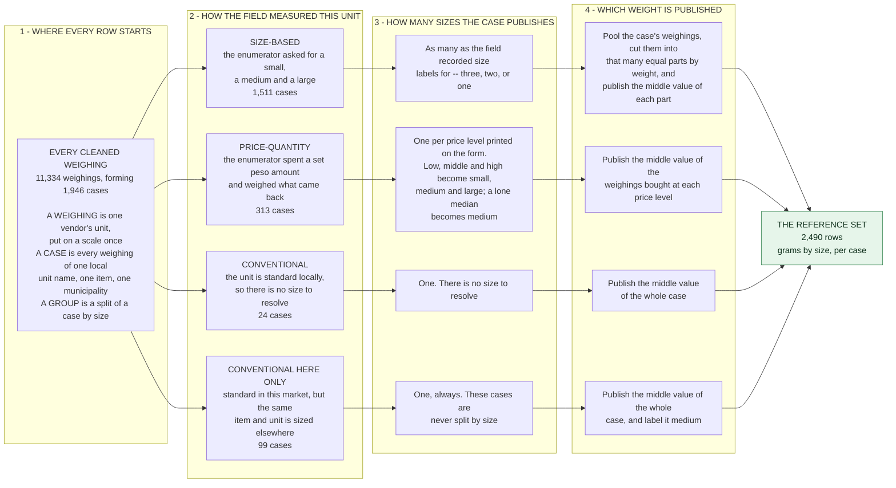

# NSU → Gram Conversion Factors: Methodology

**What this does.** Quantities in the PSPS household panel are reported in non-standard
units — a *bilog*, a *tumpok*, a *bugkos*. This pipeline turns them into grams, using the
NSU Market Survey (MS) as the measurement source.

**What it produces.** Two deliverables, built from the same weighings and **not derivable
from each other**. Outcome 1 records what a named local unit weighs, by size. Outcome 2
converts a household's reported quantity into grams.

**How to read this.** *Terms* first — the vocabulary is unavoidable and every term is
defined once, there. After that the document runs in build order: shared cleaning, then
Outcome 1, then Outcome 2, matching `dofiles/00_shared/`, `dofiles/10_reference_set/` and
`dofiles/20_psps_retrofitting/`. **The main body describes what happens to the majority of
cases. Every exception, carve-out and known defect is in an appendix**, linked from the
step it belongs to.

**Every count states its universe and its unit of observation.** They differ between
sections — 11,334 weighings, 1,946 cases, 2,490 published reference rows and 87,959
household rows are four different things, and a figure quoted at the wrong grain is the
most common error this document has had to correct.

**Figures are from the build of 16 September 2026** and move with every rebuild.
`dofiles/90_diagnostics/verify_documented_claims.py` re-derives the ones no build file
produces and fails if any has moved; the rest are one tabulation on a published file.
Recompute rather than cite.

**Companion documents.**

| document | holds |
| :-- | :-- |
| `../README.md` | folder layout, what feeds what, how to run it |
| `dofiles/README.md` | the authoritative step-by-step run order |
| `implicit_assumptions.md` | every hard-coded threshold and tie rule (`A1`…`A21`), and what each claims about the data |
| `data_dictionary.md` | every published column |
| `data_oddities.md` | individual odd cases and small exclusions |
| `master_rename.md` | the NSU vocabulary and the fold rule |
| `inflation_adjustment_spec.md` | the CPI build spec |
| `attrition_ledger.md` | where every row that does not reach a deliverable went |

---

## Terms

**Field terms** — standard terminology, not coined here.

- **NSU** (non-standard unit) — a local unit of sale with no fixed size: a *bilog*, a
  *tumpok*. The object this project exists to measure.
- **COICOP** — the international consumption classification. The CPI is published on it,
  so the inflation join runs through a COICOP group.
- **Tercile** — a cut of a distribution into three equal parts. The basis for
  small / medium / large.
- **Single-linkage merge** — a chain rule: values within a tolerance of *any* member of a
  group join that group, so a chain of near-equal values collapses to one.
- **Winsorize** — replace extreme values with a bound rather than dropping them.

**Project vocabulary** — coined here, used throughout, and each has exactly one meaning.

- **Case** — the pooling unit: **province × municipality × item × harmonized NSU unit ×
  corrected unit**. 1,946 of them over 11,334 restated weighings. Nearly every count below
  is at this grain or a published row derived from it.
- **Weighing** — one MS observation: one vendor, one market visit, one scale reading.
- **Hetero-group** (heterogeneity group) — a within-case division, indexed
  $`g \in \{1,2,3\}`$, ordered smallest/cheapest to largest/dearest. **What realizes it
  differs by branch** — a weight tercile where sizes were recorded, a price point where
  prices were. Never assume it means "size".
- **Branch** — how a weighing is *processed*: `size-based`, `price-quantity`, or
  `conventional`. Equals `weighing_approach` except for 99 reclassified cases (Appendix
  A.6). **Use `branch` for what the build does, `weighing_approach` for what the field
  did**; they are not interchangeable.
- **Rung** — one step of a fallback ladder, `fallback_level` 0–3.
- **Thin** — fewer than `THIN = 3` weighings behind a published value. Flagged as
  `d_thin`. **Flagged, never substituted** (Appendix A.7).
- **Block reading** — the weight the enumerator typed, restated in canonical units, with
  the kg/g/L tick not taken literally. `w_block`.
- **Anchor snap** — the alternative reading: the weight moved a whole number of decades
  toward its pool's median. Retained, but decides almost nothing (Appendix A.3).

**Symbols.** $`p`$ is **always PHP per NSU**; $`v`$ is **always PHP per gram**. They are
never interchangeable. Grams carry no price round — they do not inflate.

| symbol | is | round |
| :-- | :-- | :-- |
| $`w_g`$ | grams in one hetero-group-$`g`$ unit, as weighed | MS |
| $`p_g`$ | PHP per NSU for that unit | **PSPS, on every branch** |
| $`v_g \equiv p_g/w_g`$ | PHP per gram | PSPS |
| $`q_h`$ | quantity the household reported, in NSU units | — |
| $`e_h`$ | what the household paid for it | PSPS |
| $`p_h \equiv e_h/q_h`$ | the household's implied price per NSU | PSPS |
| $`\pi`$ | price-index change between the household's interview month and the MS weighing month, per province × COICOP group. **Not a constant, and negative for some items** | — |
| $`\widehat{CF}_h`$ | grams in *the household's* unit, inferred from what it paid | — |
| $`\widehat g_h = q_h \widehat{CF}_h`$ | the household's total grams | — |

---

## The two deliverables

| | **Outcome 1** — reference set | **Outcome 2** — PSPS conversion |
| :-- | :-- | :-- |
| answers | what does a named local unit weigh here? | how many grams did this household consume? |
| file | `nsu_reference_set.dta` / `.xlsx` | `psps_grams.dta` / `.csv`, via `outcome2_lookup.dta` |
| unit of observation | case × published size | household × item × acquisition slot |
| rows | **2,490** over 1,919 cells | **87,959** household rows, from a 3,638-row lookup |
| key | province, municipality, item, NSU, size | `hhid` + `psps_item_code` + `slot` |
| answer column | `grams` | `grams_h` |
| how many groups a case gets | the **field size-labels** present | the **price file's point structure** |
| borrows from other cells | **no** — a cell never visited is absent | **yes** — a 3-rung fallback ladder |

**They cannot be derived from one another, and that is the design.** The same case can
yield three sizes in Outcome 1 and one weight in Outcome 2 — all three labels recorded in
the field, but only a municipal median priced. Neither counts weighings to decide.

**Outcome 2 is a case-level table that yields household-level answers.** The household
variation arrives at lookup time: a household's own $`p_h`$ enters the division, so two
households in the same case can receive different conversion factors from the same row.
Read the `PHP per gram` column as an exchange rate — a household that spent $`p_h`$ per
NSU is assigned $`p_h / v_g`$ grams per NSU.

**Market type is not in either key.** Weights are pooled across public market, talipapa
and roadside vendors. A future enumerator asks a respondent what size they bought, not
which market type their vendor belonged to, so a market-type row could not be looked up.

### How a weight is obtained, end to end

Read left to right. Each **column** asks one question, named in the band across the top of
it. Each **row** is one kind of case, and follows the same four questions to the weight it
ends up publishing. **Click any box to jump to the section that explains it.**

The four kinds of case in column 2 are set by how the field measured that unit, and they do
not overlap: 1,511 + 313 + 24 + 99 = 1,946 cases, plus one case that was measured two ways.

**Outcome 1 — the reference set.**



**Outcome 2 — household grams.** Columns 2 to 4 ask the same three questions of the same
case, and answer them differently, because the groups are decided by the prices on file
rather than by the field's size labels.

```mermaid
flowchart LR
    classDef out fill:#e6f5ea,stroke:#3d8a58,color:#10301c
    classDef alt fill:#fbeee6,stroke:#b9762c,color:#3d2a11

    subgraph T0["1 - WHERE EVERY ROW STARTS"]
        direction TB
        P["EVERY PSPS FOOD CONSUMPTION ROW<br/>87,959 rows -- one per household,<br/>item, and way it was acquired"]
        SU["IT REPORTS A STANDARD UNIT<br/>kilos, litres, a stated container size,<br/>or a gantang of rice. The name already<br/>gives the size, so no market survey<br/>is needed<br/>52,489 rows -- 60 percent"]:::alt
        Y["IT REPORTS A LOCAL UNIT<br/>35,448 rows. These need a conversion<br/>factor, built from the 11,334<br/>market-survey weighings that form<br/>1,946 cases"]
        P --> SU
        P --> Y
    end

    subgraph T1["2 - HOW THE FIELD MEASURED THIS UNIT"]
        direction TB
        E["SIZE-BASED<br/>1,511 cases"]
        F["PRICE-QUANTITY<br/>313 cases"]
        G["CONVENTIONAL<br/>24 cases"]
        H["CONVENTIONAL HERE ONLY<br/>99 cases"]
    end

    subgraph T2["3 - HOW MANY PRICE GROUPS THE CASE SUPPORTS"]
        direction TB
        E2["As many price levels as have a weighing<br/>behind them -- one, two or three.<br/>Prices within 20 pesos of each other<br/>are treated as one level"]
        F2["One per distinct peso amount the<br/>enumerator was sent to spend.<br/>Amounts are never merged: the<br/>money bought a specific quantity"]
        G2["One"]
        H2["One, always"]
    end

    subgraph T3["4 - WHICH WEIGHT STANDS BEHIND EACH GROUP"]
        direction TB
        E3["Pool the case's weighings and cut them<br/>into that many parts, lightest part to<br/>the cheapest price level.<br/>No inflation adjustment"]
        F3["The weight that peso amount actually<br/>bought, scaled for price change between<br/>the market survey and the household's<br/>own interview month"]
        G3["The middle value of the whole case"]
        H3["The middle value of the whole case"]
    end

    subgraph T4["5 - TURNING THAT INTO ONE HOUSEHOLD'S GRAMS"]
        direction TB
        M1["MATCH the household to the price<br/>level nearest what it actually paid<br/>28,889 rows"]
        M2["DIVIDE what it paid per unit by the<br/>group's pesos-per-gram. Paying more<br/>than the group's price yields<br/>proportionally more grams"]
        M3["CAP the stretch at five times, up or<br/>down, and flag every row it binds on<br/>1,418 rows"]
        FB["IF THE CASE HAS NO WEIGHT AT ALL,<br/>borrow one: first the same case pooled,<br/>then the province, then the region.<br/>The household's own price is then not<br/>used. 6,004 borrowed, 555 refused"]:::alt
        M1 --> M2 --> M3
        FB --> M3
    end

    OUT2["HOUSEHOLD GRAMS<br/>87,959 rows<br/>one per household, item and<br/>way it was acquired"]:::out

    Y --> E --> E2 --> E3 --> M1
    Y --> F --> F2 --> F3 --> M1
    Y --> G --> G2 --> G3 --> M1
    Y --> H --> H2 --> H3 --> M1
    Y --> FB
    M3 --> OUT2
    SU --> OUT2

    click P "https://github.com/Shineyang03/nsu-market-survey-cleaning/blob/main/docs/conversion_factor_methodology.md#31-the-household-side" "3.1 The household side"
    click SU "https://github.com/Shineyang03/nsu-market-survey-cleaning/blob/main/docs/conversion_factor_methodology.md#32-standard-units-the-60-that-never-touches-the-market-survey" "3.2 Standard units"
    click Y "https://github.com/Shineyang03/nsu-market-survey-cleaning/blob/main/docs/conversion_factor_methodology.md#stage-1--shared-cleaning-from-a-raw-weighing-to-a-clean-weight" "Stage 1 - shared cleaning"
    click E "https://github.com/Shineyang03/nsu-market-survey-cleaning/blob/main/docs/conversion_factor_methodology.md#34-the-three-branches" "3.3 The three branches"
    click F "https://github.com/Shineyang03/nsu-market-survey-cleaning/blob/main/docs/conversion_factor_methodology.md#34-the-three-branches" "3.3 The three branches"
    click G "https://github.com/Shineyang03/nsu-market-survey-cleaning/blob/main/docs/conversion_factor_methodology.md#34-the-three-branches" "3.3 The three branches"
    click H "https://github.com/Shineyang03/nsu-market-survey-cleaning/blob/main/docs/conversion_factor_methodology.md#a6-cases-conventional-in-one-market-and-sized-in-another" "Appendix A.6 - the 99 reclassified cases"
    click E2 "https://github.com/Shineyang03/nsu-market-survey-cleaning/blob/main/docs/conversion_factor_methodology.md#33-the-price-ladder" "3.2 The price ladder"
    click F2 "https://github.com/Shineyang03/nsu-market-survey-cleaning/blob/main/docs/conversion_factor_methodology.md#34-the-three-branches" "3.3 The three branches"
    click G2 "https://github.com/Shineyang03/nsu-market-survey-cleaning/blob/main/docs/conversion_factor_methodology.md#34-the-three-branches" "3.3 The three branches"
    click H2 "https://github.com/Shineyang03/nsu-market-survey-cleaning/blob/main/docs/conversion_factor_methodology.md#a6-cases-conventional-in-one-market-and-sized-in-another" "Appendix A.6 - the 99 reclassified cases"
    click E3 "https://github.com/Shineyang03/nsu-market-survey-cleaning/blob/main/docs/conversion_factor_methodology.md#34-the-three-branches" "3.3 The three branches"
    click F3 "https://github.com/Shineyang03/nsu-market-survey-cleaning/blob/main/docs/conversion_factor_methodology.md#35-inflation" "3.4 Inflation"
    click G3 "https://github.com/Shineyang03/nsu-market-survey-cleaning/blob/main/docs/conversion_factor_methodology.md#34-the-three-branches" "3.3 The three branches"
    click H3 "https://github.com/Shineyang03/nsu-market-survey-cleaning/blob/main/docs/conversion_factor_methodology.md#a6-cases-conventional-in-one-market-and-sized-in-another" "Appendix A.6 - the 99 reclassified cases"
    click M1 "https://github.com/Shineyang03/nsu-market-survey-cleaning/blob/main/docs/conversion_factor_methodology.md#38-the-household-join" "3.7 The household join"
    click M2 "https://github.com/Shineyang03/nsu-market-survey-cleaning/blob/main/docs/conversion_factor_methodology.md#38-the-household-join" "3.7 The household join"
    click M3 "https://github.com/Shineyang03/nsu-market-survey-cleaning/blob/main/docs/conversion_factor_methodology.md#39-the-cap" "3.8 The cap"
    click FB "https://github.com/Shineyang03/nsu-market-survey-cleaning/blob/main/docs/conversion_factor_methodology.md#37-the-fallback-ladder" "3.6 The fallback ladder"
    click OUT2 "https://github.com/Shineyang03/nsu-market-survey-cleaning/blob/main/docs/conversion_factor_methodology.md#310-the-single-deliverable" "3.9 The single deliverable"
```



**Four things the two diagrams make visible.**

- **Column 2 is identical in both, and column 3 is not.** The same case, measured the same
  way, is split into groups on different evidence — the field's size labels for the
  reference set, the prices on file for household grams. **Neither counts weighings.** That
  is why one case can publish three sizes in the reference set and rest on a single weight
  for households.
- **Inflation touches one row of one diagram.** Only the price-quantity row of Outcome 2
  carries it, and it is applied to the weight, never to a price — so every price in the
  system stays on the household's own footing.
- **A "group" is a different thing in every row.** A third of a weight distribution, a
  price level, or the whole case. Never read it as "size".
- **Only Outcome 2 can borrow, and it borrows because a case has no weight at all — never
  because it has few.** The reference set has no such path: it stops where the measurements
  stop, so a place the market survey never visited is simply absent from it.

Two details the diagrams cannot hold. Where a case's only price is a **province-wide
median**, every municipality in that province receives the same weight and the same price,
but each still gets its own output row — the province median is a property of the price,
never of the output key. And a price level recorded **because it was unusually far from the
others** is dropped from the cut entirely, so it gets no weight even when it sits between
two surviving levels, and a household matching it is refused rather than converted
([Appendix C.2](#c2-the-unique_mun_price-refusal)).

---

# Stage 1 — shared cleaning: from a raw weighing to a clean weight

Everything here runs before both outcomes. It turns a raw survey row into one clean,
inflation-framed weight per weighing, on a pooling key that is comparable across vendors,
markets and municipalities.

*Built by `dofiles/00_shared/`.*

**Universe at the end of this stage: 11,334 weighings over 1,946 cases.**

## What the field fixed, and what cleaning can change

Column 1 is **fixed at collection** — cleaning can only record it and work around it.
Column 2 is **ours to change**. **Click any box to jump to the section that explains it.**

```mermaid
flowchart LR
    classDef out fill:#e6f5ea,stroke:#3d8a58,color:#10301c

    subgraph P1["1 - WHAT THE ENUMERATOR WROTE DOWN, AND CANNOT BE UNDONE"]
        direction TB
        N1["WHAT CLEANING ACTS ON<br/> <br/>A LOCAL UNIT NAME, as free text, so spelling,<br/>dialect and added descriptions vary by market<br/> <br/>A NUMBER, AND A TICK saying whether it is<br/>kilograms, grams or litres. The two can<br/>contradict each other<br/> <br/>SOMETIMES A NAME THAT ALREADY STATES A<br/>QUANTITY, such as half a sack of rice, 25kg<br/>-- not a local unit at all"]
        N4["WHAT PASSES STRAIGHT THROUGH<br/> <br/>A SIZE JUDGEMENT of small, medium or large,<br/>made against that one market, so a small in<br/>one place can outweigh a large in another<br/> <br/>SOMETIMES A PESO AMOUNT printed on the<br/>form, which the enumerator handed over<br/>before weighing whatever came back"]
    end

    subgraph P2["2 - WHAT CLEANING DOES, IN THIS ORDER"]
        direction TB
        S1["READ THE NUMBER AS TYPED<br/>Convert kilograms to grams and litres to<br/>millilitres, and repair misplaced decimal points"]
        S2["GIVE EVERY SPELLING OF A UNIT ONE NAME<br/>so the same unit pools across markets, and the<br/>price file and the weighings can be joined"]
        S3["REMOVE LABELS THAT ARE NOT LOCAL UNITS<br/>before anything is pooled, so a stated standard<br/>quantity never contaminates a group of weighings"]
        S4["SETTLE THE MAGNITUDE<br/>Publish the number as typed unless it cannot be a<br/>real reading for that item. 99.8 percent are<br/>published exactly as typed"]
        S5["APPLY HAND DECISIONS, AND SETTLE WHETHER<br/>A CASE IS IN GRAMS OR MILLILITRES<br/>where different vendors recorded it both ways"]
        S6["DROP WEIGHINGS WHOSE PRICE WAS NOT THE<br/>ONE HANDED OVER -- 99 of them, the only<br/>place in the pipeline they are removed"]
        S1 --> S2 --> S3 --> S4 --> S5 --> S6
    end

    subgraph P3["3 - WHAT BOTH OUTCOMES THEN READ"]
        direction TB
        W["ONE CLEAN WEIGHT PER WEIGHING<br/>11,334 weighings, forming 1,946 cases<br/> <br/>Each carries how the field measured it,<br/>whether it is grams or millilitres, and how<br/>much of the evidence behind it was questioned"]:::out
    end

    N1 --> S1
    N4 --> W
    S6 --> W

    click N1 "https://github.com/Shineyang03/nsu-market-survey-cleaning/blob/main/docs/conversion_factor_methodology.md#11-names-one-vocabulary-built-once-for-both-sources" "1.1 Names"
    click N4 "https://github.com/Shineyang03/nsu-market-survey-cleaning/blob/main/docs/conversion_factor_methodology.md#21-the-decision-re-tercile-do-not-trust-the-field-label" "2.1 Why the sizes are re-cut"
    click S1 "https://github.com/Shineyang03/nsu-market-survey-cleaning/blob/main/docs/conversion_factor_methodology.md#12-the-weight-dimension-then-magnitude" "1.2 The weight"
    click S2 "https://github.com/Shineyang03/nsu-market-survey-cleaning/blob/main/docs/conversion_factor_methodology.md#11-names-one-vocabulary-built-once-for-both-sources" "1.1 Names"
    click S3 "https://github.com/Shineyang03/nsu-market-survey-cleaning/blob/main/docs/conversion_factor_methodology.md#a1-non-nsu-labels-removed-before-anything-pools" "Appendix A.1"
    click S4 "https://github.com/Shineyang03/nsu-market-survey-cleaning/blob/main/docs/conversion_factor_methodology.md#12-the-weight-dimension-then-magnitude" "1.2 The weight"
    click S5 "https://github.com/Shineyang03/nsu-market-survey-cleaning/blob/main/docs/conversion_factor_methodology.md#13-dimension-grams-or-millilitres" "1.3 Grams or millilitres"
    click S6 "https://github.com/Shineyang03/nsu-market-survey-cleaning/blob/main/docs/conversion_factor_methodology.md#14-attrition-and-how-each-case-is-routed" "1.4 Attrition and routing"
    click W "https://github.com/Shineyang03/nsu-market-survey-cleaning/blob/main/docs/conversion_factor_methodology.md#14-attrition-and-how-each-case-is-routed" "1.4 Attrition and routing"
```



**Two of the five field inputs pass straight through, and one of them is later
overruled.** The peso amount and the size judgement are not cleaned at all — they are
carried into the two outcomes as recorded. The **size judgement is then discarded and
re-derived from the weights** in the reference set, which is the one substantive field
judgement this pipeline overrides; everything in column 2 repairs a recording error or a
naming inconsistency instead.

**The order in column 2 is load-bearing, not presentational.** Reading the number as typed
must come before the units are renamed, or the evidence used to test whether two spellings
mean the same thing would already have been nudged toward agreeing. Removing the non-unit
labels must come before the magnitude is settled, or a stated standard quantity sits in the
pool of neighbours the magnitude is judged against.

## 1.1 Names: one vocabulary, built once for both sources

**Decision: pool on `harmonized_nsu_unit`, never on the raw or cleaned label.**

Name harmonization is upstream of the Stata build entirely — `01_build_crosswalk.py`
writes `master_nsu_rename.csv` and the cleaning run only *joins* it. That is what makes
the MS file and the price file joinable at all. Rebuilding the vocabulary means re-running
the upstream script, not editing a do-file.

Three layers, doing three different jobs:

| column | is | use it for |
| :-- | :-- | :-- |
| `pull_nsu_unit` | what the enumerator wrote | reading the field record |
| `cleaned_nsu_unit` | spelling and vocabulary repair | reference only — **never pool on it** |
| `harmonized_nsu_unit` | the translation-group fold | **the pooling key** |

*Universe: 11,334 restated weighings.* 112 distinct raw labels collapse to 56 cleaned and
**54 harmonized**. At the case grain that is 1,985 raw → 1,957 cleaned → **1,943
harmonized** four-column cases; adding `corrected_unit` gives the 1,946 cases this
document counts on.

**Harmonization costs no uniqueness.** Province × municipality × item × unit × market type
× vendor × hetero-type identifies a row exactly on both the raw and the harmonized label —
11,334 rows, 11,334 groups either way. Multiple vendors across market slots are what make
a *case* non-unique, not the fold.

> **`uuid` is not a safe key.** It is `item_unit_MUNICIPALITY` with **no province**, and
> two municipality names recur across provinces — PONTEVEDRA (Capiz and Negros Occidental)
> and SAN ENRIQUE (Iloilo and Negros Occidental) — making 33 price-file uuids ambiguous.
> Joining on it silently merges two provinces' prices.

### String normalization

Every join in this project matches on text, and **any re-implementation that differs by a
character silently breaks a join**. The rule, in order: drop non-ASCII outright; case-fold
(lower for item and NSU, UPPER for geography); trim; collapse internal whitespace.

> **Do not Unicode-normalize first.** `DUEÑAS` must become **`DUEAS`**, with the Ñ
> *deleted*. NFKD-decomposing splits Ñ into `n` + combining tilde, drops only the tilde,
> and yields `DUENAS` — which matches nothing. A checking script written with NFKD once
> reported 26 phantom unmatched cells.

The authoritative implementations are `nsu_normalize.py` and the `nsu_normalize` program
in `00_globals.do`, which must agree character for character. **Import or call those;
never write a third copy**, including in a throwaway diagnostic.

## 1.2 The weight: dimension, then magnitude

Every weighing arrives as a number read off a scale and a **unit tick** (`1 = kg`,
`2 = g`, `3 = litres`). The two fail independently: the number can carry a misplaced
decimal, and the tick can contradict the number's scale.

**Step 1 — canonical dimension.** Mass becomes grams (`kg × 1000`), volume becomes
millilitres (`L × 1000`). *This is not a correction* — every mass row gets it, and it is
applied to the raw value before counting what the pipeline changed.

**Step 2 — the decision: publish the block reading.** A well-formed reading in the
recorded unit is an observation and is published as one. The anchor snap — that number
moved a decade — is a value nobody wrote down. Overruling an observation requires evidence
that it is *not* an observation, and "it differs from its neighbours" is not that evidence
for a **non-standard** unit, whose defining property is that it varies from vendor to
vendor. Dispersion is partly the thing being measured.

*Universe: 11,421 weighings carrying both readings.* The published weight **is** the block
reading on **11,402 (99.8%)**. The 19 exceptions are all hand decisions.

Only two things overrule it, and the machinery for both is in **Appendix A.3**:
plausibility bounds (below 10 g/mL or above 50 kg), and a hand verdict in the review
ledger.

### What this changed

*Universe: 11,433 weighings in `nsu_data_master.dta`. Unit of observation: one weighing.
Source: `90_diagnostics/report_weight_corrections.py`.*

| | weighings | share |
| :-- | --: | --: |
| published at the typed magnitude (dimension conversion only) | 9,252 | 80.9% |
| **published at a corrected magnitude** | **2,169** | **19.0%** |

And the corrections are overwhelmingly **not** arithmetic errors:

| mechanism | weighings | share of corrected |
| :-- | --: | --: |
| `× 1000` — a kilogram number ticked as grams (or mL as L) | **1,988** | **91.7%** |
| `÷ 1000` — a gram number ticked as kilograms | 153 | 7.1% |
| one decade either way — an actual decimal slip | 5 | 0.2% |
| any other distance | 23 | 1.1% |

**The dominant failure is a unit-tick error, not a decimal slip.** An enumerator who
writes `0.275` and ticks grams has written the kilogram number. Calling that a decimal
error misdescribes what the field did — and the genuine decimal slips are now 5 rows,
because `03a_block_reading.do` repairs the misplaced decimal at source.

### What remains uncertain

| | weighings | share |
| :-- | --: | --: |
| **either of the two below** | **950** | **8.3%** |
| disputed — the two candidate readings differ by a decade | 942 | 8.2% |
| no defensible reading — `corrected_weight` is `.c` | 8 | 0.1% |

**Not summed into one error rate**, because they need different follow-up: a disputed row
has two defensible readings, an unusable row has none. Both ship, flagged; see *Using the
output* below and A20.

## 1.3 Dimension: grams or millilitres

`corrected_unit` records which. *Universe: 11,334 restated weighings* — **9,499 g
(83.8%), 1,828 mL (16.1%), 7 unusable**. Grams are never pooled with millilitres at any
rung of any ladder, in either outcome.

Some items were recorded in both, across different vendors in one case. One verdict per
item resolves the verdicted items; the rest take the **case majority** at 1 g per mL.
**Appendix A.5** has the rule, the counts and the open check against the field photos.

## 1.4 Attrition, and how each case is routed

`07_cpi_factor.do` drops the **99** price-quantity rows whose recorded price was not the
price handed over — 72 where the vendor gave a replacement price and the case keeps a
preloaded rung, 27 where the vendor gave no price at all — and builds `cpi_factor`. A
further **22 vendor-priced rows are rescued** rather than dropped, where they were the
case's only rung: losing a case entirely is worse than the problem the drop solves.
**It is the only place those rows are dropped and both outcomes depend on it.**
`attrition_ledger.md` accounts for every row that does not reach a deliverable.

`08_branch.do` then derives **`branch`** and owns the three uncertainty flags both
deliverables publish. *Universe: 11,334 weighings, 1,946 cases.* One case carries two
approaches (Appendix A.6), so the case tables below hold 1,947 rows.

| | cases, `weighing_approach` | weighings, `weighing_approach` | cases, `branch` | weighings, `branch` |
| :-- | --: | --: | --: | --: |
| size-based | 1,511 (77.6%) | 9,753 (86.1%) | **1,610 (82.7%)** | **10,141 (89.5%)** |
| price-quantity | 313 (16.1%) | 1,113 (9.8%) | 313 (16.1%) | 1,113 (9.8%) |
| conventional | 123 (6.3%) | 468 (4.1%) | **24 (1.2%)** | **80 (0.7%)** |

`weighing_approach` is what the **field** did; `branch` is what the **build** does.

**The difference is 99 cases and 388 weighings**, reclassified from conventional to
size-based because their (item, harmonized unit) pair uses another approach elsewhere.
See **Appendix A.6**.

**A case uses exactly one weighing approach.** This is a property of the fieldwork, not of
the harmonization: at the raw and cleaned grains every case is single-branch with zero
exceptions, and it survives splitting the grain by `corrected_unit`. The fold introduces
exactly one exception (Appendix A.6).

**On the size-based branch no price was recorded.** The enumerator was asked for a small,
a medium, a large, never for a peso amount, so `pull_price` is empty there by
construction. Those cases' $`p_g`$ must be joined from the price file — which is the
origin of every price-frame question in Outcome 2.

---

# Stage 2 — Outcome 1: the reference set

**What it publishes: grams by size for each case.** A respondent reports 1 mango; the
enumerator asks the size and logs the answer directly in grams.

*Built by `dofiles/10_reference_set/`.*

## 2.1 The decision: re-tercile, do not trust the field label

**Within a case, pool every weighing — across market types, vendors and the field's own
S/M/L labels — and re-cut the pooled distribution into terciles.** Each hetero-group's
published weight is its tercile median.

```math
\text{hetero-group}(w) = \begin{cases}
S & \text{if } w \le Q_{1/3} \\[4pt]
M & \text{if } Q_{1/3} < w \le Q_{2/3} \\[4pt]
L & \text{if } w > Q_{2/3}
\end{cases}
```

**Why.** The field's labels are a local, per-vendor judgement with no cross-market
standard, so they overlap heavily in weight. *Universe: the cases where all three groups
filled, so terciles and labels are both observable — 5,657 weighings in 1,482 groups.* The
field label agrees with the empirical tercile on only **68.4%** of weighings (3,871).

**This follows the LSMS guidebook.** Oseni, Durazo & McGee (2017), *The Use of
Non-Standard Units for the Collection of Food Quantity*, §3 Step 3, p. 16
(`WB-NSU-Guide.pdf`) states the problem in the same terms —

> "the small size of a unit found in market X may be larger than the large version
> collected in market Y. These must be reconciled so that there is a standard
> classification of small, medium, and large within the relevant level of geographic
> aggregation"

— prescribes percentile classification, authorizes the two-size fallback (*"Some units may
only be found in two relatively uniform sizes"*), and sanctions the median as the
within-group estimator. It also recommends reviewing the reference photographs as a
verification step; **that check has not been done here** and is the evidence that would
settle several open questions below.

## 2.2 How many sizes a case gets

**Outcome 1 counts the distinct S/M/L labels the field recorded — not the weighings.** An
earlier rule set the group count from the weighing count; it demoted 77 of the cases that
genuinely had all three sizes recorded, and it has no bearing on anything. It is gone.

*Universe: 1,930 cases entering Outcome 1, after its own exclusions (Appendix B.1). Unit
of observation: one case.*

| | cases | weighings |
| :-- | --: | --: |
| size-based, one weighed spelling | 1,569 | 9,880 |
| size-based, pooling more than one spelling | 38 | 258 |
| price-quantity, one spelling | 297 | 1,059 |
| price-quantity, pooling more than one | 2 | 12 |
| conventional | 24 | 80 |
| **total** | **1,930** | **11,289** |

On the price-quantity branch the size is read off the price rung instead: mp25 → small,
mp50 → medium, **any median → medium**.

Re-terciling runs even where a case holds exactly one weighing per label. In the large
majority the empirical order matches the field order and terciling changes nothing; where
it does not, it corrects a genuine inversion in which the vendor's "medium" outweighed
their "large". **Always re-tercile** — the alternative publishes a reference table where
M > L.

## 2.3 Thin cells: publish, flag, never substitute

**Decision (2026-09-16, issue #31): a value resting on fewer than `THIN = 3` weighings is
published and flagged, in both outcomes. Thinness never reroutes a row.** The fallback
ladder is for weights that are **absent**, not for weights that are **few** — a single
weighing of a *bilog* in one municipality is a noisy reading of the right object, while
the province median is a precise reading of a different one.

`d_thin` is defined once, by `gen_d_thin` in `00_globals.do`, and ships on all six
deliverables. It is **missing, not zero**, where nothing is published.

Outcome 1 does one thing beyond flagging: **a cell holding at least two rungs, any of
which is thin, collapses to a single pooled row** (`fallback_level = 1`, `size_ord =
"pooled across sizes"`). Replacing only the thin rung would leave a published small at the
cell's own median beside a medium at the pooled median, which can invert the size ordering.

**The collapse requires two rungs, and pooling does not rescue a thin cell.** A one-rung
cell pools nothing — the median is over the same weighings either way — so collapsing it
would only rename it, announcing a pooling that never happened and losing the size it
measured. A cell whose two rungs hold one weighing each pools to $`n_g = 2`$ and carries
**both** `fallback_level = 1` and `d_thin = 1`. The two flags are close to orthogonal;
reading *pooled* as "weak" or *thin* as "pooled" is wrong in both directions.

## 2.4 What the published file contains

*Universe: `nsu_reference_set.dta`, 2,490 rows over 1,919 cells. Unit of observation: one
case × published size.*

| `size_ord` | rows | share |
| :-- | --: | --: |
| small | 672 | 27.0% |
| medium | 889 | 35.7% |
| large | 425 | 17.1% |
| pooled across sizes (`fallback_level = 1`) | 482 | 19.4% |
| conventional | 22 | 0.9% |

| flag | rows | share |
| :-- | --: | --: |
| `fallback_level = 0` — the cell's own weighings | 2,008 | 80.6% |
| `fallback_level = 1` — pooled across sizes | 482 | 19.4% |
| `d_thin = 1` | **434** | **17.4%** |
| … thin **and never pooled**, because the cell held one rung | 397 | 15.9% |
| … pooled and still thin | 37 | 1.5% |

`THIN` is a judgement, not a result, and A3 records its sensitivity: at a threshold of
2 / 3 / 4 / 5 the flagged count is **210 / 434 / 967 / 1,400** of 2,490.

**A missing size stays missing.** A case that filled two groups publishes two rows, so a
field lookup for the third returns nothing rather than an interpolated guess.

### What "medium" means here

**`size_ord = 2` does not mean the same thing on all 889 rows**, and the decision (issue
#21 §3) is to keep one name and state the composition rather than split it into labels the
field cannot act on.

*Universe: the 889 medium rows. Unit of observation: one published row, classified by how
many rows its own case publishes.*

| the case publishes | medium rows | what "medium" describes |
| :-- | --: | :-- |
| three or more sizes | 241 | the middle tercile, as the name implies |
| two sizes | 80 | the upper or lower of two groups, named by position |
| **one size only** | **568 (63.9%)** | **the case's only value** — not a middle of anything |

The third row is the one to read carefully: for 568 cases the published "medium" is a
case-level median with no size structure behind it. `n_g` says how many weighings it rests
on and `d_thin` flags the weak ones. A reader wanting genuinely-middle values should keep
rows whose case publishes three sizes; a reader wanting one best estimate per case should
**prefer** the one-size rows, precisely because they pool everything.

**A second population is larger than it looks.** Counted before the thin-cell collapse, of
943 rows assigned `medium` only **91 come from a real `mp50`; 852 (90%) come from a
municipality or province median** — a central tendency read as a size. **266 of 299**
price-quantity cases carry *only* a median label, so each publishes exactly one row called
"medium" with no small or large beside it. A future enumerator reading the table would
reasonably infer the other sizes exist for that cell. They do not. Tracked on issue #27.

**Exceptions:** under-filled cases, duplicate quartile labels and the two colliding
Valladolid cases are in **Appendix B**.

---

# Stage 3 — Outcome 2: converting PSPS households

**What it publishes: grams for every PSPS food consumption row**, with the reason where it
cannot.

*Built by `dofiles/20_psps_retrofitting/`. Each section below names the step that owns it.*

## 3.1 The household side

*Universe: the PSPS consumption file. Unit of observation: household × item ×
acquisition slot.* 245,051 raw rows → 129,094 food rows (`item_type == 1`) → **87,959**
slot rows. A slot appears only if it recorded a usable quantity.

| `slot` | source | rows |
| --: | :-- | --: |
| 2 | purchased | 68,100 |
| 3 | own production | 15,971 |
| 4 | gift | 3,888 |

Every unit label is classified into exactly one of five conversion paths, asserted
exhaustive and mutually exclusive:

| `conv_path` | rows | share | `grams_h` is |
| --: | --: | --: | :-- |
| 1 — standard unit | 52,489 | 59.7% | a stated container size × a reported count. **No market survey involved** |
| 2 — NSU | 35,448 | 40.3% | $`q_h \times \widehat{CF}_h`$ — the conversion this project exists to produce |
| 3 — not an NSU | 22 | 0.03% | nothing; the label names no unit |

**$`p_h`$ comes from the purchased slot only** — gifts and own production carry an imputed
value, not a faced price. The resulting factor is applied to every slot regardless (A10;
assumption 1 below).

## 3.2 Standard units: the 60% that never touches the market survey

**Decision: where the unit names its own size, convert from the name and do not look at the
market survey at all.** A household reporting 2 kilos, 3 litres, or 4 one-litre bottles has
already told us the quantity; a measured conversion factor would add noise, not information.

*Universe: 87,959 household rows.* **52,489 of them — 59.7% — convert this way.** They carry
no price point, no fallback rung, no cap, and none of the uncertainty columns, because there
is no weighing behind them to have questioned. Every figure elsewhere in this document about
conversion factors, thin evidence or borrowed weights describes the *other* 35,448 rows.

**One entry in that table is a measurement, not a definition, and it is the largest single
non-metric unit in PSPS.** A rice **gantang** (salop) is treated as a standard unit at
**2,250 g**, covering **11,665 household rows** — about a third of what would otherwise be
the market-survey conversion population.

| | one gantang of rice |
| :-- | :-- |
| traditional figure | 3 litres, quoted at about 2.5 kg |
| **this survey's own weighings** | **2,237.5 – 2,275 g**, over 7 municipalities and 28 weighings — a spread of **1.7%** |

The traditional figure's *volume* half is solid and its *density* half is loose — 3 litres of
milled rice is 2.25 kg at a bulk density of 0.75 kg/L and 2.5 kg at 0.83 — which is where the
10% gap sits. A direct measurement of the object in the provinces concerned beats a rounded
density, so 2,250 g is used.

**This is the one unit where "conventional units are standard locally" actually holds.** That
claim is falsified in general — camote tops `bundle` runs 95 g to 635 g across municipalities
of one province, a 6.7× spread — and a 1.7% spread across seven municipalities is a different
animal. It is what licenses a single sample-wide constant here and forbids one everywhere
else. **Sample-wide, not national**: those seven municipalities are all in Western Visayas.

**Two consequences worth knowing.**

- **The two deliverables disagree slightly on rice, by construction.** Outcome 1 publishes
  the measured 2,237.5–2,275 g for those seven cells; Outcome 2 converts at a flat 2,250 g
  everywhere.
- **`gantang` had been excluded from the market-survey population by an undocumented edit**
  before this was written down, which silently removed a third of the population from every
  figure about market-survey coverage. It is now a stated decision rather than a side effect.

## 3.3 The price ladder

**Decision: within a case, take the union of price points across weighed spellings, merge
points within ₱20 single-linkage, and let a merged point take the mean of its members.**

*Universe: `case_price_points.dta`, 3,171 price points over 1,907 cases.*

**Why ₱20.** It is the threshold the price file already uses: `NSU_Price.R` does not record
a municipal price separately when it is within ₱20 of the province median, and collapses
quartiles to the median alone when both quartile gaps are within ₱20. Reusing it keeps the
merge consistent with the data it operates on. **Inflation does not enter** — the merge is
step `20` and the CPI factor arrives at step `24`, so grouping is fixed in
market-survey-period pesos.

**365 of the 3,171 points (11.5%) are built from more than one peso value.** After the
merge no case holds more than four points; **after the convertibility filter — which keeps
only points with a weighing behind them — none holds more than three.**

| convertible price points | cases | share |
| --: | --: | --: |
| 1 | 1,221 | 64.0% |
| 2 | 346 | 18.1% |
| 3 | 340 | 17.8% |

**The single-point case dominates at about two thirds, but the two-group case is not
rare.** Counted on price-*type* combinations instead, a cell supports 3 / 2 / 1
hetero-groups in **36.9% / 3.6% / 59.6%** of 2,522 harmonized cells — and that 3.6% does
not survive the merge, because a quartile triple whose gaps are within ₱20 collapses to
two points or one. "A case has either the full ladder or no ladder at all" was true of the
price file's own output and is **not** true of the ladder the pipeline builds.

**Read the grain carefully.** The price file is keyed on the *raw* NSU label; both
outcomes pool at the *harmonized* unit, so the harmonized cell holds combinations that
never existed in the price file. **115 harmonized cells hold both a municipality median
and a province median; no raw cell does, and all 115 pool more than one spelling.** The
full combination tables at both grains are in **Appendix C.1**.

**The merge, the refusals and the one four-point case are in Appendix C.**

## 3.4 The three branches

Each is built independently and `25` appends them.

| branch | what $`w_g`$ is | what $`p_g`$ is | inflation |
| :-- | :-- | :-- | :-- |
| **size-based** (`21`) | pooled weights cut into as many parts as the case has convertible points, lowest weights to the lowest price; the group median | the price point | none |
| **price-quantity** (`22`) | the weight that fixed peso amount actually bought | `pull_price` | **× (1+π)** on the weight |
| **conventional** (`23`) | the case median | none | none |

On the price-quantity branch the price file is never read: **every distinct `pull_price`
is its own group, with no merge.** The enumerator spent a specific amount and weighed what
came back, so collapsing two amounts would destroy the measurement. On the size-based
branch nothing was spent, so merging is harmless. That asymmetry is the whole content of
the rule.

`pull_price` is preloaded and system-filled from PSPS prices — verified against the
SurveyCTO case-file preload in **1,096 of 1,096** matched rows, so it is the figure the
enumerator was *sent to spend*. That the money changed hands during the MS round does not
make the *number* an MS-round price; what is MS-round is the quantity it bought, which is
why $`(1+\pi)`$ lands on $`w_g`$ and never on $`p_g`$.

The 99 reclassified cases are **never cut** into groups (A12, Appendix A.6).

## 3.5 Inflation

**Decision: restate the weight, on the price-quantity branch only.**

```math
w_g^{\text{PSPS}} =
\begin{cases}
w_g \,(1+\pi) & \text{price-quantity branch} \\[4pt]
w_g           & \text{size-based and conventional branches}
\end{cases}
```

$`w_g^{\text{PSPS}}`$ means "evaluated at PSPS-round prices", **not** "observed in PSPS".
PSPS weighed nothing; every gram figure in this document is a market-survey measurement.
On the price-quantity branch it is a counterfactual — the grams the same peso amount would
have commanded at PSPS-time prices. On the other two branches grams are a property of an
object and carry no price round at all.

**π cannot be set to zero, and cannot be replaced by a scalar.** *Universe: PSA province ×
COICOP food CPI, anchor pair PSPS 2024m5 → MS 2026m4, 75 of 80 province × group series.*

- **Not small.** Median +7.4% across province × group, range **−18.1% to +58.1%**. Field
  weights are recorded to the whole gram, so on a 200 g unit the median correction is
  ~15 g against a rounding error of 1 g.
- **Not one number.** Six of sixteen groups moved the *other* way — rice −6.8%, fresh meat
  −4.0%, other meat −2.9%, sugar −2.4%, ice cream −1.9%, water ≈ 0. Signs flip *within* a
  group across provinces too: leafy vegetables fell 9.4% in Iloilo and rose 58.1% in
  Antique. A single average correction would be worse than none for every item that moved
  against it.
- **Zero is not neutral.** Because the sign is known per province × group, dropping the
  adjustment biases every price-quantity household in a cell in one *known* direction. A
  known-sign bias is harder to live with than a variance cost.
- **Use the household's own interview month.** PSPS fielding ran 2023m12–2025m1, is
  bimodal and province-dependent, so there is no single "PSPS round" month. Moving the
  anchor across its plausible range shifts π by 15.6 pp for other vegetables, 10.5 pp for
  tubers and 9.3 pp for fruits — an error the same size as the adjustment.

**Exposure is confined to 16% of cases**, because π enters on the price-quantity branch
only. The bookkeeping argument for putting it on the weight rather than the price is in
**Appendix D**.

## 3.6 The lookup

The deliverable is one row per **case × PSPS interview month × price point**, carrying the
price per NSU and $`v_g`$.

| file | rows | what it is |
| :-- | --: | :-- |
| `outcome2_lookup.dta` / `.csv` | 3,638 | the headline lookup |
| `outcome2_lookup_noinflation.dta` / `.csv` | 2,941 | issue #11's variant — drops the month dimension rather than setting π to 1 |
| `outcome2_lookup_heteroblind.dta` / `.csv` | 1,919 | one factor per cell, no size structure at all |

**Only the price-quantity branch carries a real month dimension** — its grams move with
the price level. Size-based and conventional grams are properties of an object and are
constant across months, so the three branches are appended rather than forced onto one
uniform grain. A uniform case × month grain would repeat every size-based row once per
month and invite a reader to believe those rates were month-specific when 84% are not.

`d_thin = 1` on **1,162 of the 3,172** rows carrying a count (466 rows publish no usable
value and carry missing). **The lookup reads twice as thin as Outcome 1 because it
publishes one row per price point rather than one per cell × size** — a grain difference,
not weaker evidence.

## 3.7 The fallback ladder

**Decision: climb when a weight is ABSENT. Never climb because it is few.**

| level | grain | condition |
| :-- | :-- | :-- |
| **L0** | prov × mun × item × NSU × unit × hetero | the household's price selects the rung. **No thinness test** |
| L1 | prov × mun × item × NSU × unit | the cell built no usable rung — pool across hetero, no price match |
| L2 | prov × item × NSU × unit | no MS weighing at the cell grain |
| L3 | item × NSU × unit, **regionally** | still nothing anywhere |
| — | unconvertible | reported, never imputed |

**L0 is not gated on `THIN`.** A household whose matched rung rests on one or two
weighings is converted *at that rung* and marked `d_thin` — **7,077 of the 28,889 L0 rows
(24.5%)**. Gating L0 would move those rows onto pooled weights and raise total published
grams by 6.7%; the decision not to is recorded and dated on issue #31. From L1 down the
ladder **does** re-test at every level: a cell whose two rungs hold one weighing each pools
to $`n_g = 2`$ and continues to L2.

**"Regional", not "national".** The survey covers AKLAN, ANTIQUE, CAPIZ, ILOILO and NEGROS
OCCIDENTAL — all Western Visayas (Region VI), with Guimaras the one Region VI province
absent. L3 is the widest pool the data contains and says nothing about the Philippines
outside this region. **It is the weakest rung**: conventional units vary up to **6.7×**
across municipalities of one province (camote tops `bundle`, 95 g to 635 g over 28
municipalities), so a regional median describes no municipality in particular.

**The conventional branch has no hetero levels**, so L1 is a no-op there; such a case goes
straight to L2.

**Read the ladder from both ends.** A cell the market survey *did* visit gets a per-cell
answer. A cell it never visited — the larger exposure — cannot be served by any per-cell
table, so L2 and L3 are also written on their own keys and `28` climbs cell → province →
regional. All three readings come from the same collapses, so they cannot disagree.

**How accurate a borrowed weight is cannot be measured from this data, and that is not a
gap that can be closed.** The natural test is leave-one-municipality-out: hold a
municipality back, estimate from the rest of its province, and compare the prediction to
what was actually weighed there. **That test can only run where the answer is known — on
cells that do have their own weighings — and the cells the ladder actually serves are by
construction the ones nobody weighed.** Using the first population's accuracy for the second
assumes they behave alike, and there is a plausible reason they do not: a cell with no local
weighing is more likely to hold a rarer unit in a thinner market, so borrowing may do worse
there than any harness can show. **The gap is unquantified and should not be assumed small.**

It is mitigated rather than resolved. No accuracy threshold is enforced; instead the rung and
the weighing count ship with every borrowed weight so a reader can set their own cut, and a
pool that cannot clear `THIN` is **refused outright rather than served weak**. On the current
build that leaves **191 province pools and 70 regional pools** available to borrow from.

**What ships on a fallback row is the rung and the count behind it, and deliberately
nothing else.** An earlier design published four ray-fit statistics; they belonged to a
fallback that borrowed a price–weight *slope*. This ladder borrows a **median weight** at a
coarser grain, so there is no slope to qualify. Every column not shipped is one that would
have implied a precision the estimator does not have.

## 3.8 The household join

**Match the household to the nearest price point, tie on $`v`$, divide.**

```math
g(h) = \arg\min_{g} \; \lvert\, p_h - p_g \,\rvert
\qquad
\widehat{CF}_h = p_h \cdot \frac{w_{g(h)}^{\text{PSPS}}}{p_{g(h)}} = \frac{p_h}{v_{g(h)}}
```

Both sides are PSPS round, and **only one adjustment is performed** — B1's restatement of
$`w_g`$. The price points could also be restated from wave-average to the household's own
month; that is a second, distinct adjustment and it is *not* done. Applying both to the
price would leave $`(1+\pi)^2`$ in the arithmetic.

**Ties break toward fewer grams, and the rule is stated on $`v`$, not on the price
point.** A household exactly equidistant takes the **higher** $`v_g`$, which yields the
smaller $`p_h/v_g`$. The two formulations coincide only if $`v`$ falls monotonically across
the ladder, and nothing guarantees that — $`v_g = p_g/w_g`$ is a ratio of two
independently measured quantities, so a large unit that is cheap per gram inverts the
order.

**Consistency check.** If $`p_h = p_{g(h)}`$ then $`\widehat{CF}_h = w_{g(h)}^{\text{PSPS}}`$
— a household paying exactly a group's price is assigned exactly that group's weight.

**Same units as $`w_g`$, different unit referent.** $`p_h/p_g`$ is dimensionless, so both
are grams per NSU unit. What differs is *whose* unit: $`w_g`$ is grams in the
hetero-group's unit as weighed at the market; $`\widehat{CF}_h`$ is grams in the
household's unit, inferred from what it paid.

## 3.9 The cap

**Decision: clamp the price ratio, not the output, at $`t = 5`$; keep the row and flag
it.**

```math
r_h = \frac{p_h}{p_{g(h)}}, \qquad
\tilde r_h = \min\!\bigl(\max(r_h,\ 1/t),\ t\bigr), \qquad
\widehat{CF}_h = \tilde r_h \cdot w_{g(h)}^{\text{PSPS}}
```

The conversion is **linear in $`p_h`$ with no upper bound**, so a household whose implied
price is ten times the matched group's is handed ten times the grams of a unit that was
actually weighed. Clamping the *input* is what makes the bound legible: it puts
$`\widehat{CF}_h`$ inside $`[w_g/t,\ w_g t]`$, a multiplicative window around a measured
weight. **Rows are retained, not dropped** — `r_h_raw` and `d_cap` ship alongside, so an
analyst can drop the affected households rather than use a clamped number.

*Universe: 34,893 converted NSU household rows.*

| | rows | share |
| :-- | --: | --: |
| **`d_cap = 1`** | **1,418** | **4.06%** |
| … clamped **up** (the household paid far less than the matched point) | 1,399 | 4.01% |
| … clamped **down** | 19 | 0.05% |

**The binding is overwhelmingly on the low side**, which is not what a story about bulk
purchases predicts.

*Exposure by how many convertible price points the case has. Universe: the 29,568 rows
matched to a case with a point count — a fallback row never matched a point and has none.*

| convertible points | rows | `d_cap = 1` |
| --: | --: | --: |
| 1 | 17,908 | 4.90% |
| 2 | 4,968 | **6.94%** |
| 3 | 6,692 | 2.91% |

**A three-point ladder halves the exposure**, which is the expected direction — a household
far from one point is usually nearer another. The two-point case being worst than the
one-point case is *not* predicted by that story and is unexplained.

**One check before treating the cap as a fix rather than a symptom:** whether an extreme
$`r_h`$ travels with $`q_h = 1`$ or with round-number expenditure. A household "spending a
fifth of the bottom price point" is more often a quantity misreport than a real purchase.
Where that is the pattern the flag is the useful output and the clamp is cosmetic. Two
rejected alternatives are in **Appendix C.4**.

## 3.10 The single deliverable

`psps_grams.dta` / `.csv` appends the NSU rows and the standard-unit rows — they share 23
columns and never overlap — and adds the 22 `conv_path == 3` rows that ship in neither, so
the count reconciles to `20a`'s own **87,959**.

*Universe: 87,959 household × item × slot rows.*

| | rows | share |
| :-- | --: | --: |
| converted (`d_converted = 1`) | 87,382 | 99.34% |
| no gram figure | 577 | 0.66% |

### Fallback depth is the real exposure

*Universe: the 35,448 NSU rows (`conv_path == 2`). Unit of observation: one household ×
item × slot row.*

| rung | rows | share | grams |
| :-- | --: | --: | --: |
| **L0** — the matched price point, in the cell's own weighings | 28,889 | 81.5% | 16,562,945 |
| L1 — the cell pooled across sizes | 118 | 0.3% | 71,573 |
| L2 — province × item × unit | 5,521 | 15.6% | 8,027,526 |
| L3 — item × unit, regionally | 365 | 1.0% | 2,630,703 |
| refused, and reported | 555 | 1.6% | 0 |
| **converted** | **34,893** | **98.4%** | **27,292,747** |

**Two fifths of the converted grams come from a borrowed rung.** L2 and L3 together carry
**10,658,229 of 27,292,747 grams — 39.1% — against a row share of only 16.6%.** The cells
the market survey never visited are not a random sample of consumption, and this is the
single most useful number for judging how far to trust an aggregate built from these
conversions.

**From L1 down the household's own price is not used at all**: every household in the cell
receives the same grams whatever it paid.

The 555 refusals, and the sense in which `fallback_level` and `conv_route` answer
different questions, are in **Appendix C.3**.

### The hetero-blind counterfactual

`outcome2_lookup_heteroblind` and `psps_grams_heteroblind` are the same pipeline with
**within-NSU heterogeneity removed entirely** — one factor per cell, and every household in
a cell gets it whatever it paid and whatever size it bought. They exist because matching a
household to its own rung by price is the most consequential thing Outcome 2 does, and the
build otherwise has no way to say how much it moves.

| | headline | hetero-blind |
| :-- | --: | --: |
| converted NSU rows | 34,893 | 35,019 |
| rung L0 / L1 / L2 / L3 | 28,889 / 118 / 5,521 / 365 | — / 24,229 / 10,388 / 402 |
| total grams, all converted NSU rows | 27,292,747 | **34,654,162** |
| rows carrying `d_thin = 1` | 7,077 | **0, asserted** |

**Going blind raises household grams by about a quarter.** The matching is therefore
pulling households toward *smaller* units on balance — what you would expect if purchases
skew to the cheap end of each NSU, and the substance of what the blind file gives up. The
blind pair carries **no thin row by construction**, which is the sharpest statement of what
it buys and what it costs.

**Read it as a robustness object, not a better answer.** Nothing downstream should prefer
the blind file without saying why.

---

# Using the output

## Joining the grams back onto PSPS consumption

**The key is `hhid` + `psps_item_code` + `slot`**, asserted unique on those three.

The raw consumption file is **wide by slot** — one row per (`hhid`, `item`) with three sets
of columns. `psps_grams` is **long**. So the merge is `m:1`:

```stata
use "<psps_grams.dta>", clear
rename psps_item_code item
merge m:1 hhid item using "${psps_cons}", keep(1 3)
```

**`m:1`, not `1:1`.** A household that both bought and was gifted the same item is one raw
row and two rows here — 340 (household × item) pairs are in that position. A `1:1` merge
fails on them; a `1:m` in the other direction silently multiplies grams.

`q_h` is `fd_cons_<slot>a`, `e_h` is `fd_cons_<slot>b`, and the raw NSU label is
`fd_cons_<slot>aunit_lbl`.

**Four things that will bite otherwise.**

- **Not every raw row yields three rows.** A household that only bought an item has one row
  here, not three.
- **Do not key on `hh_row`.** It is assigned by a sort and is stable only *within* a build.
- **Filter on `d_converted`, not on `grams_h > 0`.** 577 rows have no grams — 555 refusals
  plus 22 non-NSU rows — and `conv_route` says which and why. Filtering on `grams_h` throws
  the reason away.
- **To reach household × item, sum over `slot`.** `cf_h` and `p_h` are per-unit rates and
  must not be summed.

## How much of the weight behind a number was questioned

Both deliverables publish this, and it is worth reading before quoting any single row.
Roughly one weighing in twelve is disputed or unusable. **Those weighings still ship** —
the alternative is discarding them — but the published rows say so.

| column | on | means |
| :-- | :-- | :-- |
| `n_g` / `n_g_used` | all | weighings behind the published value |
| `n_disputed` | reference set, lookup | of those, how many had two conflicting readings |
| `n_uncertain` | reference set, lookup | disputed **or** unusable — the union, not the sum |
| `share_uncertain` | all | `n_uncertain / n_g` |
| `nu_used` | household rows | questioned weighings **at the rung that actually supplied the weight**, not at the household's own cell |
| `d_thin` | **all six deliverables** | `n_g < 3`; missing where nothing is published |

**Read `share_uncertain` against `n_g`, not on its own.** One questioned weighing out of
five is a different claim from one out of one. `share_uncertain == 1` is the sharp signal.

**`nu_used` is taken at the rung, and that needed care.** A household served by a province
pool inherits the uncertainty of the pool it got, not of its own cell. The ladder computes
`nu_l0`…`nu_l3` and `30_fallback.do` picks `nu_used` in the same `replace` as `grams_used`,
with an assertion per rung that the two came from the same place.

**Only one borrowed rung is more questioned than L0, and it is not the one you would
expect.** *Universe: 34,893 converted NSU household rows.*

| rung | rows | median `n_g_used` | mean of the row's `share_uncertain` | pooled `Σ nu_used / Σ n_g_used` |
| :-- | --: | --: | --: | --: |
| L0 the cell's own weighings | 28,889 | 4 | 0.069 | 0.071 |
| L1 cell pooled across sizes | 118 | 5 | 0.033 | 0.042 |
| **L2 province × item × unit** | 5,521 | 60 | **0.144** | **0.116** |
| L3 item × unit, regionally | 365 | 21 | 0.031 | 0.072 |

**L2 is roughly twice as questioned as L0 on either reading. L3 is not** — it draws on
21-weighing pools that happen to be clean, so the weakest rung by construction is not the
most doubted one in practice. Do not read fallback depth as a proxy for provenance.

**Name the aggregation before quoting a figure.** The two columns answer different
questions and both are correct. The fourth gives each *household row* equal weight and is
the household-facing number. The fifth pools every weighing used at the rung, so large
clean pools dominate — which is why L3 moves from 0.031 to 0.072 between them. A20 states
both.

**Nothing is dropped or down-weighted.** These columns let a reader apply a tolerance; the
build applies none. A20 says why the three kinds of doubt are not weighted against each
other.

**A standard-unit row has none of them populated**, and that is correct: its grams come
from a stated container size, so there is no weighing to have questioned.

## Warning for downstream use

**Measurement error in $`p_h`$ propagates into grams.** $`p_h = e_h/q_h`$ is a derived unit
value: misreporting either feeds into $`p_h`$, which can flip the household across a size
boundary at the match step and scales $`\widehat g_h`$ proportionally at the division step.

**Two fifths of converted grams rest on a weight from outside the household's own
municipality.** See §3.9.

**The implausible tail is upstream, not in the conversion.** Every household above 10 kg
per person per day in the sense check is a *standard-unit* report — a reported count of
5-gallon water containers, or 250 kg of pork — where the conversion is arithmetic. An
implausible total there is an implausible reported quantity.

---

# Assumptions the method makes

**This covers the assumptions the *method* makes.** The assumptions the *code* makes — a
threshold set to 30, a lower-inclusive tie rule, a normalizer that drops accents — are a
separate register in `implicit_assumptions.md`, which is what to read before changing any
constant.

**The two load-bearing ones are 2 and 3, and they are mirror images**: the price-quantity
branch assumes the *price* schedule moved only with the index; the size-based branch
assumes the *quantity* schedule did not move at all.

| register entry | binds to |
| :-- | :-- |
| A1 conventional units standard within a locality | 6 |
| A5b the field label is informative in aggregate | 7 |
| A9 shrinkflation, rank alignment, terciles | 3, 4, 5 |
| A10 one peso-per-gram rate across acquisition modes | 1 |

1. **Single price schedule within a case.** *(all branches)* Households in a case face the
   same price-per-gram schedule, so a higher PHP-per-gram means a bigger unit, not a
   different deal. Bargaining, quality and vendor differences violate it, and within a
   matched hetero-group any price variation that is *not* size passes proportionally into
   $`\widehat g_h`$. The LSMS guidebook names this as the known weakness of price-based
   conversion (§1.2, p. 3): *"unit prices can vary because of factors unrelated to the
   actual mass or volume of an item… quality differences… price discounts on larger
   units."* Step A does weigh directly, as recommended; the caution applies to the *matching*.

   **Its household-side counterpart**: the same schedule is assumed to hold however the
   household acquired the unit. Only the purchased slot supplies $`p_h`$, but the factor is
   applied to every slot — so a gifted *bugkos* is assumed the same size as a bought one.
   **Roughly one food observation in five is acquired without a purchase**, and the claim
   is untested.

2. **Real price per gram moved only with the index.** *(price-quantity branch —
   load-bearing)* This licenses $`w_g^{\text{PSPS}} = w_g(1+\pi)`$. Since π comes from a
   province × COICOP-group index the assumption is *within-group*: no differential real
   price change between, say, cabbage and other leafy vegetables.

3. **Unit size stable between rounds.** *(size-based branch — load-bearing)* This licenses
   $`w_g^{\text{PSPS}} = w_g`$. **Shrinkflation violates it** and would make size-based
   weights too small. No price adjustment can repair this; it needs a size-comparability
   check against the reference photographs, which has not been done.

4. **Rank alignment of the two ladders.** *(size-based branch)* Pairing the $`k`$-th weight
   tercile with the $`k`$-th price percentile assumes households who paid least bought the
   lightest units. Nothing in the data establishes it — the two distributions come from
   different rounds and different respondents, and only rank order links them. Where size
   and price are weakly related, the pairing misassigns **systematically, not noisily**.
   Does *not* apply to the price-quantity branch, where $`w_g`$ and $`p_g`$ were observed
   in the same transaction.

5. **Terciles are the right cut.** *(size-based branch)* A convention. If transactions
   concentrate in one size the cut misallocates the tails.

6. **Conventional units are standard within a locality.** *(conventional branch)* They
   still vary *across* municipalities — up to 6.7× — and A1 records that the spread is not
   only between them: of 106 conventional cases with at least two weighings, **41 disperse
   beyond 2× inside one municipality.**

7. **The field label is wrong per weighing but informative in aggregate.** *(size-based
   branch — and it is the criterion that chose the under-filled naming rule, so read it
   before trusting that rule.)*

   Naming a surviving group needs a standard for "right", and the one used was: **if a
   group is made mostly of weighings the enumerator called large, "large" is the right
   name.** That sits in open tension with the reason re-terciling exists — if the labels
   could be trusted they would simply be used. The tension resolves only if the labels are
   noisy per weighing but unbiased in aggregate.

   *Universe: the cases where all three groups filled, so terciles and labels are both
   observable — 5,657 weighings in 1,482 groups.*

   | | agreement with the field label |
   | :-- | :-- |
   | per weighing — why re-terciling exists | **68.4%** (3,871 / 5,657) |
   | per group, using the modal label — what the criterion assumes | **82.0%** (1,215 / 1,482) |

   Aggregating does recover signal. **But the disagreement is not symmetric**: 196 groups
   carry a modal label *below* their tercile position against 71 above, mean signed error
   **−0.096**. The modal field label runs systematically **low**, so a criterion built on
   it is biased toward the *lower* of two candidate names — the same direction as the
   status quo it was used to judge. The margin was wide enough to survive it, but the
   conclusion is weaker than the raw counts suggest.

   **What would settle it** is evidence independent of the field labels: the reference
   photographs the guidebook recommends.

8. **A thin *price* is nobody's problem here, though a thin *weight* is.** *(all branches
   that use a price — load-bearing, and deliberately one-sided)*

   The conversion is $`\widehat{CF}_h = p_h \cdot w_g / p_g`$, so it is **exactly as
   sensitive to the price as to the weight**: a factor-of-seven error in either moves a
   household's grams by seven. This project counts, flags and falls back on the weighings
   behind $`w_g`$ — `n_g`, `d_thin`, the whole L0→L3 ladder — and is **blind to how many
   price observations stand behind $`p_g`$**. It does not read the price file's own
   observation counts at all.

   **The exposure is the same order as the one that is flagged.** 263 of 1,184
   province-median price rows — **22.2%** — rest on a *single* price observation, against
   the 20.3% of converted household rows carrying `d_thin`. Those prices are also the fat
   tail: up to ₱6,000, against ₱930 for province medians built on more than one observation.

   **The position is deliberate: this project reads the price file, it does not correct
   it.** A price is the number a household faced, and how the price file arrived at it is
   that file's business. Importing a price-side thinness measure would invite a fallback
   rule for prices, and no such rule has been designed or agreed.

   **What it does not excuse.** A thin price is the price file's. **Two different province
   medians for one unit inside one province is ours**, and arises when merging two
   spellings pools prices the price file had kept apart — ILOILO / POTOTAN ice cream is the
   live case, where a ₱224 price resting on one observation folds together with a ₱32.50
   price resting on four. Whether to undo that fold or assert against the shape is open.

---

# Appendix A — exceptions in the shared cleaning

## A.1 Non-NSU labels, removed before anything pools

Some NSU names state a standard quantity (`1/2 sack of rice (25kls.)`), an ambiguous
quantity, or free text. `02_drop_non_nsu_labels.py` removes them **before** the magnitude
step, so they never pollute a pool. Re-running it without rebuilding the crosswalk is a
no-op **by design**: it refuses to overwrite the record of what it removed.

One label needed an explicit decision. ILOILO / DUEÑAS / cabbage was reached through
`2 kapinutos nga cabbage/20pesos` — a label bundling a count, the item name and a price, so
what one unit *is* cannot be recovered. It is now an exact-match literal in the `AMBIGUOUS`
set, taking its 4 weighings with it. **A conversion factor whose unit is unrecoverable is
worse than none** (issue #22). With it gone, **every cell reaching either outcome has a
price-file row** — checked directly, all branches.

Removing the label fixed the symptom; the cause was a mixed-vegetable override that
rewrote `harmonized_nsu_unit` *after* the crosswalk merge, splitting one cell's four
weighings across two harmonized units. That fold now lives in `CELL_MIX` in
`nsu_fold_rule.py`, where the join validates it and both sides move together.

## A.2 The weight bounds

**Nothing below 10 g/mL or above 50,000 g/mL is published while the other candidate is
inside those bounds**, whichever rule chose it. The ceiling is twice the largest defensible
purchase in the file (a 25 kg sack of rice); the floor sits below anything legitimate.

This is what catches a **contaminated pool** — where a whole cell shares one recording
error, the median encodes that error and a pool-based rule reproduces it faithfully. Two
beer "case" rows reaching 1.2 million g and thirty-eight fresh-fish rows falling to 4–9 g
are caught here.

**One band of readings is assumed rather than checked.** A weight ticked *litres* at 10 or
more is treated as already being millilitres — the same premise the grams rule uses.
**67 rows sit in that band, ranging 35 to 7,680**, and every one of them is read as
millilitres, so a genuine 10-litre reading there would be **silently divided by a
thousand**. Nothing in the data distinguishes the two cases. The band is protected partly by
accident: the mineral-water cell that held real litre readings was removed upstream by the
non-unit exclusion. **Check the range, not just the count** — a stable count with a moved
range is what this failure would look like, which is why the verification script prints
both.

## A.3 The anchor snap and its referee ladder — retained, and deciding nothing

The **anchor snap** takes the median of the base-10 logarithm of a pool's readings and
snaps each reading to the nearest integer power of ten toward it. Its strength is that it
moves however many decades the data implies. It survives as `w_step1`, with its flag
`review_step1`, so the choice can be audited without re-running anything.

**On the current build it decides 5 rows** — those with no block reading at all, a zero or
missing raw weight. Everything below is documented because it is reachable, not because it
is doing work.

Where both candidates exist and the block reading is out of bounds, the choice is made per
row in this order:

| order | condition | published |
| --: | :-- | :-- |
| 1 | a referee median exists | whichever candidate is closer **in orders of magnitude** |
| 2 | no median; the cell holds two or more sub-1 decimal readings | the block reading |
| 3 | no median; the raw number is a whole number | the block reading |
| 4 | nothing above fires | the anchor snap |
| 5 | *always, last* | the other candidate, if the chosen one is out of bounds and the other is inside |

**Orders of magnitude, not grams.** A 255 g reading against a 152.5 g cell median is the
same decade; 25 g is a decade out. Absolute distance would prefer the value that is ten
times too small, because 127 g is closer to 190 g than 1,265 g is.

**The referee** is the median of the rows in a cell where the two rules *already agree* —
rows that carry no information about which rule is better, which is what makes their median
a usable yardstick. A pool must hold more than 5 agreeing rows to referee, or more than 2
for a pool specific to one hetero-group.

**The ladder's order is generated by one rule: exhaust every hetero-CORRECT pool, most
local first, before falling back to any hetero-BLIND one.**

| pool | hetero grain | rows it would referee |
| :-- | :-- | --: |
| province × municipality × item × unit × hetero-group | kept | 8,909 |
| province × item × unit × hetero-group | kept | 1,972 |
| item × unit × hetero-group, across the region | kept | 310 |
| province × municipality × item × unit (the pooled cell) | **dropped** | 22 |
| province × item × unit | **dropped** | 66 |
| no usable pool | — | 154 |

A pool that mixes small, medium and large sits below the larges, so a large's block reading
looks a decade too big against it and the anchor wins by being closer to a number
describing smaller units. **That bias does not stop applying when a hetero pool is thin; it
just stops being visible.** Geography is the weaker confounder: a medium *puto* in the next
province is a closer referent for a medium *puto* than a large *puto* in the same market.

**Repeated sub-1 decimals are a convention, not a slip.** Where several readings in one
cell are 0.xxx, that is what the enumerators in that market wrote on purpose. A *single*
0.xxx reading is not covered by this — that is the one-off the anchor is for.

### Why the pool stopped overruling the field

The pool used to overrule a plausible block reading on 197 rows, split 104 up a decade
against 93 down — **a regression toward the local centre in both directions, not the
correction of a systematic error**. Tested against each row's own item × unit × size range,
it landed the row inside that range on 101 and outside on 71, with 25 having no comparable
rows. Meanwhile, of the 227 rows a person adjudicated in the review ledger, **200 chose the
block reading against 21 for the anchor** — the rule was overruling the field far more
often than any reviewer looking at the same rows ever did.

**The one independent check moved the right way.** Agreement between the enumerator's own
S/M/L label and the empirical tercile rose from 65.4% to **68.4%** per weighing and from
78.5% to **82.0%** per group across these changes, and the modal-label bias shrank from
−0.131 to **−0.096**. The snap never reads the field labels, so that is an observation of
the same object made independently of every rule above. It is weak evidence — the labels
are wrong about a third of the time at row level — but it is **not circular**, which the
pool comparisons are.

## A.4 Hand corrections and the review ledger

`05_manual_corrections.do` holds every reading set by hand: rows adjudicated during review
where the rules did not reach the reviewer's answer, the g/mL dimension verdicts, and the
readings no interpretation rescues (set to `.c` rather than deleted, so the attrition
ledger can still account for them).

**Every block asserts its own row count.** A correction that silently matched nothing once
shipped a 1 gram whole chicken to the published reference set.

**Verdicts are matched on content** — cell, hetero group, raw weight at six significant
digits — not on `id`, because the earliest review workbooks predate the durable id registry.
Six significant digits because `weight` is a Stata float: 1265 stores as 1264.9999 and an
exact float join drops such rows silently.

Of the 227 verdicts in the ledger, **200 chose the block reading**, which is what the rule
now does unaided; they are kept because a verdict that stops being needed is not a verdict
that was wrong. **The 21 that chose the anchor still override the rule**, which is why the
ledger is applied after the magnitude step rather than folded into it.

**Five verdicts now disagree with a block reading that has since changed.** They were
decided when the choice was between 2 mL and 183 mL — 1,830 mL was not on the table — and
they still win, leaving one raw pattern resolved two ways in the published file. Re-review
or retire them; do not leave it implicit.

## A.5 Items recorded in both grams and millilitres

A case could arrive holding both a mass and a volume reading, because different vendors in
one market ticked different units for the same object. Published twice, such a case would
split one set of price points across two dimensions and halve the evidence behind each.

**The rule (`05_manual_corrections.do` §1c): where an unverdicted item's case holds both, a
case-majority vote sets the dimension for the whole case, relabelling at 1 g per mL, ties
going to grams.** Items with an explicit verdict keep it.

**1 g per mL, not a sourced density.** A within-item test against the cases that answered in
only one dimension refutes a density story: the spread in the implied ratio tracks
heterogeneity, vendor and market effects, not the substance. The same 1:1 relabelling was
already applied to every other observation in the pipeline, and liquor — the item where a
real density gap would show first — provides the precedent.

**This is an open check.** The mass/volume tick, the harmonization of `pull_nsu_unit`, and
the non-obvious decimal corrections should all be checked against the field photographs.
Tracked on its own issue.

After this rule runs, **no cell holds both dimensions**. The dimension column is therefore
no longer a *discriminating* key at cell grain — but it stays in the published schema,
because it is the only thing telling a reader whether a published `85` means grams or
millilitres, and because **20 of 212 province groups and 8 of 84 regional ones still hold
both**, since they pool municipalities that resolved differently.

**A household has no dimension of its own, so it inherits the cell's.** A PSPS household
reporting "2 pieces of ice cream" says nothing about whether that is grams or millilitres,
and something must be chosen. The rule is the sub-cell with more weighings behind it, with
grams breaking a tie. At cell grain this now decides nothing — there is only one sub-cell to
find — but it still binds at the province and regional rungs, where pooling municipalities
re-mixes dimensions. **The choice moves a label and almost never a number**, because this
project treats a millilitre and a gram as the same reading at the precision recorded. The
reason to have a rule at all is that the alternative is row order, and row order is whatever
the sort seed chose: determinism is the point, not accuracy.

## A.6 Cases conventional in one market and sized in another

A case that is conventional **in the field** but whose (item, harmonized unit) pair uses
another approach elsewhere is processed as **size-based** — 99 cases, 388 weighings (issue
#28). `d_reclassified` identifies them.

**They are never terciled** (A12): a reclassified case publishes exactly one group. All 99
publish at `medium`, and the thin ones carry `d_thin = 1` rather than being relabelled
"pooled across sizes" — a one-rung cell has nothing to pool.

**Getting the two variables backwards is a silent error in either direction.** Use `branch`
wherever the code decides how a weighing is processed or published. Keep
`weighing_approach` wherever it describes what the field did — it is never overwritten, and
the evidence for #28 is keyed on it, so a diagnostic reading `branch` would report no mixed
pairs at all, which is the finding erasing itself.

**The one mixed-branch case.** ILOILO / TIGBAUAN / carrot, where `bilog` (9 size-based
weighings) and `pieces or units` (7 price-quantity weighings) both fold to harmonized
`pieces or units`. It is exported for a manual branch assignment; until then Outcome 1 takes
its size-based rows and Outcome 2 its price-quantity rows.

## A.7 Thin values: what was rejected

The alternative to publishing thin values is sending them up the fallback ladder. It was
simulated and rejected: gating L0 on `THIN` would move **7,077 household rows** onto pooled
weights and raise total published grams by **6.7%**. Recorded and dated on issue #31.

**Both outcomes meet thinness and answer it the same way now**, though their exposure
differs. Outcome 1 records what was weighed in a cell, so a cell with no weighing is absent
rather than imputed. Outcome 2 must produce a number for a household that exists, so it
climbs — but only when a weight is absent.

---

# Appendix B — exceptions in Outcome 1

## B.1 What Outcome 1 excludes before partitioning

*Universe: 11,334 restated weighings.*

| step | weighings remaining |
| :-- | --: |
| restated weighings | 11,334 |
| less rows with no usable `corrected_weight` (8) | 11,326 |
| less `unique_mun_price` weighings (33) — not a size | 11,293 |
| less the price-quantity rows of the one mixed-branch cell (4) | **11,289** |

**1,930 cases** remain.

## B.2 Under-filled cases: naming the groups that actually survived

The rule "the $`g`$-th group inherits the $`g`$-th label present" assumes every group comes
back non-empty. **87 of the size-based cases fill fewer groups than the field recorded
labels for.** Weights are whole grams, so vendors tie exactly on a cut point; the tie rule
is lower-inclusive, so every tied row goes down and the upper group empties.

| groups filled | cases |
| :-- | --: |
| one group only | 29 |
| groups 1 and 2 — the **top** emptied | 44 |
| groups 1 and 3 — the **middle** emptied | 14 |

**The naming rule, which fires only where groups-filled < $`k`$:**

| shape | published as |
| :-- | :-- |
| 1 group filled, $`k \ge 2`$ | **medium** |
| groups 1, 2 filled of 3 | small + medium (the rank rule already gives this) |
| groups 1, 3 filled of 3 | small + large (the rank rule already gives this) |
| groups filled = $`k`$ | untouched |

**Only the first line changes anything.** Grams and $`n_g`$ are untouched: this renames
groups, it does not recut them, so it cannot create a non-monotonic row or change the row
count.

**It must be keyed on groups-filled < $`k`$, not on groups-filled alone.** Read as "1 group
filled → medium", the rule would also catch the **698** cases where the field recorded one
label and one group filled — relabelling **362 cases the field called small** and **155 it
called large** to medium. A naive group-number-to-size map mislabels **437 of 1,508**
size-based cases, which is asserted on every verification run.

**A rank rule under-names the survivors of the first shape** — a case whose weights ran
small to medium and collapsed into one group published as *small*, even where most of its
weighings were ones the field had called medium. That is what the first line repairs.

## B.3 Duplicate quartile labels, and the two Valladolid collisions

Where a fold leaves a cell holding a municipality median *and* a province median — both of
which map to `medium` — they publish as two rungs ordered by **price**: cheaper `small`,
dearer `large`. The ordering must come from price, not geography: the province median is
the dearer point for cabbage and the cheaper one for carrot, so no "municipality beats
province" rule gets both right.

Without this, two live cases published a single averaged row. At NEGROS OCCIDENTAL /
VALLADOLID a 325 g group and a 780 g group became one 425 g `medium`, with nothing on the
row saying two genuinely different quantities had been averaged.

**Two price-quantity cases still collide**, because `mp50`, `municipality median` and
`province median` all map to `size_ord = 2`:

| case | spelling | n | price | median weight |
| :-- | :-- | --: | --: | --: |
| N. OCCIDENTAL / VALLADOLID / cabbage | `bilog` (mun median) | 3 | ₱25 | 325 g |
| | `pieces or units` (prov median) | 3 | ₱60 | 780 g |
| N. OCCIDENTAL / VALLADOLID / carrot | `bilog` (mun median) | 3 | ₱17.50 | 150 g |
| | `pieces or units` (prov median) | 3 | ₱8 | 95 g |

Cabbage collapses a 2.4× weight spread into one published "medium". **Unresolved** — issue
#21.

**The build halts on a duplicate quartile label.** The median repair works because all
medians map to `medium`, leaving `small` and `large` free; `mp25`/`mp50`/`mp75` already
occupy all three rungs, so two `mp25` points at different prices have nowhere to go. Widen
the merge tolerance or revisit the fold — both decisions above this file. Zero occurrences
now; see A2.

---

# Appendix C — exceptions in Outcome 2

## C.1 Price-type combinations at both grains

Point selection followed a field protocol, so **the set of available price points is itself
a signal of how thin or homogeneous the PSPS data was for that cell**:

- **≥3 unique PSPS prices in the municipality** → record p25, p50, p75 — *unless* the
  interquartile range is ≤ ₱40, in which case record only the municipality median.
- **≤2 unique prices** → record the province median alongside the 1–2 municipal prices —
  *unless* those sit within ₱20 of the province median, in which case record only the
  province median.

(₱20 — the smallest bill and a common coin — was taken as the smallest meaningful gap
between quartiles; ₱40 is two of those. There is no strong prior behind it beyond that.)

*Raw grain — 2,927 cells, keyed on the raw NSU label. Six combinations, mapping one-to-one
onto the protocol, which confirms the protocol description and the file agree:*

| combination | protocol branch | cells | share |
| :-- | :-- | --: | --: |
| `mp25 + mp50 + mp75` | ≥3 unique prices, IQR > ₱40 | 954 | 32.6% |
| `municipality median` only | ≥3 unique prices, IQR ≤ ₱40 | 809 | 27.6% |
| `province median` only | ≤2 unique prices, within ₱20 of it | 809 | 27.6% |
| `province median` + `unique_mun_price` | ≤2 unique prices, > ₱20 from it | 350 | 12.0% |
| quartile triple + `unique_mun_price` | — | 4 | 0.1% |
| quartile triple + `province median` | — | 1 | 0.0% |

*Harmonized grain — 2,522 cells, what the pipeline pools on. Twelve combinations; the eight
marked ✦ **do not exist in the price file at all — the fold creates them**:*

| combination | cells |
| :-- | --: |
| `mp25+mp50+mp75` | 782 |
| `municipality median` | 602 |
| `province median` | 592 |
| `province median` + `unique_mun_price` | 290 |
| ✦ `municipality median` + `province median` | 81 |
| ✦ `mp25+mp50+mp75` + `province median` | 63 |
| ✦ `mp25+mp50+mp75` + `municipality median` | 47 |
| ✦ `mp25+mp50+mp75` + `province median` + `unique_mun_price` | 27 |
| ✦ `municipality median` + `province median` + `unique_mun_price` | 27 |
| ✦ `mp25+mp50+mp75` + `municipality median` + `province median` | 4 |
| `mp25+mp50+mp75` + `unique_mun_price` | 4 |
| ✦ `mp25+mp50+mp75` + `municipality median` + `province median` + `unique_mun_price` | 3 |

**115 harmonized cells hold both a municipality median and a province median; no raw cell
does, and every one of the 115 pools more than one spelling.** AKLAN / ALTAVAS / cabbage is
typical: `bilog` carries a province median of ₱60 and `binilog` a municipality median of
₱50; folding them gives one cell two medians at two geographies with two values (issue #21).

**Reading any of this as hetero-groups needs a judgement call.** Where a province median
accompanies a thin municipal observation, it is a **fallback reference, not a second
hetero-group** — the two estimate the same central tendency at different geographies, and
pairing them as small/large would be meaningless. **Note the scope**: that call was made
about that one raw-grain combination, and does not by itself settle the ✦ combinations,
which arise from a different mechanism (issue #23).

| hetero-groups on price grounds | harmonized (operative) | raw |
| --: | :-- | :-- |
| 3 | 930 · **36.9%** | 959 · 32.8% |
| 2 | 90 · **3.6%** | 97 · 3.3% |
| 1 | 1,502 · **59.6%** | 1,871 · 63.9% |

Under the alternative reading — every distinct price level counts — the harmonized split is
40.9% / 13.6% / 45.1%, plus 10 cells with 4 groups and 1 with 5. The qualitative conclusion
holds either way.

## C.2 The `unique_mun_price` refusal

**On the size-based branch nothing is weighed against a price point** — the weights are
pooled and cut, and `k_use` counts only points with a weighing behind them. A
`unique_mun_price` point therefore gets **no moment at all**, even when it sits between two
surviving points, and the **148 households matching it are refused rather than converted.**

Serving them would mean extrapolating linearly from another point's pesos-per-gram out to a
price the price file only recorded *because* it was more than ₱20 from the median — **the
longest rays in the dataset, on the rows least able to support them.** A16 carries the
reasoning and a worked example.

**It never occurs alone**: 350 cases carry a province median alongside it, 4 the full
triple. But 171 of the 177 affected cases collapse to a single convertible point, so they
lose their size structure too.

**42 (case, unique price) pairs sit within ₱20 of their province median**, including exact
ties, which the stated protocol would have collapsed to province median only. (Counting
strictly under ₱20 gives 34.) See issue #6.

## C.3 The 555 refusals, and `fallback_level` vs `conv_route`

*Universe: 35,448 NSU household rows.*

| reason | rows |
| :-- | --: |
| A11 spelling gap — a priced-but-unweighed spelling more than 2.0× from its cell's weighed price | 304 |
| unique price — see C.2 | 148 |
| nothing anywhere — no weighing at any rung | 103 |
| **total** | **555** |

**None is imputed.** Each keeps its row with no gram figure and a stated reason.

**`fallback_level` and `conv_route` answer different questions, and pairing them wrongly is
easy.** `fallback_level` is the rung that *supplied* the weight; `conv_route` is *why* the
row left L0. They do not partition each other: `conv_route == "fallback: empty size part"`
splits across **L1 (118 rows) and L2 (109 rows)**, because a household whose own size rung
was empty may be served either by its cell pooled or by the province pool.

**Two asymmetries in the hetero-blind pair are deliberate**, and asserted:

- **A11 refusals survive.** The objection is that the household's NSU label may not name the
  object the market survey weighed; removing the price match does not affect that, so those
  304 rows are refused in both files.
- **Unique-price refusals do not.** That refusal says a price point had no weighing behind
  it — an obstacle only the price match faces. Those rows are legitimately served in the
  blind file.

## C.4 Empty price points, the four-point case, and the two rejected caps

**Empty price points stay in the lookup, deliberately.** `21_branch_size_based.do` writes
out the price points that ended up with no weighing behind them — either the cut's upper
part came back empty or the price was a refused unique price. **466 of the 3,638 lookup
rows are such points**: matchable, but yielding no weight, so they carry a missing `d_thin`
rather than a value. A household matches the
*nearest* price point, so deleting an empty one would slide that household onto the next
point along and convert it at a weight belonging to a different size. Keeping it means the
household matches the empty point and is refused, **which is the honest outcome.**

**A four-point case stops the build.** The cut has branches for 1, 2 or 3 groups; a 4 would
leave rows silently unassigned, so the file exits. That is an *implementation* limit, not a
methodological one — four price points are no harder to reason about than three, and adding
a quartile branch would be about four lines. It is deliberately not done: nothing would
exercise it (no case has ever had 4 convertible points), and a fourth rung buys resolution
the data cannot support. The nearest live case, ILOILO / CARLES chicken, holds 10 weighings —
about 3 per group at three ways, already on `THIN`, and 2.5 at four.

That case is also why the guard looks unreachable and is not. After the ₱20 merge it has
**four** points — ₱200, ₱240, ₱336.25 (two merged) and ₱380 (a unique price) — and passes
only because ₱380 has no weighing behind it, so the convertible count is 3 and the household
matching ₱380 is refused. **The margin to the guard is one unweighed price point, in one
case.** The lever is the merge tolerance, not the cut.

**How far the pile-up goes.** Raw price points reach **11** in one case; the ₱20 merge brings
the maximum to 4 and the convertibility filter to 3. The merge reduces the point count in 358
cases. Twenty cases carry 4 or more raw points and **17 of those 20 fold two or more
spellings** — so harmonization is the driver at the top end, which is what #21 said. The
exception is the largest case of all: NEGROS OCCIDENTAL / PONTEVEDRA / cabbage /
`pieces or units` reaches 11 raw points from a **single** spelling whose municipal quotes
simply span a wide range; eight collapse into one ₱33.28 point.

**Two alternative caps were considered and rejected.** Bounding $`\widehat{CF}`$ against the
case's own observed weight range, $`[\min(w_c)/t,\ \max(w_c)t]`$, is the more physical
framing but rests on 3–9 vendors per case, so its band *widens* with vendor count and is
loosest where the evidence is thickest. Winsorizing $`p_h`$ to the case price span is
simplest but silently discards households that genuinely bought a larger unit. The ratio
clamp is the operating rule; the weight-range variant is carried as a sensitivity check.

## C.5 A known inconsistency in the merge rule

**The ₱20 merge applies only to cases pooling more than one weighed spelling.** A case with
a single spelling keeps its price points as recorded, however close together they are.

Those points are not always far apart. Of 959 single-spelling full quartile triples in the
price file, **452 (47%) have at least one adjacent gap of ₱20 or less**: 376 have
`mp50 − mp25 ≤ 20` and 76 have `mp75 − mp50 ≤ 20`. Across all single-spelling ladders with
more than one point, 446 of 1,310 (34%) contain a pair within ₱20.

So the same closeness is merged in one case and kept in another. **The rule is deliberate** —
it is scoped to the problem harmonization created and leaves the price file's own output
untouched elsewhere — **but it is not internally consistent**, and a reader comparing two
cases will see identical price gaps treated differently. Extending the merge would change 452
cases and is not part of this decision.

*Measured effect of the tolerance, on the 38 cases that pool more than one spelling:*

| rule | mean points per case | cases with >3 points | cases with <2 weighings per point |
| :-- | --: | --: | --: |
| no merge | 3.37 | 17 | 18 |
| ≤ ₱10 | 2.55 | 10 | 14 |
| **≤ ₱20** | **1.97** | **1** | **10** |
| ≤ ₱30 | 1.84 | 1 | 8 |
| relative ≤ 10% | 2.82 | 11 | 16 |

Picking one spelling's ladder and discarding the other's would give 2.11, so ₱20 lands
slightly below that without having to choose a spelling.

---

# Appendix D — why the inflation adjustment sits on the weight

Adjusting the weight up by $`(1+\pi)`$ and deflating the price by $`(1+\pi)`$ are the same
operation:

```math
p_h\,w_g(1+\pi)/p_g = p_h\,w_g\big/\bigl(p_g/(1+\pi)\bigr)
```

Putting it on the weight is a bookkeeping choice with two benefits: **every price in the
system stays PSPS round**, so no column needs a frame label and no two rows can be silently
compared across frames; and **π touches exactly one column on 16% of rows**, which is easy
to audit and easy to switch off for a robustness check.

**Two ways to get it wrong.**

- **Adjusting the size-based price points.** They look like prices "used at market survey
  time", but no money changes hands in a size-based interview — the value is a PSPS statistic
  joined on afterwards. Deflating it inflates $`\widehat{CF}`$ *and* corrupts the match: with
  hetero-groups at ₱6/₱10/₱16 deflated to ₱3/₱5/₱8, a household paying ₱10 is nearest ₱8 and
  matches group 3 instead of group 2. **Every household shifts systematically up the ladder.**
- **Adjusting one side of a comparison but not the other.** If prices are moved into MS terms,
  $`p_h`$ must be too. A household-level π on one side and a cell-level π on the other leaves
  a residue that is pure artefact.

**The index is sound for ratio use.** Fixed-base levels (83–308, median 137 at 2023m12 rising
to 148 at 2026m1) with no base break at the 2026 boundary (median m/m change +1.3% there
against +0.0% elsewhere). Coverage is complete for all 5 provinces × 16 groups, because the
`cons_name → item_group` crosswalk is province-specific by design: ice cream maps to
`01.1.8.6` everywhere except Iloilo, which carries only the parent `01.1.8`. No fallback
ladder is needed.

**What is not yet measured.** All of the above says π changes the *level* of a conversion
factor. It does **not** establish how often π is large enough to move a household across a
hetero-group boundary and change *which* weight it is assigned, which is the more
consequential failure. That depends on the price spacing within each case. Compare the
distribution of π against the within-case gaps between $`p_g`$ values, and report how many
households switch groups when the adjustment is switched off.

---

# Appendix E — a worked example

A size-based case with three price points, ₱50 / ₱80 / ₱100 per NSU, whose re-grouped size
medians are 150 / 200 / 260 g:

| group | $`w_g`$ | $`p_g`$ | $`v_g = p_g/w_g`$ |
| --: | --: | --: | --: |
| 1 | 150 g | ₱50 | 0.33 PHP/g |
| 2 | 200 g | ₱80 | 0.40 PHP/g |
| 3 | 260 g | ₱100 | 0.38 PHP/g |

**Note the inversion at the top**: the large unit is cheaper per gram than the medium one.
That is exactly the case where "take the lower price point" and "take the higher $`v`$"
diverge, and why the tie rule is stated on $`v`$.

A household spending ₱65 per NSU matches ₱50 and receives $`65 / 0.33 = 195`$ g per NSU —
**more than the 150 g weighed for the small group, because it paid more than the small
group's price.** Its ratio $`r_h = 65/50 = 1.3`$ is well inside the cap.
