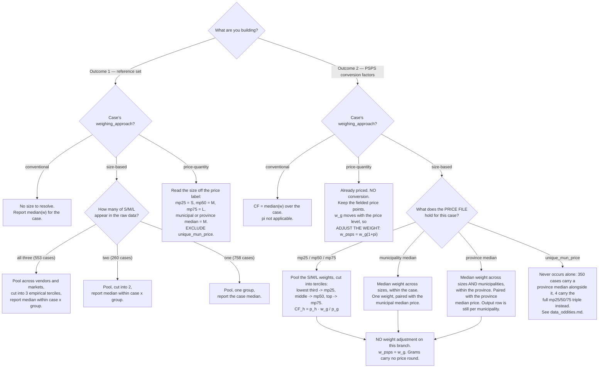
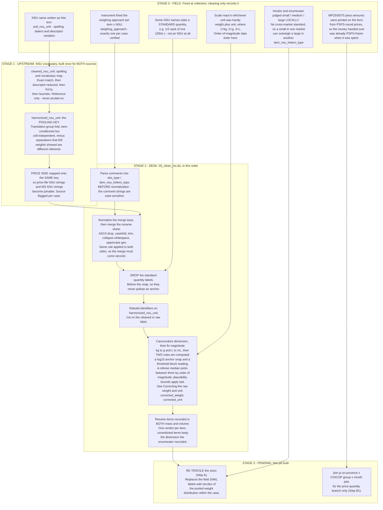
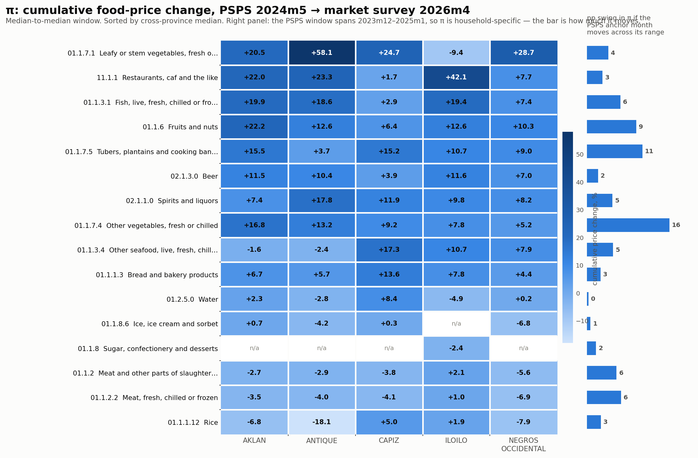
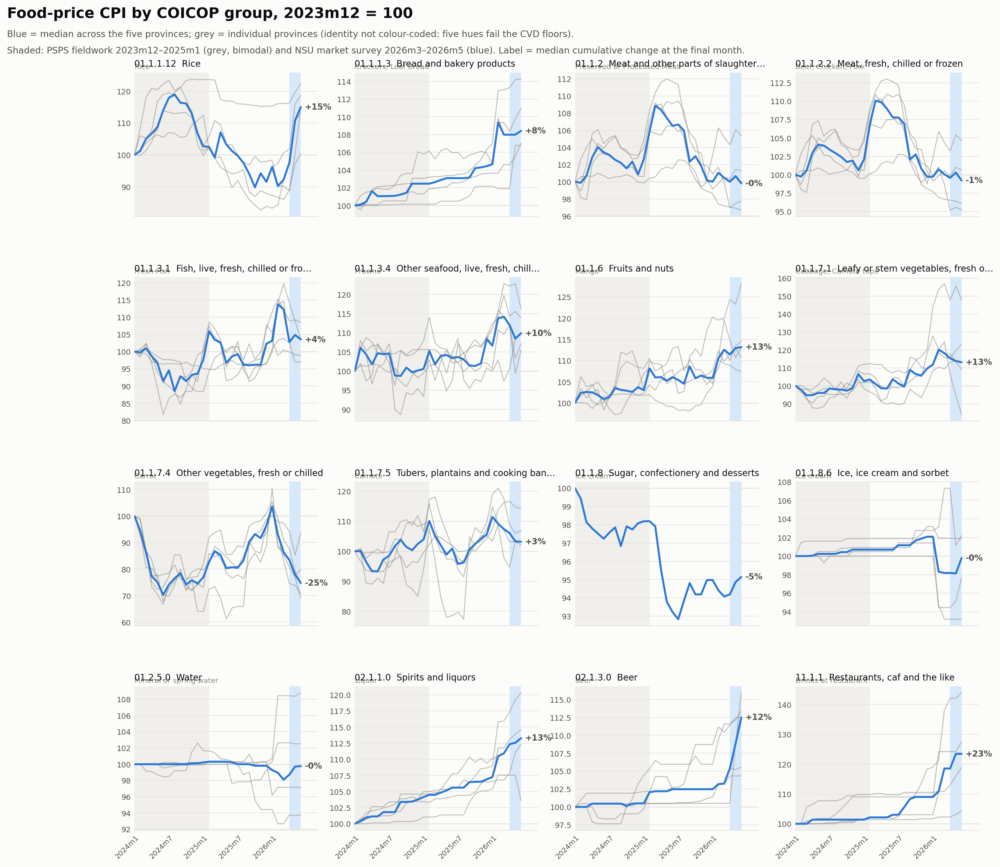

# NSU → Gram Conversion Factors: Methodology

**Purpose.** Convert quantities reported in non-standard units (NSUs) in the PSPS
household panel into grams, using the NSU Market Survey as the measurement source.

**Companion documents.** `docs/data_oddities.md` holds the individual cases, coding
conventions and small exclusions that would otherwise clutter this one — read it
before treating any single-case discrepancy as a bug.
`docs/inflation_adjustment_spec.md` is the build spec for the CPI inputs.
`docs/master_rename.md` documents the NSU vocabulary.

**How to read this.** The sections below run in dependency order, but most readers do
not need all of them:

| if you want to… | read |
|---|---|
| know what this produces | **Two deliverables** |
| use the reference table in the field | **Two deliverables** → **Conventional NSU** → **Step A** |
| convert PSPS household quantities to grams | **Notation** → **Step A** → **Step B** |
| understand why a particular case looks odd | **Decision tree** → `docs/data_oddities.md` |
| know which price points a case gets | **Decision rule (Outcome 2)** |
| judge whether to trust a number | **Assumptions to keep visible** → **Warning for downstream use** |
| run or modify the pipeline | **Reference: which files are live** (at the end) |

Two things to know before reading anything else. **There are two deliverables, not
one, and they are not derivable from each other** — the same weighings are sliced
differently for each. And **a "case" means province × municipality × item ×
harmonized NSU unit × corrected unit**; nearly every count in this document is at that
grain.

## Two deliverables

**Outcome 1 — reference set for future data collection.** A lookup key with columns

> province | municipality | item | NSU | size | grams per unit

keeping within-item heterogeneity (a row per size, not one averaged scalar). Use
case: a respondent reports 1 mango; the enumerator asks the size (small / medium /
large, e.g. with reference pictures) and logs the answer directly in grams.

**Market type is not in the key.** The reference weight is aggregated *across*
public market, talipapa and roadside vendors, exactly as Step A pools across them.
This is deliberate: the future enumerator using this table asks a respondent what
size they bought, not which market type the respondent's vendor belonged to, so a
market-type-specific row could not be looked up. It also keeps Outcome 1 on the same
grain as the Step A pool, so both come from one collapse rather than two.

**Outcome 2 — conversion factors for PSPS.** A lookup that turns PSPS NSU
quantities into grams retrospectively. It is a **case-level table that yields
household-level answers**: the table is keyed at

> case | PSPS interview month | price point | price per NSU (PHP) | PHP per gram

and the household variation arrives at lookup time, not from the table having a
household dimension. A household's own implied unit price $`p_h`$ enters the
division in Step B3, so two households in the same case can receive different
conversion factors from the same row.

Read the last column as an exchange rate. `PHP per gram` is $`v_g = p_g/w_g`$; a
household that spent $`p_h`$ per NSU is assigned $`p_h / v_g`$ grams per NSU. The
term *conversion factor* stays reserved for the NSU → gram figure itself.

Why a month dimension. Only the price-quantity branch carries one: its grams are
"what a fixed peso amount bought", so they move with the price level and must be
restated for the household's own interview month. Size-based and conventional grams
are properties of an object and are constant across months. See "Outcome 2 as a
table" under Step B for the resulting three-table structure.

---

## Decision tree

**How many hetero-groups a case gets is decided by different evidence in each
outcome.** This is the single most important thing on this page:

- **Outcome 1** counts the **field size-labels** the case actually contains. Three
  of S/M/L recorded → three groups. Two → two. One → one.
- **Outcome 2** reads the **price file's point structure** for that case. Three
  quartile points → three groups. A single median → one.

Neither uses the number of weighings. The same case can therefore yield three sizes
in Outcome 1 and one weight in Outcome 2 — all three labels in the field, but only
a municipal median priced. **That is the design, not an inconsistency.** It also
means the two outputs cannot be derived from one another.



### The scenarios as a table

All price points are nominal PSPS round throughout.

| # | outcome | branch | groups decided by | $`w_g`$ is | $`p_g`$ is | weight adj. | result |
|---|---|---|---|---|---|---|---|
| 1 | 1 | size-based | field labels present (3 / 2 / 1) | median within case × tercile | *not used* | none | $`w_g`$ itself |
| 2 | 1 | price-quantity | the price label (mp25→S, mp50→M, mp75→L, median→M) | median within case × label | *not used* | none | $`w_g`$ itself |
| 3 | 1 | conventional | one | case median | *not used* | none | $`w_g`$ itself |
| 4 | 2 | size-based, 3 price points | the price file | median within case × tercile | p25 / p50 / p75 | none | $`p_h\,w_g/p_g`$ |
| 5 | 2 | size-based, municipal median | the price file | median across sizes, within case | municipal median | none | $`p_h\,w_g/p_g`$ |
| 6 | 2 | size-based, province median | the price file | median across sizes **and municipalities** | province median | none | $`p_h\,w_g/p_g`$ |
| 7 | 2 | price-quantity | already fielded | weight bought at that point | `pull_price` | $`\times(1+\pi)`$ | $`p_h\,w_g(1{+}\pi)/p_g`$ |
| 8 | 2 | conventional | one | case median | none | none | $`\text{median}(w)`$ |

**Scenario 6 pools the weight province-wide but still emits a municipality-level
row.** Every municipality in that province receives the same $`w_g`$ and the same
$`p_g`$, so the same CF — but each gets its own row, and the output grain stays
province × municipality × item × NSU throughout. The province median is a property
of the *price*, never of the output key.

Two further things the table makes visible. **Inflation is a branch property, not a
global step** — scenario 7 only, and it applies to the weight, never to a price, so
every $`p_g`$ stays PSPS round. And **a hetero-group is not the same observable in
every branch**: a weight tercile where sizes were recorded, a given price point
where prices were.

---

## Harmonization stages: what the field fixed vs what cleaning imposes

Everything above assumes cases are comparable across vendors, markets and
municipalities. They are not, as collected. Four separate harmonizations make them
so, at four different stages, and it matters which is which: a **field** fact is
something we can only record and work around, while a **desk** rule is ours to
change. The order is also load-bearing — the standard-quantity drop must precede the
magnitude snap, and the name merge must follow key normalization.



| stage | harmonizes | from → to | where |
|---|---|---|---|
| 0 field | *nothing* — this is the input | — | the instrument and the enumerator |
| 1 upstream | NSU **names**, MS and price side alike | `pull_nsu_unit` → `cleaned_nsu_unit` → `harmonized_nsu_unit` | `dofiles/00_shared/01_build_crosswalk.py` → `outputs/tables/master_nsu_rename.csv`; see `docs/master_rename.md` |
| 2 desk | the **grain**, then the **unit of measure** | raw MS rows → `corrected_weight` in g or mL, keyed on `harmonized_nsu_unit` | `dofiles/00_shared/03_clean_ms.do` → `dofiles/00_shared/04_unit_snap.do` |
| 3 pending | **sizes**, and the price **round** | field S/M/L → weight terciles; nominal PSPS pesos → MS-frame weights | Step A and Step B1 below |

**The size labels are the one field artefact cleaning replaces outright.** Stage 0
recorded S/M/L as a local, per-vendor judgement; Stage 3 discards those labels and
re-derives the sizes from pooled weight. Everything else in Stage 2 repairs a
recording error or a naming inconsistency — this is the only step that overrides a
substantive field judgement, which is why it needs the guidebook citation it gets in
Step A.

**Name harmonization is upstream of everything and shared by both sources.** It is
not part of the Stata cleaning at all: the cleaning run only *joins* a key that was
already built, which is what makes the MS and price files joinable in the first
place. Rebuilding the vocabulary means re-running the upstream script, not editing
the do-file.

### String normalization: the exact rule, and why it must be identical everywhere

Every join in this project matches on text — province, municipality, item, NSU. All
of them go through one normalization, and **any re-implementation that differs by a
character silently breaks a join**. The rule, in order:

1. **Drop non-ASCII characters outright.** Stata `ustrto(v, "ascii", 2)`; Python
   `str(s).encode('ascii','ignore').decode('ascii')`.
2. **Case-fold** — lower for item and NSU, UPPER for province and municipality.
3. **Trim** leading and trailing whitespace.
4. **Collapse** internal whitespace runs to a single space.

> **Do not Unicode-normalize before step 1.** `DUEÑAS` must become **`DUEAS`**, with
> the Ñ *deleted*. Decomposing first (Python `unicodedata.normalize("NFKD", …)`)
> splits Ñ into `n` + combining tilde, drops only the tilde, and yields `DUENAS` —
> which matches nothing. Stata's `ustrto` deletes the whole character, so the price
> file, `master_nsu_rename.csv` and the built data all carry `DUEAS`. A checking
> script written with NFKD once reported 26 phantom unmatched cells for this reason.

The authoritative implementation is `nz()` / `ni()` / `ng()` in
`dofiles/00_shared/01_build_crosswalk.py`, mirrored operation-for-operation by the
`nsu_normalize` program in `03_clean_ms.do`. **Import or call those. Never write
a fourth copy**, including in throwaway diagnostics — a normalizer that disagrees
produces findings that look like data problems and are not.

Order also matters against the rest of the pipeline: comment parsing runs *before*
normalization (the comment crosswalk carries raw-cased strings), and the rename
merge runs *after* it (the master file's keys arrive pre-normalized).

### What identifies a row, at each stage

Three different keys do three different jobs, and conflating them is the most
likely way to corrupt an aggregation.

| purpose | key | unique? |
|---|---|---|
| **a weighing** (raw) | province × municipality × item × `pull_nsu_unit` × `market_type` × `vendor_id` × `obs_type` | **yes** — 11,495 rows, 11,495 groups |
| **a weighing** (built) | province × municipality × item × `harmonized_nsu_unit` × `market_type` × `vendor_id` × `item_nsu_hetero_type` | **yes** — 11,384 rows, 11,384 groups |
| **a case** (the pooling unit) | province × municipality × item × `harmonized_nsu_unit` × `corrected_unit` | **no, by design** — this is the pool |

**Harmonization does not cost uniqueness.** Dropping `market_type` and `vendor_id`
leaves 3,364 groups for 11,384 rows — but the same key on `pull_nsu_unit` leaves
3,422 for 11,495. Multiple vendors across up to three market slots are what make a
case non-unique, not the fold. Add market type and vendor and both levels identify a
row exactly.

> **`uuid` is not a safe key.** It is `item_unit_MUNICIPALITY` with **no province**,
> and two municipality names recur across provinces — **PONTEVEDRA** (Capiz and
> Negros Occidental) and **SAN ENRIQUE** (Iloilo and Negros Occidental) — making 33
> price-file uuids ambiguous. Joining on it silently merges two provinces' prices.
> Use province × municipality × item × NSU.

---

## Notation

A **case** $`c`$ is a province × municipality × item × NSU combination, where NSU
means **`harmonized_nsu_unit`** — the folded pooling key, not the raw `pull_nsu_unit`
or the spelling-corrected `cleaned_nsu_unit`. Every count in this document is at
that grain; the same tabulation on a different unit column gives different numbers
(1,943 cases harmonized, 1,957 cleaned, 1,985 raw). See *Practical prerequisites*.

**Market survey (MS) side.** A case is resolved into up to three **hetero-groups** — an
*ordinal* ladder from smallest/cheapest to largest/dearest, indexed
$`g \in \{1,2,3\}`$. A hetero-group is not intrinsically a size; which observable realizes
it depends on the weighing approach:

| weighing approach | a hetero-group is | $`w_g`$ | $`p_g`$, and the round it belongs to |
|---|---|---|---|
| size-based | a weight tercile (S / M / L) | tercile median | joined from the price file → **PSPS round** |
| price-quantity | a price point given to the enumerator (MP25/50/75) | weight that money bought | a PSPS-derived point, spent during MS → **PSPS round** |
| conventional | the whole case | cell median | none |

- $`w_g`$ — grams in one hetero-group-$`g`$ unit
- $`p_g`$ — **PHP per NSU** for a hetero-group-$`g`$ unit. **Always PSPS round, on
  every branch.** On the size-based branch it is joined from the price file. On the
  price-quantity branch it is `pull_price`, which is preloaded and system-filled from
  PSPS prices — verified to match the SurveyCTO case-file preload in 1,105 of 1,105
  matched rows, so it is the figure the enumerator was *sent to spend*, not one they
  observed. That the money changed hands during the MS round does not make the
  *number* an MS-round price; what is MS-round is the quantity it bought, which is
  why $`(1+\pi)`$ lands on $`w_g`$ and never on $`p_g`$.
- $`v_g \equiv p_g / w_g`$ — unit value, **PHP per gram**, in whatever round
  $`p_g`$ belongs to

S / M / L are the *values* a hetero-group takes wherever there are three of them — a weight
tercile on the size-based branch, a rank-aligned price point (MP25/50/75) on the
price-quantity branch; $`g`$ is the index everywhere.

**PSPS side**, household $`h`$ in case $`c`$:

- $`q_h`$ — quantity reported, in NSU units
- $`e_h`$ — total paid for that quantity (PHP)
- $`p_h \equiv e_h / q_h`$ — implied price, **PHP per NSU**, always PSPS round
- $`\pi`$ — cumulative price-index change between the household's PSPS interview
  month and the MS weighing month, so $`1+\pi`$ is the factor between the rounds.
  $`\pi`$ is **not a constant**: it is specific to province × COICOP group × month
  pair, and it is negative for some items.

Throughout, **$`p`$ is always PHP per NSU** and **$`v`$ is always PHP per gram** —
never interchangeable. Grams carry no round: they do not inflate.

---

## Correcting the raw weight and unit

Every weighing arrives as two fields: a number the enumerator read off a scale, and a
**unit tick** — `1 = kg`, `2 = g`, `3 = litres`. Neither is reliable on its own, and the
two fail independently: the number can carry a misplaced decimal, and the tick can
contradict the number's scale. This section is what the pipeline does about that. It runs
before both deliverables, in `dofiles/00_shared/04_unit_snap.do`.

### 1. Canonical dimension

Mass readings become grams (`kg × 1000`), volume readings become millilitres
(`L × 1000`). The items recorded by volume are near water density, so a gram and a
millilitre are the same reading at the precision recorded — the same assumption used
everywhere downstream.

**This conversion is not a correction.** Every mass row gets it. When counting how many
readings the pipeline *changed*, it is applied to the raw value first, so a kilogram row
published in grams does not count.

### 2. Two candidate answers, computed independently

**The anchor snap.** For each `item × harmonized unit` pool, take the median of the
base-10 logarithm of the canonical readings. Snap each reading to the nearest integer
power of ten toward that median. The pool falls back to item level when a cell is thin,
and the row is flagged when the anchor is itself untrustworthy — below 5 g, more than 1.5
decades from the item-level reference, or leaving a post-snap residual above 0.35
decades. Its strength is that it moves **however many decades the data implies**.

**The block reading.** A threshold on the raw number: below 10, the number was written in
the larger unit and needs `× 1000`; at or above 10, it is already in the canonical unit.
Its strength is that it restates *what the enumerator typed* rather than inferring a
scale from neighbours.

Both are kept. The anchor's answer survives as `w_step1` and its flag as `review_step1`
precisely so the choice below can be audited without re-running anything.

### 3. Choosing between them

Neither rule dominates, so the choice is made per row, in this order. The precedence
matters: the first two rules disagree on 259 of the 818 disputed rows that have a usable
median, so this is a decision and not a formality.

| order | condition | published |
|---|---|---|
| 1 | a referee median exists | whichever candidate is closer **in orders of magnitude** |
| 2 | no median; the cell holds two or more sub-1 decimal readings | the block reading |
| 3 | no median; the raw number is a whole number | the block reading |
| 4 | nothing above fires | the anchor snap |
| 5 | *always, last* | the other candidate, if the chosen one falls outside 10–50,000 g/mL and the other is inside |

**Orders of magnitude, not grams.** A 255 g reading against a 152.5 g cell median is the
same decade; 25 g is a decade out. Absolute distance would prefer the value that is ten
times too small, because 127 g is closer to 190 g than 1,265 g is. The decade is the thing
the two rules disagree about, so the decade is what gets compared.

**The referee** is the median of the rows in a cell where the two rules *already agree*.
Those rows carry no information about which rule is better, which is exactly what makes
their median a usable yardstick for the rows that disagree. A pool must hold more than 5
agreeing rows to referee; below that the ladder widens:

| pool | rows refereed by it |
|---|---|
| province × municipality × item × harmonized unit (the cell) | 7,517 |
| province × item × unit × hetero-group | 3,289 |
| province × item × unit | 394 |
| no usable pool — rules 2 to 4 decide | 233 |

**Repeated sub-1 decimals are a convention, not a slip.** Where several readings in one
cell are 0.xxx, that is what the enumerators in that market wrote on purpose, and the
block reading — which restates the number — is the better reading. A *single* 0.xxx
reading is not covered by this: that is the one-off the anchor is for.

**The bounds are the last word.** Nothing below 10 g/mL or above 50,000 g/mL is published
while the other candidate is inside those bounds, whichever rule chose it. The ceiling is
twice the largest defensible purchase in the file (a 25 kg sack of rice); the floor sits
below anything legitimate. This is what catches a *contaminated pool*: where a whole cell
shares one recording error, the median encodes that error and the snap faithfully
reproduces it. Two beer "case" rows reaching 1.2 million g and thirty-eight fresh-fish
rows falling to 4–9 g are caught here.

### 4. Hand corrections

`dofiles/00_shared/05_manual_corrections.do` holds every reading set by hand: 12 rows
adjudicated during review where the rules did not reach the reviewer's answer, the g/mL
dimension verdicts, and the readings no interpretation rescues (set to `.c` rather than
deleted, so the attrition ledger can still account for them). Every block asserts its own
row count — a correction that silently matches nothing once shipped a 1 gram whole chicken
to the published reference set.

### 5. What this did

Of **11,433** weighings:

| | weighings | share |
|---|---|---|
| published at the typed magnitude (conversion only) | 8,838 | 77.3% |
| **published at a corrected magnitude** | **2,583** | **22.6%** |

And the corrections are mostly *not* arithmetic errors:

| mechanism | weighings |
|---|---|
| `× 1000` — a kilogram number ticked as grams (or mL as L) | **1,882** |
| `÷ 1000` — a gram number ticked as kilograms | 145 |
| one decade either way — an actual decimal slip | 412 |
| any other distance | 144 |

The largest category by far is a **unit-tick error**: an enumerator who writes `0.275` and
ticks grams has written the kilogram number. Calling that a decimal error misdescribes
what the field actually did.

### 6. What remains uncertain

| | weighings | share |
|---|---|---|
| **any of the three below** | **1,742** | 15.2% |
| disputed — the rules disagreed and the block reading won | 607 | 5.3% |
| the anchor machinery distrusted its own answer | 1,500 | 13.1% |
| no defensible reading — weight is `.c` | 12 | 0.1% |

These are three different things needing different follow-up, so they are not summed into
one error rate. A disputed row has two defensible readings; a flagged row has one the
anchor is unsure of; an unusable row has none.

`dofiles/90_diagnostics/report_weight_corrections.py` writes this per weighing, including
which rule decided it and which pool refereed it, and the pipeline explorer carries the
same table as `weight_corrections`.

## Conventional NSU (the simple case)

Some NSUs are effectively standard within a locality (gantang, salop, salmon …).
There is no size to resolve: a single weight $`w_c`$ characterizes the unit, so

```math
\widehat{CF}_h = w_c \quad\text{for every household in the case.}
```

---

## The pipeline (size / price-varying NSUs)

### Step A — build the reference from the market survey

Within a case, **pool all weighings** — across market types, vendors, and the
survey's original heterogeneity labels — into one weight distribution. Let $`w`$
be a pooled weighing and let $`Q_{1/3}, Q_{2/3}`$ be the terciles of that
distribution. **Relabel each weighing by its weight tercile:**

```math
\text{hetero-group}(w) = \begin{cases}
S & \text{if } w \le Q_{1/3} \\[4pt]
M & \text{if } Q_{1/3} < w \le Q_{2/3} \\[4pt]
L & \text{if } w > Q_{2/3}
\end{cases}
```

Each hetero-group's representative weight $`w_g`$ is its tercile median. Pairing it with
that hetero-group's price $`p_g`$ gives $`v_g = p_g / w_g`$. Bigger units cost more, so the
prices order $`p_1 \le p_2 \le p_3`$ and the ladder aligns by rank: S↔MP25, M↔MP50,
L↔MP75. **That rank alignment is an assumption, not an observation** — see
assumption 5.

Re-terciling is deliberate: the survey's own S/M/L labels overlap heavily in weight
across vendors, so the sizes are re-derived from the pooled weights rather than
taken from the labels.

**This follows the LSMS guidebook's prescription.** Oseni, Durazo & McGee (2017),
*The Use of Non-Standard Units for the Collection of Food Quantity*, §3 Step 3, p. 16
(`docs/WB-NSU-Guide.pdf`) states the problem in the same terms —

> "the small size of a unit found in market X may be larger than the large version
> collected in market Y. These must be reconciled so that there is a standard
> classification of small, medium, and large within the relevant level of
> geographic aggregation"

— and prescribes the method:

> "classify measurements based on their position in the distribution of
> measurements for that particular item-unit pair. The most basic approach is to
> classify observations that fall below the 33rd percentile as small, between the
> 33rd and 66th percentile as medium, and above the 66th percentile as large."

The same page authorizes the two-size fallback used in the ladder below —

> "the number of sizes must be considered before applying this method. Some units
> may only be found in two relatively uniform sizes, in which case only small and
> large size should be assigned"

— and the choice of the median as the within-hetero-group estimator: *"The mean or median
measurement for each container unit can be used."* The guidebook also recommends
reviewing the reference photos as a verification step; that check has not been done
here and remains available.

#### Branch shares, and why size-based cases have no MS price

A case uses **exactly one** weighing approach. This is a property of the fieldwork,
not an artefact of the harmonization: at the raw and cleaned grains *every* case is
single-branch, with zero exceptions, and it survives splitting the grain further by
`corrected_unit` (grams vs millilitres).

| approach | cases | weighings |
|---|---|---|
| size-based | **1,515 (78%)** | 9,770 (85%) |
| price-quantity | 314 (16%) | 1,220 (11%) |
| conventional | 123 (6%) | 468 (4%) |

The fold introduces exactly one exception, so the table above assigns each case its
modal approach: ILOILO / TIGBAUAN / carrot, where `bilog` (9 size-based weighings)
and `pieces or units` (7 price-quantity weighings) both fold to harmonized
`pieces or units`. It is exported to
`outputs/master_rename_build/tables/fold_multi_weighing_approach.xlsx` and needs a
manual branch assignment — either pick a branch for the pooled case, or keep the two
raw labels apart for this cell.

On the size-based branch the enumerator was asked for a *small / medium / large*
unit and never for a peso amount, so **no price was recorded** — `pull_price` is
empty for those rows by construction. Their $`p_g`$ must be joined from the price
file, where the values are PSPS-round percentiles that were never spent in the MS
round. This is the origin of every frame question below.

#### Which price points exist for a case

The price file does not carry a mp25/mp50/mp75 triple for every case. Point
selection followed the field protocol below, so **the set of available price points
is itself a signal of how thin or how homogeneous the PSPS data was for that cell**:

- **≥3 unique PSPS prices in the municipality** → record p25, p50, p75 — *unless*
  the interquartile range is ≤ ₱40, in which case record only the municipality
  median. (₱20 — the smallest bill and a common coin — was taken as the smallest
  meaningful gap between quartiles; ₱40 is two of those. There is no strong prior
  behind the threshold beyond that.)
- **≤2 unique PSPS prices in the municipality** → record the province median
  alongside the 1–2 municipal prices — *unless* those municipal prices sit within
  ₱20 of the province median, in which case record only the province median.

So a case whose only price point is a municipality or province median is one where
few PSPS respondents used that NSU in that cell, or where the prices they reported
barely varied.

#### Degrading gracefully: how many hetero-groups a case can support

> **Superseded rule, recorded so it is not reintroduced.** Earlier drafts set the
> group count to `min(price points, weighings)`, with a weighing-count ladder
> (≥6 → three, 3–5 → two, <3 → one). **The weighing count no longer enters either
> outcome.** It was a proxy for "can this distribution support a split", but it
> demoted 77 of the 553 three-label cases that genuinely had all three sizes
> recorded, and it has no bearing at all on how many prices exist to pair with.

Each outcome counts something different, and neither counts weighings.

**Outcome 1 counts the field size-labels present in the case.** If the enumerators
recorded all three of S/M/L, the case gets three groups — however few or many
weighings sit behind them. Measured on the size-based cases:

| distinct S/M/L labels recorded | groups | cases |
|---|---|---|
| three | S / M / L | 553 |
| two | the two present | 260 |
| one | one | 758 |

Re-terciling still runs in every one of these, including where a case holds exactly
one weighing per label (33 cases). In 31 of those 33 the empirical order matches the
field order, so terciling changes nothing; in 2 it corrects a genuine inversion where
the vendor's "medium" outweighed their "large". Always re-tercile: the alternative
publishes a reference table where M > L.

**Outcome 2 counts the price points the price file holds.** A size is only useful if there is a
price to pair it with, so a cell with a single median price supports one hetero-group no
matter how often we weighed it.

**Read these counts at the right grain.** The price file is keyed on the *raw* NSU label;
both outcomes pool at the *harmonized* unit. Harmonization merges spellings, and two
spellings of one unit can carry different `price_type`s — so the harmonized cell holds
combinations that never existed in the price file and that no protocol branch produced.
The two grains are reported separately below because they answer different questions:
the raw grain checks the protocol description against the file, and the harmonized grain
is what the pipeline actually operates on.

*Raw grain — 2,950 cells. Six combinations, mapping one-to-one onto the four branches of
the field protocol above, which confirms the protocol description and the file agree:*

| `price_type` combination | protocol branch | cases | share |
|---|---|---|---|
| `mp25 + mp50 + mp75` | ≥3 unique prices, IQR > ₱40 | 954 | 32.3% |
| `province median` only | ≤2 unique prices, within ₱20 of province median | 832 | 28.2% |
| `municipality median` only | ≥3 unique prices, IQR ≤ ₱40 | 809 | 27.4% |
| `province median` + `unique_mun_price` | ≤2 unique prices, > ₱20 from province median | 350 | 11.9% |
| quartile triple + an extra point | — | 5 | 0.2% |

*Harmonized grain — 2,550 cells. Twelve combinations. The eight marked ✦ do not exist in
the price file at all; the fold creates them:*

| `price_type` combination | cells |
|---|---|
| `mp25+mp50+mp75` | 782 |
| `province median` | 620 |
| `municipality median` | 602 |
| `province median` + `unique_mun_price` | 290 |
| ✦ `municipality median` + `province median` | 81 |
| ✦ `mp25+mp50+mp75` + `province median` | 63 |
| ✦ `mp25+mp50+mp75` + `municipality median` | 47 |
| ✦ `mp25+mp50+mp75` + `province median` + `unique_mun_price` | 27 |
| ✦ `municipality median` + `province median` + `unique_mun_price` | 27 |
| ✦ `mp25+mp50+mp75` + `municipality median` + `province median` | 4 |
| `mp25+mp50+mp75` + `unique_mun_price` | 4 |
| ✦ `mp25+mp50+mp75` + `municipality median` + `province median` + `unique_mun_price` | 3 |

**115 harmonized cells hold both a municipality median and a province median; no raw cell
does.** Every one of the 115 pools more than one spelling. AKLAN / ALTAVAS / cabbage is
typical: `bilog` carries a province median of ₱60 and `binilog` a municipality median of
₱50, and folding them into `pieces or units` gives one cell two medians at two
geographies with two values. See issue #21.

Reading any of this as hetero-groups needs one judgement call. Where a province median
accompanies a thin municipal observation (the fourth raw-grain row), it is a **fallback
reference, not a second hetero-group** — the two are estimates of the same central
tendency at different geographies, and pairing them as small/large would be meaningless.
Note the scope: this call was made about that one raw-grain combination. It does not by
itself settle the ✦ combinations, which arise from a different mechanism and need their
own rule — see issue #23.

| hetero-groups on price grounds | harmonized (operative) | raw |
|---|---|---|
| 3 | 930 · **36.5%** | 959 · 32.5% |
| 2 | 90 · **3.5%** | 97 · 3.3% |
| 1 | 1,530 · **60.0%** | 1,894 · 64.2% |

(Under the alternative reading — every distinct price level counts — the harmonized split
is 40.4% / 13.3% / 45.8%, plus 11 cells with 4 or 5 groups. The qualitative conclusion
holds either way.) Both grains are tallied by `dofiles/90_diagnostics/scope_price_combo_grain.py`;
`dofiles/90_diagnostics/tally_price_points.py` computes the raw grain only.

So on the Outcome 2 side about **60%** of cases collapse to a single group on price
grounds, and the two-group case is genuinely rare at 3.5% — in practice a case has either
the full three-group ladder or no ladder at all.

Two caveats. These figures cover all price-file cases, including price-only ones with no
MS weighings, so the shares among cases that actually have weights will differ. And the
₱20 rule has exceptions: **42 (case, unique price) pairs sit within ₱20 of their province
median**, including several exact ties, which the stated protocol would have collapsed to
province median only. (Counting strictly under ₱20 gives 34. An earlier version of this
document said 38, which reproduces under neither cut.) Measured by
`dofiles/90_diagnostics/scope_unique_price_size_based.py`; see issue #6.

**Every size-based case has a price-file row.** Checked directly by
`dofiles/90_diagnostics/verify_documented_claims.py`: all size-based cells match.

This held at **1,514 of 1,515** until the one exception was removed at source. That
cell was ILOILO / DUEÑAS / cabbage, reached through the raw label
`2 kapinutos nga cabbage/20pesos` — a label that bundles a count, the item name and a
price, so what one unit *is* cannot be recovered from it. It is now an exact-match
literal in `02_drop_non_nsu_labels.py`'s `AMBIGUOUS` set and excluded with the other
non-NSU labels, taking its 4 weighings with it.

The cell was resolved by **dropping the ambiguous label**, not by giving it a fallback
price: a conversion factor whose unit is unrecoverable is worse than none. See issue #22.

**Two changes were needed, and they are often confused.** Dropping the label removed the
symptom; moving the mixed-bag fold into the crosswalk removed the cause.

The cause was the mixed-vegetable override that used to sit in `03_clean_ms.do`, which
rewrote `harmonized_nsu_unit` *after* the crosswalk merge whenever a curated note
matched. One of the four DUEÑAS weighings carried the note
"consider changing the unit to plutos (halo halo)", so that row alone was rewritten to
`putos (mix vegetable)` — a fold target the price file had nothing for in DUEÑAS — while
its three siblings kept the self-mapped label. One cell, one raw label, two harmonized
units. The fold now lives in `CELL_MIX` in `nsu_fold_rule.py`, where the join validates
it and both sides move together.

An earlier count of 26 unmatched cells was an artefact of a checking script that
Unicode-normalized `DUEÑAS` differently from the pipeline — see the normalization
rule above. Re-run the verification script after any change to the fold rule, since a
new fold target with no price-file counterpart would show up here as a second
exception.

**When a case collapses to one hetero-group** the sizes are not separated at all: pool every
size-based weighing in the cell across vendors, market types **and** the original
S / M / L labels, take the median of that single pooled distribution, and map it to
the one available price point. Every household in the cell gets that one number
regardless of what it paid. Note what this is *not*: it is not "the small one" or
"the medium one" — it is the middle of the whole pooled distribution, the same
object the conventional-NSU branch produces,
$`\widehat{CF} = \text{median}(w)`$.

### Step B — apply to a PSPS household

**B1. Put the measured weight in PSPS terms.** Only one branch needs this. On the
price-quantity branch $`w_g`$ is "what a fixed peso amount bought at MS-round
prices", so it moves with the price level. On the size-based branch $`w_g`$ is a
property of the object (a medium mango), so it does not:

```math
w_g^{\text{PSPS}} =
\begin{cases}
w_g \,(1+\pi) & \text{price-quantity branch} \\[4pt]
w_g           & \text{size-based and conventional branches}
\end{cases}
```

**Reading the superscript.** $`w_g^{\text{PSPS}}`$ means "evaluated at PSPS-round
prices", **not** "observed in PSPS". PSPS weighed nothing: every gram figure in this
document is a market-survey measurement. On the price-quantity branch
$`w_g^{\text{PSPS}}`$ is a counterfactual — the grams the same peso amount would have
commanded at PSPS-time prices — and on the other two branches it equals the measured
$`w_g`$ unchanged, because grams there are a property of the object and carry no
price round at all.

Every $`p_g`$ then stays at its nominal PSPS-round value, so a given hetero-group means the
same thing in every case.

**B2. Match** the household to a hetero-group by price. Both sides are PSPS round:

```math
g(h) = \text{arg\,min}_{g} \; \lvert\, p_h - p_g \,\rvert
```

Nominal $`p_g`$ on both sides, one adjustment only. The price points in the price
file are computed across the whole PSPS wave, so one *could* also restate them from
wave-average to the household's month. That is a second, distinct adjustment and it
is **not** performed here. Only the MS → PSPS restatement of $`w_g`$ in B1 is. The
reason to be explicit: applying both to the price would leave $`(1+\pi)^2`$ in the
arithmetic, and applying the second to the match but not to the $`v`$ used for
conversion would make the match and the division disagree.

**Ties break toward fewer grams, and the rule is stated on $`v`$, not on the price
point.** A household exactly equidistant between two points takes the one with the
**higher** $`v_g`$ (pesos per gram), which yields the smaller $`p_h/v_g`$. Stating it
on $`v`$ rather than "take the lower price point" matters because the two coincide
only if $`v`$ falls monotonically across the ladder, and nothing guarantees that:
$`v_g = p_g/w_g`$ is a ratio of two independently measured quantities, so a large
unit that was cheap per gram can invert the order. Check monotonicity empirically
rather than assuming it; where it fails, the $`v`$ rule is the one that delivers the
intended conservatism.

**B3. Convert** to grams:

```math
\widehat{CF}_h = p_h \cdot \frac{w_{g(h)}^{\text{PSPS}}}{p_{g(h)}}
\qquad\Longrightarrow\qquad
\widehat g_h = q_h \cdot \widehat{CF}_h
```

$`\widehat{CF}_h`$ is grams in one NSU unit; $`\widehat g_h`$ is the household's
total grams.

**Same units as $`w_g`$, different unit referent.** Since $`p_h`$ and $`p_g`$ are
both PHP per NSU, the ratio $`p_h/p_g`$ is dimensionless, so $`\widehat{CF}_h`$ and
$`w_g`$ are both **grams per NSU unit**. What differs is *whose* unit: $`w_g`$ is
grams in the hetero-group's unit as weighed at the market, while $`\widehat{CF}_h`$ is grams
in the household's unit, inferred from what it paid. Equivalently, in terms of the
unit value $`v_g = p_g/w_g`$:

```math
\widehat{CF}_h = p_h \,/\, v_{g(h)}
```

PHP per unit divided by PHP per gram gives grams per unit. Read this way the hetero-group
contributes a *rate* ($`v_g`$, its price per gram) rather than a level, and $`w_g`$
enters only through that rate.

**Consistency check.** If $`p_h = p_{g(h)}`$ then
$`\widehat{CF}_h = w_{g(h)}^{\text{PSPS}}`$ — a household paying exactly a hetero-group's
price is assigned exactly that hetero-group's weight.

**B4. Cap the extrapolation, and flag what was capped.** B3 is linear in $`p_h`$ with
no upper bound, so a household whose implied unit price is ten times the matched
hetero-group's price is handed ten times the grams of a unit that was actually
weighed. Clamp the ratio before multiplying:

```math
r_h = \frac{p_h}{p_{g(h)}}, \qquad
\tilde r_h = \min\!\bigl(\max(r_h,\ 1/t),\ t\bigr), \qquad
\widehat{CF}_h = \tilde r_h \cdot w_{g(h)}^{\text{PSPS}}
```

Clamping the *input* rather than the output is what makes the bound legible: it puts
$`\widehat{CF}_h`$ inside $`[\,w_g/t,\ w_g \cdot t\,]`$, a multiplicative window around
the weight that was actually measured. Rows are retained, not dropped: keep the raw
$`r_h`$ and a `d_cap` indicator alongside the clamped value, so an analyst can drop
the affected households rather than use a clamped number.

$`t`$ is set from the data, not chosen in advance — compute the $`r_h`$ distribution
once the join exists, put the cap where it stops being credible, and report the share
of rows that hit it. Report that share **split by how many price points the case
has**, because the exposure is not uniform: about two thirds of cases carry a single
price point, so there is no ladder to bracket a household and every household matches
that one point however far its spend lies from it. Extrapolation is worst exactly
where the price evidence is thinnest.

One thing to check before treating the cap as a fix rather than a symptom: whether an
extreme $`r_h`$ travels with $`q_h = 1`$ or with round-number expenditure. A household
"spending ten times the top price point" is more often a quantity misreport than a
bulk purchase. Where that is the pattern, the flag is the useful output and the clamp
is only cosmetic.

Two alternatives were considered. Bounding $`\widehat{CF}`$ against the case's own
observed weight range, $`[\min(w_c)/t,\ \max(w_c)\cdot t]`$, is the more physical
framing but rests on 3–9 vendors per case, so its band *widens* with vendor count and
is loosest where the evidence is thickest. Winsorizing $`p_h`$ to the case price span
is simplest but silently discards households that genuinely bought a larger unit. The
ratio clamp is the operating rule; the weight-range variant is carried as a
sensitivity check.

#### Outcome 2 as a table: three branches, appended

The deliverable is one row per **case × PSPS interview month × price point**, carrying
the price per NSU and $`v`$ (PHP per gram). Build it branch by branch and append,
rather than forcing one uniform grain:

| branch | share of cases | rows per case | month dimension |
|---|---|---|---|
| price-quantity | 16% | price points × PSPS months in the case | real: $`v`$ moves with $`\pi`$ |
| size-based | 78% | price points | degenerate: $`v`$ constant across months |
| conventional NSU | 6% | 1 | degenerate |

Appending rather than unifying keeps the table honest. A uniform case × month grain
would repeat every size-based and conventional row once per month and invite a reader
to believe those rates were month-specific when 84% of them are not. The join to the
household file is unaffected — it is on case and month either way — so the only thing
gained by uniformity is redundant rows.

The size-based branch reaches this table through re-grouping, not through prices of
its own. Step A pools the case's weighings and re-slices them into as many groups as
the price file has points; each group is then paired with a price point in order, and
$`v`$ follows as $`p_g/w_g`$. No inflation enters, because no money changed hands at
market-survey time on that branch — see the two failure modes under "Why the
adjustment sits on the weight".

**Worked example.** A case with three price points, ₱50 / ₱80 / ₱100 per NSU, whose
re-grouped size medians are 150 / 200 / 260 g, gives $`v`$ = 0.33 / 0.40 / 0.38 PHP
per gram. Note the inversion at the top: the large unit is cheaper per gram than the
medium one, which is exactly the case where "take the lower price point" and "take the
higher $`v`$" diverge, and why the tie rule is stated on $`v`$. A household spending
₱65 per NSU matches ₱50, and receives $`65 / 0.33 = 195`$ g per NSU — more than the
150 g weighed for the small group, because it paid more than the small group's price.

## Decision rule (Outcome 2): which price points a case gets

A case is province × municipality × item × harmonized NSU unit × corrected unit.
Harmonization pools raw spellings, and the price file is keyed on the **raw** spelling,
so a case can inherit more than one set of price points. This section states what
happens in every case, exhaustively.

Two facts drive the whole rule:

- **On the price-quantity branch a price was spent.** The peso amount was printed on
  the form from PSPS-round prices, the enumerator handed it over, and weighed what came
  back. The weight was elicited *at* that price.
- **On the size-based branch no price was spent.** The enumerator asked for a small, a
  medium, a large. The price file enters only afterwards, to say how many groups the
  case supports and what each group's price is.

So merging price points is harmless where no price was spent, and destroys a
measurement where one was.

### The partition

Every one of the 2,020 cases falls in exactly one row.

| # | branch | pools >1 weighed spelling | cases | weighings | price points the case gets |
|---|---|---|---|---|---|
| 1 | conventional | no | 123 | 468 | none — one group, the case median. The price file is not used for grouping. |
| 2 | conventional | yes | **0** | 0 | *(does not occur; verified, not assumed)* |
| 3 | size-based | no | 1,534 | 9,505 | the spelling's own points, **exactly as recorded**. No merge. |
| 4 | size-based | **yes** | **39** | **256** | the **union** across weighed spellings, then merged — see below |
| 5 | price-quantity | no | 320 | 1,104 | `pull_price` per weighing. The price file is not used. |
| 6 | price-quantity | **yes** | **3** | **14** | every distinct `pull_price`, **kept separate**. No merge. |
| 7 | price-quantity + size-based | yes | 1 | 13 | Outcome 1 takes the size-based rows under row 4; Outcome 2 takes the price-quantity rows under row 6 |
| | | | **2,020** | **11,360** | |

Price rows belonging to a spelling that was **never weighed in that cell** are excluded
from every row above. They contribute no weight, so they cannot inform a weight moment.
They are retained for one purpose only: matching a PSPS household that reports that
spelling.

### Row 4 in detail — the merge rule

1. **Pool the weights** across the weighed spellings. This is what harmonization is
   for: more observations behind each estimate.
2. **Take the union of price points** from those spellings, on the peso value.
3. **Merge points within ₱20 of each other**, single-linkage, so a chain of near-equal
   values collapses to one group. Merging is on the **value, not the rung label** — the
   `mp25` of one spelling may merge with the `mp50` of another.
4. **The merged point takes the mean** of the values merged into it. Two points at ₱17.50
   and ₱8 become one point at ₱12.75.
5. **Cut the pooled weight distribution into as many parts as there are surviving
   points**, lowest weights to the lowest price.

**Why ₱20 and not another number.** It is the threshold the price file already uses.
`NSU_Price.R`, which builds that file, does not record a municipal price separately when
it is within ₱20 of the province median, and collapses quartiles to the median alone
when both quartile gaps are within ₱20. Reusing it keeps the merge consistent with the
data it operates on rather than adding a second, unrelated tolerance.

**Why the mean rather than one of the two values.** Mapping a size onto a price rung
already assumes small ↔ mp25, medium ↔ mp50, large ↔ mp75 — an assumption nothing in the
data establishes, since the weight and price distributions come from different rounds
and different respondents. Against that, the choice between two prices ₱20 apart is not
material. The mean avoids privileging one spelling arbitrarily.

**Effect** (measured by `dofiles/90_diagnostics/scope_price_point_merge_rule.py`, 38 cases at the
four-key grain):

| rule | mean points per case | cases with >3 points | cases with <2 weighings per point |
|---|---|---|---|
| no merge | 3.37 | 17 | 18 |
| ≤ ₱10 | 2.55 | 10 | 14 |
| **≤ ₱20** | **1.97** | **1** | **10** |
| ≤ ₱30 | 1.84 | 1 | 8 |
| relative ≤ 10% | 2.82 | 11 | 16 |

Picking one spelling's ladder and discarding the other's would give a mean of 2.11, so
₱20 lands slightly below that without having to choose a spelling.

**The one case that does not resolve.** ILOILO / CARLES / chicken / `whole (chicken)` —
10 weighings, 5 union points, still 4 after merging, because chicken prices are high
enough that ₱20 is a small relative gap. Its weights are cut into 4 parts and mapped
onto the 4 surviving points. No special rule.

### Row 6 in detail — why no merge

The enumerator spent a specific amount. Collapsing two spellings to one price would
misattribute the treatment:

| case | spelling | n | price handed over | median weight |
|---|---|---|---|---|
| NEGROS OCCIDENTAL / VALLADOLID / cabbage | `bilog` | 3 | ₱25 | 325 g |
| | `pieces or units` | 3 | ₱60 | 780 g |
| NEGROS OCCIDENTAL / VALLADOLID / carrot | `bilog` | 3 | ₱17.50 | 150 g |
| | `pieces or units` | 3 | ₱8 | 95 g |
| ILOILO / AJUY / cabbage `pack` | `pack` | 1 | ₱50 | 785 g |
| | `shredded cabbage(pack)` | 1 | ₱20 | 135 g |

₱60 bought 2.4× what ₱25 bought. That is the price–quantity relationship the branch
exists to measure.

Keeping both points is also a **gain at the matching step**: Valladolid carrot ends up
with two conversion factors under one harmonized unit, at ₱17.50 and ₱8. A PSPS
household reporting `bilog` can be matched to whichever point its own unit value is
closer to, including the one collected under `pieces or units`. Harmonization buys that
flexibility precisely by not collapsing the price dimension.

No implementation is required for rows 5 and 6: Outcome 2's price-quantity branch
already uses `pull_price` as $`p_g`$, so the price file is never consulted there.

### Known inconsistency in this rule

The ₱20 merge applies to row 4 only. Row 3 — a size-based case with a single weighed
spelling — keeps its price points as recorded, however close together they are.

Those points are not always far apart. Of 959 single-spelling full quartile triples in
the price file, **452 (47%) have at least one adjacent gap of ₱20 or less**: 376 have
`mp50 − mp25 ≤ 20` and 76 have `mp75 − mp50 ≤ 20`. Across all single-spelling ladders
with more than one point, 446 of 1,310 (34%) contain a pair within ₱20.

So the same closeness is merged in row 4 and kept in row 3. The rule is deliberate — it
is scoped to the problem harmonization created, and leaves the price file's own output
untouched elsewhere — but it is not internally consistent, and a reader comparing two
cases will see identical price gaps treated differently. Extending ₱20 to row 3 would
change 452 cases and is not part of this decision.

## Decision rule (Outcome 1): how a weighing gets its size

Outcome 1 publishes **grams by size** — small, medium, large, or conventional. It has
no price dimension, so the price file runs the opposite way from Outcome 2: instead of
prices setting how many groups the weights are cut into, a price rung decides which
*size* a weighing is called.

Outcome 1 applies its own exclusions first — rows with no usable weight (7),
`unique_mun_price` weighings (33, which are not a size), and the price-quantity rows of
the one mixed-branch cell (4). **2,005 cases and 11,316 weighings** remain, and every
case falls in exactly one row:

| # | branch | pools >1 weighed spelling | cases | weighings | how the size is decided |
|---|---|---|---|---|---|
| 1 | conventional | no | 123 | 468 | no size; one row, the case median |
| 2 | size-based | no | 1,532 | 9,511 | $`k`$ = distinct S/M/L field labels; re-tercile the weights into $`k`$ groups; the $`g`$-th group inherits the $`g`$-th label present |
| 3 | size-based | yes | 39 | 256 | same, but $`k`$ counts labels across both spellings and the terciles are cut on the **pooled** weights |
| 4 | price-quantity | no | 309 | 1,069 | read off the rung: mp25→S, mp50→M, mp75→L, **any median→M** |
| 5 | price-quantity | yes | 2 | 12 | same rule; both cases collide, see below |
| | | | **2,005** | **11,316** | |

Conventional cases never pool more than one spelling — verified, not assumed.

**Row 3 is the design, not a defect.** Pooling changes the tercile inputs in 39 cases.
Oseni, Durazo & McGee (2017) §3 step 3 prescribes re-deriving sizes from the pooled
distribution precisely because a small in one market can outweigh a large in another.
Spelling is a vendor-level attribute here (no vendor in the file ever used two
spellings), so a spelling gap *is* vendor heterogeneity, which the re-tercile exists to
absorb. Pooling raises $`k`$ above what any single spelling recorded in 3 of the 39.

**Row 5 collides, in both cases.** Both are NEGROS OCCIDENTAL / VALLADOLID,
`pieces or units`: cabbage has `bilog` at a municipality median (n=3, median 325 g) and
`pieces or units` at a province median (n=3, 780 g); carrot has the same pair at 150 g
and 95 g. Because `mp50`, `municipality median` and `province median` all map to
`size_ord = 2`, cabbage collapses a 2.4× weight spread into one published "medium".
Unresolved — see issue #21.

**What row 4 exposes, which is larger than the pooling question.** Of the rows Outcome 1
publishes as "medium", only 92 come from a real `mp50`; **861 come from a municipality
or province median**. And **277 of the 311 price-quantity cases carry only a median
label**, so each publishes exactly one row, called "medium", with no small and no large
beside it. A future enumerator reading the table sees "medium" and reasonably infers the
other sizes exist for that cell. They do not. This is not caused by harmonization;
it is the cost of reading a central tendency as a size. Tracked on issue #27.

### Under-filled cases: naming the groups that actually survived

Row 2's rule — *the $`g`$-th group inherits the $`g`$-th label present* — assumes every
group it cuts comes back non-empty. **100 of the 1,565 size-based cases fill fewer groups
than the field recorded labels for.** Weights are whole grams, so vendors tie exactly on
a cut point; the tie rule is lower-inclusive, so every tied row goes down, and the upper
group empties.

| $`k`$ labels recorded | groups filled | cases | which groups filled |
|---|---|---|---|
| 2 | 1 | 39 | group 1 |
| 3 | 2 | 51 | groups 1, 2 — the **top** emptied |
| 3 | 2 | 14 | groups 1, 3 — the **middle** emptied |
| 3 | 1 | 4 | group 1 — both upper groups emptied |

### What "medium" means in the published file

`size_ord = 2` is published as **medium** on 1,274 of the 3,307 reference-set rows, and
the label does not mean the same thing on all of them. The decision (issue #21 §3) is to
keep the single name and state the composition here rather than split it into two labels
the field cannot act on.

| what the case looks like | medium rows | what "medium" is describing |
|---|---|---|
| publishes all three sizes | 502 | the middle tercile, as the name implies |
| publishes two sizes | 273 | the upper or lower of two groups, named by position |
| publishes one size only | 499 | **the case's only value.** Not a middle of anything — the case never separated into sizes, so its single median is labelled medium by default |

The third row is the one to read carefully. For 499 cases the published "medium" is the
whole case: a municipality/item/unit median with no size structure behind it. `n_g` on
those rows is the weighing count the value rests on, and `d_thin` marks the ones resting
on fewer than three. A reader wanting only genuinely-middle values should keep rows whose
case publishes three sizes; a reader wanting a best single estimate per case should
prefer the one-size rows precisely because they pool everything.

This is a naming convention, not a measurement claim. Nothing downstream keys on the
label — the case grain plus `size_ord` identifies a row, and `grams` is the estimate.

The last shape loses *two* groups. It did not occur under the previous magnitude rule,
and it is a direct consequence of the anchor snap: snapping a weight toward its cell
median pulls outliers into the body of the distribution, so more vendors tie on a cut
point. The under-filled total rose from 94 to 104 for the same reason, then fell to 100
when STEP 3e began adjudicating by rule -- the block reading restates the typed number
instead of pulling it toward the median, so fewer weights land on a cut. These cases are
reported and not patched — see issue #3.

A rank rule under-names the survivors of the first shape. A case whose weights ran from
small to medium and collapsed into one group published as **small**, even where most of
its weighings were the ones the field had called medium.

**The rule, which fires only where groups-filled < $`k`$:**

| shape | published as |
|---|---|
| 1 group filled, $`k \ge 2`$ | **medium** |
| groups 1, 2 filled of 3 | small + medium (the rank rule already gives this) |
| groups 1, 3 filled of 3 | small + large (the rank rule already gives this) |
| groups filled = $`k`$ | untouched, whatever $`k`$ is |

Only the first line changes anything, and it moves **25 published rows from small to
medium** — small 1,173 → 1,148, medium 1,245 → 1,270. Grams and $`n_g`$ are untouched:
this renames groups, it does not recut them, so it cannot create a non-monotonic row and
it cannot change the published row count (3,321 either way).

Both two-group shapes already come out right, because `ord_at1` and `ord_at3` on a case
holding {S, M, L} *are* small and large. `10_size_assignment.do` §2d asserts that rather
than relying on it.

**It must be keyed on groups-filled < $`k`$, not on groups-filled alone.** Read as "1
group filled → medium", the rule would also catch the 753 cases where the field recorded
one label and one group filled — relabelling **408 cases the field called small** and
**155 it called large** to medium. That is the same defect the rank mechanism exists to
prevent, mirrored: `verify_documented_claims.py` already asserts that a naive
group-number-to-size map mislabels 449 of 1,565 cases.

**A missing size stays missing.** A case that filled two groups publishes two rows, so a
field lookup for the third size returns nothing rather than an interpolated guess. That
is deliberate — see assumption 7.

## Assumptions to keep visible

Each is tagged with the branch it binds on. **The two load-bearing ones are 2 and 3,
and they are mirror images** — the price-quantity branch assumes the *price* schedule
moved only with the index; the size-based branch assumes the *quantity* schedule did
not move at all. Neither branch is assumption-free, and they do not lean on the same
thing.

1. **Single price schedule within a case.** *(all branches)* Households in a case
   face the same price-per-gram schedule, so a higher PHP-per-gram means a bigger
   unit, not a different deal. Bargaining, quality and vendor differences violate
   it; within a matched hetero-group, any price variation that is *not* size passes
   proportionally into $`\widehat g_h`$.

   The LSMS guidebook names this as the known weakness of price-based conversion and
   its reason for preferring direct weighing (Oseni, Durazo & McGee 2017, §1.2,
   p. 3): *"unit prices can vary because of factors unrelated to the actual mass or
   volume of an item… quality differences… price discounts on larger units."* Step A
   does weigh directly, as recommended, but Step B reintroduces price as the
   *matching* variable, so the caution applies to the hetero-group assignment. The
   quantity-discount point is why the method keeps a separate $`v_g`$ per hetero-group
   rather than one case-level scalar.

2. **Real price per gram moved only with the index.** *(price-quantity branch —
   load-bearing)* This licenses $`w_g^{\text{PSPS}} = w_g(1+\pi)`$: the only reason a
   fixed peso amount buys less now is general inflation for that item, not a change
   in its real price. Since $`\pi`$ comes from a province × COICOP-group index, the
   assumption is *within-group* — no differential real price change between, say,
   cabbage and other leafy vegetables.

3. **Unit size stable between rounds.** *(size-based branch — load-bearing)* This
   licenses $`w_g^{\text{PSPS}} = w_g`$: a "medium" unit is assumed to have been the
   same physical size in both rounds, so an MS-measured weight can be paired with a
   PSPS-round price. Shrinkflation — vendors holding the peso price and reducing the
   unit — violates it and would make size-based weights too small. No price
   adjustment can repair this; it needs a size-comparability check against the
   reference photos, which the guidebook recommends and which has not been done.

4. **Rank alignment of the two ladders.** *(size-based branch)* Pairing the $`k`$-th
   weight tercile with the $`k`$-th price percentile assumes households who paid
   least bought the lightest units. Nothing in the data establishes it: the two
   distributions come from different rounds and different respondents, and only rank
   order links them. Where size and price are weakly related (assumption 1), the
   pairing misassigns *systematically*, not noisily. Does **not** apply to the
   price-quantity branch, where $`w_g`$ and $`p_g`$ were observed in the same
   transaction.

5. **Terciles are the right cut.** *(size-based branch)* Bottom / middle / top thirds
   is a convention; if transactions concentrate in one size the cut misallocates the
   tails. Worth a robustness check against alternative cuts or a modal-size rule.

6. **Conventional units are standard within a locality.** *(conventional branch)*
   They may still vary *across* municipalities, which is testable wherever the MS
   weighed the same unit in several of them.

7. **The field label is wrong per weighing but informative in aggregate.**
   *(size-based branch — and it is the criterion that CHOSE the under-filled rule, so
   read this before trusting that rule)*

   Deciding what to call a surviving group needs a standard for "right", and the one
   used was: **if a group is made mostly of weighings the enumerator called large, then
   "large" is the right name for it** — the modal field label of a group's own members.
   That is an assumption, and it sits in open tension with the reason re-terciling
   exists at all. If the field labels could be trusted, they would simply be used, and
   Step A would not re-cut anything.

   The tension resolves only if the labels are **noisy per weighing but unbiased in
   aggregate**. Measured on the 489 cases where all three groups filled, so that
   terciles and labels are both observable:

   | | agreement with the field label |
   |---|---|
   | per weighing — why re-terciling exists | **64.7%** (3,609 / 5,581) |
   | per group, using the modal label — what the criterion assumes | **77.0%** (1,122 / 1,458) |

   Aggregating does recover signal, which is what the criterion needs. **But the
   disagreement is not symmetric.** 356 groups carry a modal label *below* their tercile
   position against 83 above — mean signed error **−0.138**. So the modal field label runs systematically *low*, and a
   criterion built on it is biased toward the *lower* of two candidate names.

   That bias points the same way as the status quo, which is the uncomfortable part: it
   is part of why "small + medium" beat "small + large" for the 50 cases whose top group
   emptied. The margin there was wide enough to survive it — 36 rows moved from correct
   to incorrect against 11 the other way, against a mean bias of a tenth of a rank — but
   the direction of the bias and the direction of the conclusion coincide, so the
   conclusion is weaker than the raw counts suggest.

   **What would settle it** is evidence independent of the field labels: the reference
   photographs the guidebook recommends, or a size-comparability check against them.
   Until then the under-filled rule is the best available reading of the labels, not a
   measurement. All three figures above are re-derived by
   `verify_documented_claims.py`, so a change in the data moves them visibly.

## Warning for downstream use

**Measurement error in $`p_h`$ propagates into grams.** $`p_h = e_h / q_h`$ is a
derived unit value: misreporting $`e_h`$ or $`q_h`$ feeds into $`p_h`$, which can
flip the household across a size boundary in B2 and scales $`\widehat g_h`$
proportionally in B3.

## Practical prerequisites

- **Unit-name harmonization.** Already done, upstream of everything here —
  `harmonized_nsu_unit` in `master_nsu_rename.csv` is the pooling key, and the price
  side is mapped onto it too. Pool on it, never on the raw or cleaned label. See
  *Harmonization stages* above and `docs/master_rename.md`.
- **Multiple vendors.** Vendor-level weights within a case are aggregated with a
  robust estimator (median, or a light fixed-trim mean); the Step A pooling already
  dilutes single-vendor outliers.
- **Join the two hetero-group limits.** The weighing-count and price-point tallies in
  *Degrading gracefully* are marginal. Joining them on `harmonized_nsu_unit` gives
  the real joint distribution and is the first implementation task.


---

# Reference

## Why the inflation adjustment is built this way

*Moved out of the main sequence: these justify choices already stated in Step B.*

### Why the adjustment sits on the weight

Adjusting the weight up by $`(1+\pi)`$ and deflating the price by $`(1+\pi)`$ are
the same operation: $`p_h\,w_g(1+\pi)/p_g = p_h\,w_g/\bigl(p_g/(1+\pi)\bigr)`$.
Putting it on the weight is a bookkeeping choice with two benefits — every price in
the system stays PSPS round (so no column needs a frame label, and no two rows can
be silently compared across frames), and $`\pi`$ touches exactly one column on 16%
of rows, which is easy to audit and easy to switch off for a robustness check.

Two ways to get this wrong:

- **Adjusting the size-based price points.** They look like prices "used at market
  survey time", but no money changes hands in a size-based interview — the value is
  a PSPS statistic joined on afterwards. Deflating it inflates $`\widehat{CF}`$ by
  $`(1+\pi)`$ *and* corrupts the match: with hetero-groups at ₱6/₱10/₱16 deflated to
  ₱3/₱5/₱8, a household paying ₱10 is nearest ₱8 and matches hetero-group 3 instead of hetero-group
  2. Every household shifts systematically up the ladder.
- **Adjusting one side of a comparison but not the other.** If prices are moved into
  MS terms, $`p_h`$ must be too. A household-level $`\pi`$ on one side and a
  cell-level $`\pi`$ on the other leaves a residue that is pure artefact.

### Why $`\pi`$ cannot just be set to zero

The simplest thing to do about inflation is nothing, and that would be defensible if
$`\pi`$ were small and roughly the same everywhere. It would then wash out of the
hetero-group matching in B2 and only rescale the conversion factors by a constant. So the
question is whether that holds here. It does not, and the data say so in three
separate ways.

All figures below are measured on the PSA province × COICOP food CPI over the anchor
pair PSPS 2024m5 → MS 2026m4, by `dofiles/plot_cpi_inflation.py`, which also writes
the two figures shown here.



*$`\pi`$ by province × COICOP group, PSPS 2024m5 → MS 2026m4. Read the columns for
cross-province disagreement within a group and the right-hand panel for how much the
estimate depends on the anchor month.*

**It is not small.** The median correction across province × group is **+7.4%**, and
the correction runs from **−18.1% to +58.1%**. For scale, field weights are recorded
to the whole gram, so on a 200 g unit the median correction is around 15 g against a
rounding error of 1 g. This is not a second-order term.

**It is not one number, so no scalar can stand in for it.** Six of the sixteen
groups moved the other way over this window: rice −6.8%, fresh meat −4.0%, other
meat −2.9%, sugar −2.4%, ice cream −1.9%, and water at about zero. Signs also flip
*within* a group across provinces, most sharply for leafy vegetables, which fell
9.4% in Iloilo and rose 58.1% in Antique. Applying a single average correction would
therefore be worse than applying none for every item that moved against it. This is
also why "deflating" is the wrong word for what B1 does: a third of the groups need
adjusting in the opposite direction.

**Setting it to zero is not the neutral choice.** Because the sign is known per
province × group, dropping the adjustment does not introduce noise that averages out
across households. It biases every price-quantity household in a cell in one
direction, and the direction differs by item: rice conversion factors would come out
systematically too high, Antique leafy vegetables systematically too low. A
known-sign bias is harder to live with than a variance cost, which is the argument
for carrying $`\pi`$ even though it only touches 16% of rows.

One further reason not to shortcut the join. PSPS fielding ran 2023m12–2025m1 and is
bimodal and province-dependent, with Aklan appearing only in the early wave and
Negros Occidental only in the late one, so there is no single "PSPS round" month to
anchor on. Moving the anchor across its plausible range shifts $`\pi`$ by 15.6 pp
for other vegetables, 10.5 pp for tubers and 9.3 pp for fruits. A cell-level proxy
date would introduce an error of the same order as the adjustment itself, so use the
household's own interview month. It is available on the PSPS side.



*Index paths by group, each province a grey line and the cross-province median in
blue, indexed to 2023m12 = 100. The grey band is the PSPS fieldwork window and the
blue band the market survey. The width of the grey band is the problem the paragraph
above describes: any single anchor month inside it is a choice, and for the volatile
vegetable groups the paths move enough across that band to matter.*

**What is not yet measured.** All of the above says $`\pi`$ changes the *level* of a
conversion factor. It does not establish how often $`\pi`$ is large enough to move a
household across a hetero-group boundary in B2 and change *which* weight it is assigned,
which is the more consequential failure. That depends on the tercile spacing within
each case, which only exists once Step A has run. Check it then: compare the
distribution of $`\pi`$ against the within-case gaps between $`p_g`$ values, and
report how many households switch hetero-groups when the adjustment is switched off.

The index is sound for ratio use: fixed-base levels (83–308, median 137 at 2023m12
rising to 148 at 2026m1) with no base break at the 2026 boundary (median m/m change
+1.3% there vs +0.0% elsewhere). Coverage is complete for all 5 provinces × 16
groups, because the `cons_name → item_group` crosswalk is province-specific by
design: ice cream maps to `01.1.8.6` everywhere except Iloilo, which carries only
the parent `01.1.8`. No fallback ladder is needed.

**Exposure is confined to 16% of cases.** Because $`\pi`$ enters only on the
price-quantity branch, the 78% size-based and 6% conventional cases are
arithmetically immune to CPI mismeasurement — worth knowing given the spread above.

---

## Which files are live

Run in this order. Anything not listed here is not part of the pipeline.

| file | does | status |
|---|---|---|
| `dofiles/00_shared/03_clean_ms.do` | raw MS → cleaned weighings on the harmonized NSU key | live |
| `dofiles/00_shared/04_unit_snap.do` | called by the above; kg→g, L→mL, magnitude snap | live |
| `dofiles/build_cpi_level_panel.py` | PSA CPI → `cpi_level_panel.csv` (levels only) | live |
| `dofiles/00_shared/07_cpi_factor.do` | builds `cpi_factor`, the province × item-group × month index ratio Outcome 2 uses for the MS → PSPS adjustment. It no longer restates weights: the former `w_ref` is retired (issue #29). | live |
| `dofiles/10_reference_set/12_publish_reference_set.do` | **Outcome 1** — the reference set | live |
| *Outcome 2 — PSPS conversion factors* | | **not yet written** |
| `dofiles/archive/nsu_step_a_rungs.do` | an earlier shared "Step A" | ⚠️ **superseded — do not run** |

Not part of the build, but not throwaway either — run these to check the build rather
than to produce it:

| file | does |
|---|---|
| `dofiles/90_diagnostics/verify_documented_claims.py` | re-derives every number in `docs/` that no build file produces, and prints the documented value beside the current one. Exits non-zero if any has moved. **Run it after any pipeline change.** |
| `dofiles/00_shared/01_build_crosswalk.py` | the authoritative raw → cleaned → harmonized NSU crosswalk; writes `master_nsu_rename.csv`, which everything else reads instead of re-deriving the fold |
| `dofiles/90_diagnostics/validate_folds.py` | size-stratified weight tests behind the keep-separate decisions in the fold rule |
| `dofiles/90_diagnostics/tally_price_points.py` | how many price points each case has, under both readings of the price file |
| `dofiles/90_diagnostics/scope_multi_price_points.py` | measures the multi-price-point-within-a-case problem |
| `dofiles/plot_cpi_inflation.py` | the two CPI figures embedded below, and the $`\pi`$ figures quoted with them |
| `dofiles/summary_statistics.py` | raw vs cleaned summary tables |

Any number quoted in this document should be traceable to one of the files above. If
you find one that is not, it is unverified — treat it as a claim, not a measurement.

> **`nsu_step_a_rungs.do` is kept only as a record of a rejected approach.** It set
> the group count from the *weighing count*, which neither outcome uses, and assumed
> one resolution could serve both deliverables, which it cannot. Its output
> `nsu_rungs.dta` is stale and nothing reads it. The file carries a banner saying so.
